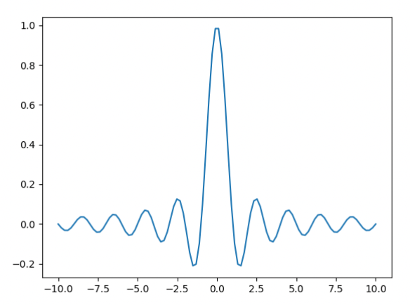

## 常用函数

### 符号函数

$$
{\rm sgn}(x)=
\begin{cases}
1, & x \gt 0 \\
0, & x = 0 \\
-1,& x \lt 0
\end{cases}
$$

### sinc函数

$$
{\rm sinc}(x)=\frac{\sin{\pi x}}{\pi x}
$$

`numpy.sinc(x)`可以实现。与矩形函数互为傅立叶变换对。

### $\delta$函数

$$
\delta(x,y)=
\begin{cases}
+\infty, & x=y=0 \\
0, & \rm others
\end{cases}
$$

$\delta$函数可以看作各种普通函数的极限情况，如：

$$
\delta(x,y) = \lim_{N \to \infty}N^2{\rm sinc}(Nx){\rm sinc}(Ny)
$$

- 性质：
  1. $\iint^{+\infty}_{-\infty}\delta(x,y)\ dxdy=1$
  2. $\iint_{-\infty}^{+\infty}\delta(x-x_0,y-y_0)\phi(x,y)\ dxdy = \phi(x_0,y_0)$
  3. $\delta(ax,by)=\frac{1}{\|ab\|}\delta(x,y)$
  4. $h(x,y)\delta(x-x_0,y-y_0)=h(x_0,y_0)\delta(x-x_0,y-y_0)$

### 梳状函数

$$
{\rm comb}(x) = \sum_{n=-\infty}^{+\infty}\delta(x-n)
$$

n为整数

## 卷积(convolution)

[卷积性质与证明](https://zhuanlan.zhihu.com/p/150737244)

[有意思的分析](https://www.zhihu.com/question/22298352)

$$
g(x,y)=f(x,y)*h(x,y) = \iint_{-\infty}^{+\infty}f(\xi,\eta)h(x-\xi,y-\eta)\ d\xi d\eta
$$

- 运算过程：

1. 以$\xi,\eta$作为函数变量；
2. 折叠：$h(\xi,\eta)$变为$h(-\xi,-\eta)$；
3. 平移：$h(-\xi,-\eta)$向右上平移$(x,y)$，在$f(\xi,\eta)$上滑动；
4. 积分：平移$(x,y)$后的积分值作为$g(x,y)$的值

- 效应：

1. 展宽：有限展宽函数，卷积的宽度等于悲剧氨基函数的宽度之和
2. 平滑化：被卷积的函数经过卷积运算，其细微结构在一定程度上被消除、被平滑，因为卷积后的函数值是两个函数积分的结果。卷积核展宽越窄，被卷积函数的平滑效果一般越不显著。

- 定律：

1. 交换律：

$$
f(x,y)*h(x,y)=h(x,y)*f(x,y)
$$

2. 分配律：

$$
[v(x,y)+w(x,y)]*h(x,y)=v(x,y)*h(x,y)+w(x,y)*h(x,y)
$$

3. 结合律：

$$
[v(x,y)*w(x,y)]*h(x,y)=v(x,y)*[w(x,y)*h(x,y)]
$$

4. $\delta$函数相关

$$
f(x,y)*\delta(x,y)=f(x,y)
$$

$$
f(x,y)*\delta(x-x_0,y-y_0)=f(x-x_0,y-y_0)
$$

## 相关(correlation)

$$
r_{fg}(x,y)=f(x,y)\star g(x,y) = \iint_{-\infty}^{+\infty}f(\xi,\eta)g^*(\xi-x,\eta-y)\ d\xi d\eta
$$

- 运算过程：

1. 以$\xi,\eta$作为函数变量；
2. 共轭：$g(\xi,\eta)$变为$g^*(\xi,\eta)$；
3. 平移：$g^*(\xi,\eta)$向左下平移$(x,y)$，在$f(\xi,\eta)$上滑动；
4. 积分：平移$(x,y)$后的积分值作为$g(x,y)$的值

- 性质：

1. 不满足交换律：

$$
f(x,y)\star g(x,y) = [f(-x,-y)\star g(-x,-y)]^*
$$

2. 与卷积的关系：

$$
f(x,y)\star g(x,y) = f(x,y)*g^*(-x,-y)
$$

## 傅里叶变换

$$
G(f) = F[g(x)] = \int_{-\infty}^{+\infty}g(x)\exp(-\mathrm{j}2\pi fx)\ dx
$$

$$
g(x) = F^{-1}[G(f)] = \int_{-\infty}^{+\infty} G(f)\exp(\mathrm{j}2\pi fx)\ df
$$

- 定理：

1. 线性定理：

$$
F[\alpha g(x,y),\beta h(x,y)] = \alpha G(f_x,f_y)+ \beta H(f_x,f_y)
$$

2. 位移定理：

空域位移导致频域相移：空域周期没变，所以$\mathrm{abs}(f_x),\mathrm{abs}(f_y)$不变，但是相位发生移动

$$
F[g(x-a,y-b)]=G(f_x,f_y)\exp(-\text{j}2\pi (f_xa+f_yb))
$$

空域相移导致频域位移：

$$
F[g(x,y)\exp(\mathrm{j}2\pi(f_ax+f_by))]=G(f_x-f_a,f_y-f_b)
$$

3. 卷积定理：

$$
F[g(x,y)*h(x,y)]=G(f_x,f_y)\cdot H(f_x,f_y)
$$

$$
F[g(x,y)\cdot h(x,y)]=G(f_x,f_y)*H(f_x,f_y)
$$

