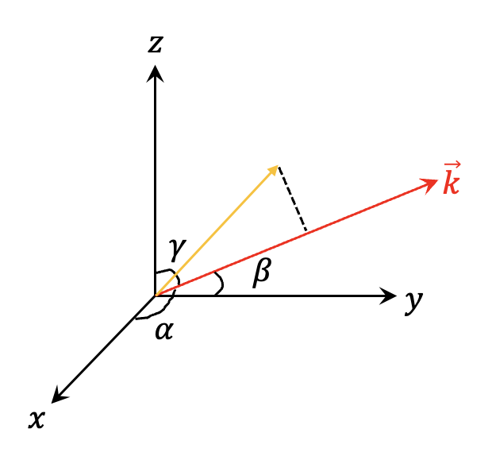
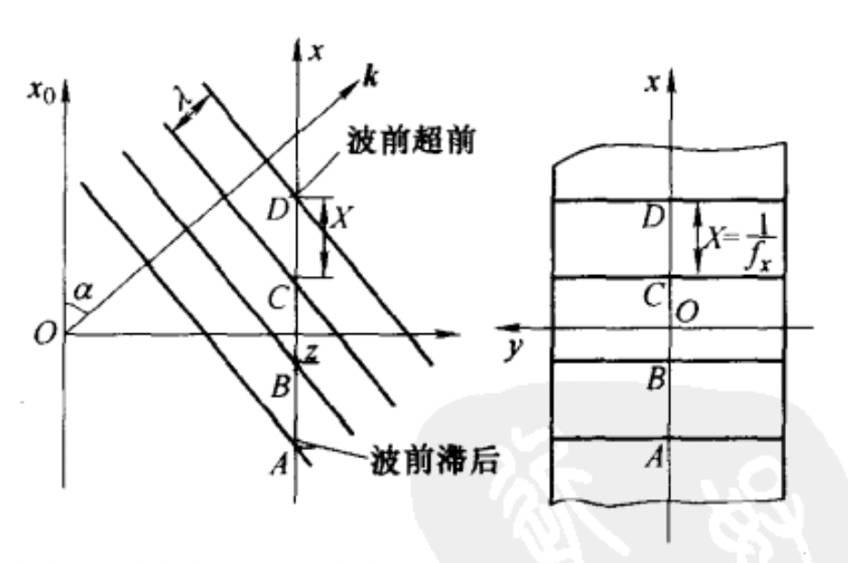
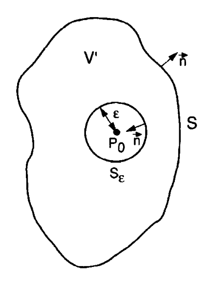
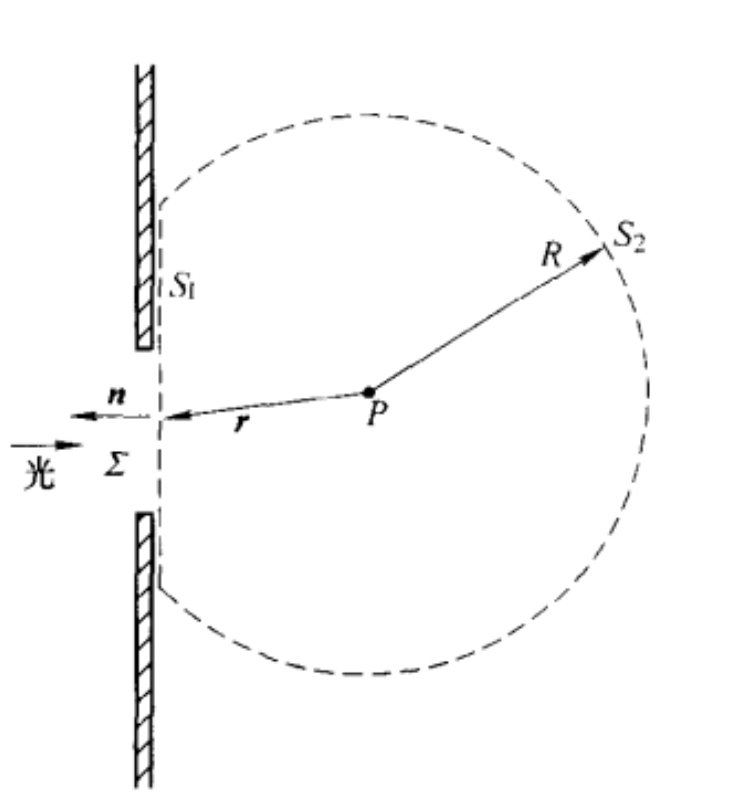
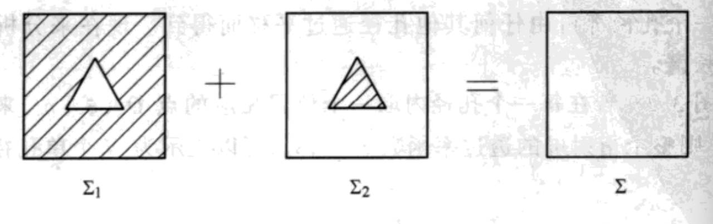

光波是矢量波，完备描述光波，应当考虑光波场的矢量性质。然而在描述干涉、衍射等现象时，允许把光波近似作为标量处理。标量衍射近似成立的条件是：

1. 衍射孔径比波长大得多。这里的衍射孔径应该是指狭缝，对于metasurface的局部周期近似，标量衍射理论也是成立的。
2. 近场不适用。

## 为什么光波要用复数表示

对于单色光波中某点 $P$ 在 $t$ 时刻光表示为：

$$
\begin{split}
u(\textbf{r},t)&=A(\textbf{r})\cos\left(\frac{2\pi}{\lambda}\hat{\textbf{k}}\cdot\textbf{r}-\frac{2\pi}{T}t\right)\\
&=A(\textbf{r})\cos(\textbf{k}\cdot\textbf{r}-\omega t)
\end{split}
$$

复数形式为：

$$
u(\textbf{r},t)=A(\textbf{r})e^{i\textbf{k}\cdot\textbf{r}}e^{-i\omega t}
$$

写成复数形式的好处为：

1. 计算简便，将三角函数运算转化成指数运算。
2. 可以便捷地将时间相位因子和空间相位因子分开。

## 标量衍射理论

复振幅指单色光在**某一个时刻**下，空间中的电场分布可以用复振幅的形式表示，根据上面式子：

$$
u(\textbf{r},t)=U(\textbf{r})e^{-i\omega t}
$$

其中复振幅$U(\textbf{r})$为：

$$
U(\textbf{r})=A(\textbf{r})e^{i\textbf{k}\cdot\textbf{r}}
$$

### 平面波与角谱法

直角坐标系下，

$$
\textbf{r}=
\begin{bmatrix}
x \\
y \\
z
\end{bmatrix}
$$

沿

$$
\hat{\textbf{k}}=
\begin{bmatrix}
\cos(\alpha) \\
\cos(\beta) \\
\cos(\gamma)
\end{bmatrix}
$$

传播的平面波为：

$$
U(\textbf{r})=Ae^{i\frac{2\pi}{\lambda}[x\cos(\alpha)+y\cos(\beta)+z\cos(\gamma)]}
$$

$\hat{\textbf{k}}$如图所示：

又$\cos^2(\alpha)+\cos^2(\beta)+\cos^2(\gamma)=1$，则：

$$
U(x,y,z)=Ae^{i\frac{2\pi}{\lambda}z\sqrt{1-\cos^2{\alpha}-\cos^2(\beta)}}e^{i\frac{2\pi}{\lambda}[x\cos(\alpha)+y\cos(\beta)]}
$$

考虑$z=z_0$平面，有：

$$
U(x,y,z_0)=Ae^{i\frac{2\pi}{\lambda}z_0\sqrt{1-\cos^2{\alpha}-\cos^2\beta}}e^{i\frac{2\pi}{\lambda}[x\cos(\alpha)+y\cos(\beta)]}
$$

为了简单起见，假设$\beta=\frac{\pi}{2}$，在$z=z_0$平面的相对光场分布为：$e^{i\frac{2\pi}{\lambda}x\cos(\alpha)}$

在$z=z_0$平面上，光波的空间周期由沿着波矢$\textbf{k}$方向的$\lambda$，变成了$\lambda/\cos\alpha$，空间频率$f_x$变为了$\cos\alpha/\lambda$，恰好等于指数项中$x$前方的因子，因此平面波在某个平面上的光场，可以写成：

$$
U(x,y,z_0)=Ae^{i2\pi (f_zz_0+f_xx+f_yy)}=Ae^{i2\pi\sqrt{1-f_x^2-f_y^2}z_0}e^{i2\pi (f_xx+f_yy)}
$$

这个式子表示，如果测量到平面波在某个平面上的等相位条纹，就可以确定该平面波的传播方向。而且，如果

而根据傅立叶变换：

$$
G(f_x ,f_y)=F\{g(x,y)\}=\iint_{-\infty}^{+\infty}g(x,y)e^{-i2\pi (f_xx+f_yy)}\ dxdy
$$

$$
g(x ,y)=F^{-1}\{G(f_x,f_y)\}=\iint_{-\infty}^{+\infty}G(f_x,f_y)e^{i2\pi (f_xx+f_yy)}\ df_xdf_y
$$

如果观察到了一个复杂的等相位条纹，可以通过傅立叶变换的方式分解为众多朝不同方向传播$(\cos\alpha =\lambda f_x,\cos\beta = \lambda f_y)$的平面波，每个平面波的振幅和初始相位记录为$G(f_x,f_y)$。因此，对于复杂光场的传播，传播过程中分解的每个平面波的传播方向和振幅保持不变，但会附加一个相位$\exp\left(i2\pi z_0\sqrt{1-f_x^2-f_y^2}\right)$，最后通过逆傅立叶变换合成总光场，这种求解方法称为角谱法，公式如下：

$$
U(x,y,z_0)=F 
\left \{
F^{-1}\left \{
U(x,y,0)e^{i2\pi z_0\sqrt{1-f_x^2-f_y^2}}
\right \}
\right \}
$$

其中$\exp(i2\pi z_0\sqrt{1-f_x^2-f_y^2})$称为角谱法的传递函数。

### 球面波与瑞利-索末菲衍射

球坐标下，发散球面波为：

$$
U(r)=\frac{1}{r}e^{ikr}
$$

#### 菲涅尔-基尔霍夫衍射公式

根据麦克斯韦方程

$$
\nabla \times \textbf{E}=-\mu \frac{\partial \textbf{H}}{\partial t}
$$

$$
\nabla\times\textbf{H}=\epsilon\frac{\partial\textbf{E}}{\partial t}
$$

可得：

$$
\nabla\times(\nabla\times \textbf{E})=\nabla(\nabla\cdot\textbf{E})-\nabla ^2\textbf{E}=-\mu\epsilon\frac{\partial^2 \textbf{E}}{\partial t^2 }
$$

变换可得到波动方程：

$$
\nabla^2\textbf{E}-\frac{n^2}{c^2}\frac{\partial^2 \textbf{E}}{\partial t^2 }=0
$$

以单色光简化：

$$
\nabla^2(\textbf{U(r)}e^{-i2\pi f t})-\frac{n^2}{c^2}\frac{\partial^2 \left( \textbf{U(r)}e^{-i2\pi ft}\right )}  {\partial t^2 }=0
$$

可得空间中不含时的亥姆霍兹方程：

$$
\nabla^2\textbf{U(r)}+\left ( \frac{2\pi nf}{c}\right )^2 \textbf{U(r)}=\nabla^2\textbf{U(r)}+k^2\textbf{U(r)}=0
$$

不考虑偏振时，可简化为标量方程

$$
(\nabla^2+k^2)U(\vec{r})=0
$$

自由空间中传播的光场均满足该方程，球面波和平面波均为该方程在自由边界条件下的解。

为了求解空间中某点$P_0$的电场值，我们可以使用格林定理：

$$
\iiint_V\left( G\nabla^2U-U\nabla^2G\right)\ \text{d}v=\iint_S\left(U\frac{\partial G}{\partial n}-G\frac{\partial U}{\partial n}\right)\ \text{d}s
$$

将波动方程带入其中可得：

$$
U(P_0)=\frac{1}{4\pi}
\iint_S\left(G
\frac{\partial U}{\partial n}-U\frac{\partial G}{\partial n}\right)\ \text{d}s
$$

其中$G$为一个满足亥姆霍兹方程的辅助函数，$n$为$\text{d}s$朝外的法向量。从上式可以看出，如果已知围绕$P_0$的封闭曲面上的电场值，我们就可以求出$U(P_0)$。基尔霍夫选取了从$P_0$点发出的球面波：

$$
G=\frac{e^{jkr_{01}}}{r_{01}}
$$

作为辅助函数，其中$r_{01}$表示从$P_0$点到$\text{d}s$上某点$P_1$的向量，代入可得：

$$
U(P_0)=\frac{1}{4\pi}
\iint_S\left[
\frac{\partial U}{\partial n}\left(\frac{e^{ikr_{01}}}{r_{01}}\right)-U\frac{\partial}{\partial n}\left(\frac{e^{ikr_{01}}}{r_{01}}\right)\right]\ \text{d}s
$$

以下图中的边界条件分析上式：

可得：

$$
U(P_0)=\frac{1}{4\pi}\iint_{S_1+S_2}\left[\frac{\partial U}{\partial n}\left(\frac{e^{ikr_{01}}}{r_{01}}\right)-U\frac{\partial}{\partial n}\left(\frac{e^{ikr_{01}}}{r_{01}}\right)\right]\ \text{d}s
$$

即积分可分为两个部分，一部分是衍射屏的平面$S_1$积分，另一个是球面$S_2$积分。单独拿出$S_2$的积分，当$R_2$很大时：

$$
\frac{\partial}{\partial n}\left(\frac{e^{ikr_{01}}}{r_{01}}\right)=\left(jk-\frac{1}{r_{01}}\right)\frac{e^{ikr_{01}}}{r_{01}}\approx jk\frac{e^{ikr_{01}}}{r_{01}}
$$

带入可得：
$$
\begin{split}
\frac{1}{4\pi}\iint_{S_2}\left[\frac{\partial U}{\partial n}\left(\frac{e^{ikr_{01}}}{r_{01}}\right)-U\frac{\partial}{\partial n}\left(\frac{e^{ikr_{01}}}{r_{01}}\right)\right]\ \text{d}s
&=\frac{1}{4\pi}\iint_{S_2}\left[\frac{\partial U}{\partial n}\left(\frac{e^{ikr_{01}}}{r_{01}}\right)-jkU\left(\frac{e^{ikr_{01}}}{r_{01}}\right)\right]\ \text{d}s\\
&=\frac{1}{4\pi}\iint_{S_2}\left[\frac{\partial U}{\partial n}\left(\frac{e^{ikr_{01}}}{r_{01}}\right)-jkU\left(\frac{e^{ikr_{01}}}{r_{01}}\right)\right]\ \text{d}s\\
&=\frac{1}{4\pi}\iint_{S_2}\left(\frac{\partial U}{\partial n}-jkU\right)\frac{e^{ikr_{01}}}{r_{01}} r_{01}^2\ \text{d}\omega\\
\end{split}
$$

若满足以下条件，则$S_2$上积分为0：

$$
\lim_{r_{01}\to\infty}r_{01}\left(\frac{\partial U}{\partial n}-jkU\right)=0
$$

上式称为**索末菲边界条件**。因此只剩下$S_1$上的积分。

若还满足**基尔霍夫边界条件**：在孔径外$\frac{\partial U}{\partial n}$和$U$均为0，则只需考虑孔径内$\sum$上的积分：

$$
U(P_0)=\frac{1}{4\pi}\iint_{\sum}\left[\frac{\partial U}{\partial n}\left(\frac{e^{ikr_{01}}}{r_{01}}\right)-U\frac{\partial}{\partial n}\left(\frac{e^{ikr_{01}}}{r_{01}}\right)\right]\ \text{d}s
$$

当$P_0$点远离衍射屏时，$\lambda \ll r_{01}$，可得：

$$
\frac{\partial}{\partial n}\left(\frac{e^{ikr_{01}}}{r_{01}}\right)=\cos(\vec{n},\vec{r_{01}})\left(jk-\frac{1}{r_{01}}\right)\frac{e^{ikr_{01}}}{r_{01}}\approx jk\cos(\vec{n},\vec{r_{01}})\frac{e^{ikr_{01}}}{r_{01}}
$$

代入可得**菲涅尔-基尔霍夫衍射公式**：

$$
U(P_0)=\frac{1}{4\pi}\iint_{\sum}\left(\frac{\partial U}{\partial n}-jkU\cos(\vec{n},\vec{r_{01}})\right)\frac{e^{ikr_{01}}}{r_{01}} \ \text{d}s
$$

#### 瑞利-索末菲衍射公式

对于基尔霍夫边界条件，若同时满足场值和其偏导值为0，则孔径内的场值也应为0，这十分矛盾，为了解决这个问题，索末菲采用了新的辅助函数来求解。

第一种情况是：

$$
G_-=\frac{e^{jkr_{01}}}{r_{01}}-\frac{e^{jk\hat{r}_{01}}}{\hat{r}_{01}}
$$

其中$\hat{r}_{01}$是$P_0$点关于衍射屏的对称点$P'_0$到$\text{d}s$上某一点$P_1$的向量，代入可得：

$$
U_I(P)=-\frac{1}{4\pi}\iint_\sum U\frac{\partial G_-}{\partial n}\ \text{d}s
$$

由于选择的辅助函数十分巧妙，此时$U$的偏导项没有出现在表达式中，因此不用假设衍射屏孔径外偏导为0。同上，$P_0$远离衍射屏时：

$$
\frac{\partial G_-}{\partial n}\approx 2jk\cos(\vec{n},\vec{r_{01}})\frac{e^{ikr_{01}}}{r_{01}}
$$

可得**第一类瑞利-索末菲衍射公式**：

$$
U_I(P)=\frac{1}{j\lambda}\iint_{\sum}U\frac{e^{jkr_{01}}}{r_{01}}\cos(\vec{n},\vec{r_{01}})\ \text{d}s
$$

若选择辅助函数为：

$$
G_+=\frac{e^{jkr_{01}}}{r_{01}}+\frac{e^{jk\hat{r}_{01}}}{\hat{r}_{01}}
$$

可求得：

$$
U_{II}(P)=\frac{1}{4\pi}\iint_\sum \frac{\partial U}{\partial n}G_+\ \text{d}s
$$

此时为**第二类瑞利-索末菲衍射公式**：

$$
U_{II}(P)=\frac{1}{2\pi}\iint_\sum\frac{\partial U}{\partial n}\frac{e^{jkr_{01}}}{r_{01}}\ \text{d}s
$$

### 菲涅尔衍射

在傍轴近似情况下，$\cos(\vec{n}, \vec{r}_{01}\approx 1)$，基于第一类瑞利索末菲公式，可以得到：

$$
U_I(P)=\frac{1}{j\lambda}\iint_{\sum}U\frac{e^{jkr_{01}}}{r_{01}}\ \text{d}s
$$

取：

$$
r_{01}=\sqrt{(x-x_0)^2+(y-y_0)^2+z_0^2}
$$

可得：

$$
U(x_0,y_0)
=\frac{1}{j\lambda}\iint_{\sum}U\frac{e^{jk\sqrt{(x-x_0)^2+(y-y_0)^2+z_0^2}}}{\sqrt{(x-x_0)^2+(y-y_0)^2+z_0^2}}\ \text{d}x\text{d}y
$$

对$r_{01}$作泰勒展开，取近似$(\sqrt{1+x^2}\approx 1-\frac{x^2}{2})$可得：

$$
r_{01}=z_0\sqrt{1+(\frac{x-x_0}{z_0})^2+(\frac{y-y_0}{z_0})^2}\approx z_0+\frac{(x-x_0)^2+(y-y_0)^2}{2z_0}
$$

指数项的$r_{01}$的敏感度远大于分母中的$r{01}$，于是指数项按上式近似，分母项直接按$r_{01}\approx z_0$近似，可以得到**菲涅尔衍射**的公式：

$$
U(x_0,y_0)=\frac{e^{jkz_0}}{j\lambda z_0}\iint_\sum U(x,y)e^{j\frac{k}{2z_0}\left[(x-x_0)^2+(y-y_0)^2\right]}\ \text{d}x\text{d}y
$$

写成卷积形式：

$$
U(x_0,y_0)=U(x,y)*\left(\frac{e^{jkz_0}}{j\lambda z_0}e^{j\frac{k}{2z_0}(x^2+y^2)}\right)
$$

菲涅尔衍射的频域传递函数为：

$$
F\left[
\frac{e^{jkz_0}}{j\lambda z_0}e^{j\frac{k}{2z_0}(x^2+y^2)}
\right]
=e^{jkz_0}e^{-j\pi\lambda z(f_x^2+f_y^2)}
$$

当然，也可以将菲涅尔衍射公式展开：

$$
\begin{split}
U(x_0,y_0)&=\frac{e^{jkz_0}}{j\lambda z_0}e^{j\frac{k}{2z_0}(x_0^2+y_0^2)}\iint_\sum \left(U(x,y)e^{j\frac{k}{2z_0}(x^2+y^2)}\right)e^{-j2\pi(\frac{x_0}{\lambda z_0}x+\frac{y_0}{\lambda z_0}y)}\ \text{d}x\text{d}y\\
&=\frac{e^{jkz_0}}{j\lambda z_0}e^{j\frac{k}{2z_0}(x_0^2+y_0^2)}F\left[U(x,y)e^{j\frac{k}{2z_0}(x^2+y^2)}\right]_{f_x=\frac{x_0}{\lambda z_0},f_y=\frac{y_0}{\lambda z_0}}
\end{split}
$$

表明菲涅尔衍射后的图案为$U(x,y)e^{j\frac{k}{2z_0}(x^2+y^2)}$的傅立叶变换，观察平面坐标与频率关系为：$f_x=\frac{x_0}{\lambda z_0},f_y=\frac{y_0}{\lambda z_0}$。

因此综上，我们一共有4种方式计算菲涅尔衍射：积分形式、卷积形式、频域传递函数形式，以及傅立叶变换形式。

#### 泰伯效应

### 夫琅和费衍射

对$r_{01}$作进一步的近似，取：

$$
r_{01}\approx z_0+\frac{(x-x_0)^2+(y-y_0)^2}{2z_0}\approx z_0+\frac{x_0^2+y_0^2}{2z_0}-\frac{x_0x+y_0y}{z_0}
$$

可得夫琅和费衍射公式：

$$
\begin{split}
U(x_0,y_0)&=\frac{e^{jkz_0}}{j\lambda z_0}e^{j\frac{k}{2z_0}(x_0^2+y_0^2)}\iint_\sum U(x,y)e^{-j2\pi(\frac{x_0}{\lambda z_0}x+\frac{y_0}{\lambda z_0}y)}\ \text{d}x\text{d}y\\
&=\frac{e^{jkz_0}}{j\lambda z_0}e^{j\frac{k}{2z_0}(x_0^2+y_0^2)}F\left[U(x,y)\right]_{f_x=\frac{x_0}{\lambda z_0},f_y=\frac{y_0}{\lambda z_0}}
\end{split}
$$

### 巴比涅原理

假设光线分别经过屏1、屏2衍射，在观察平面上点$P$得到的光场分别为$U_1(P)$和$U_2(P)$，若两个屏为下图所示的互补屏，则两个互补屏在观察点产生的光场复振幅之和，等于自由传播到该点的复振幅。

即：

$$
U_1(P)+U_2(P)=U(P)
$$

该现象称为巴比涅原理。

