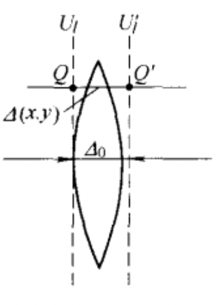
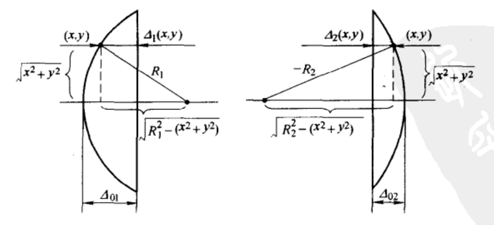
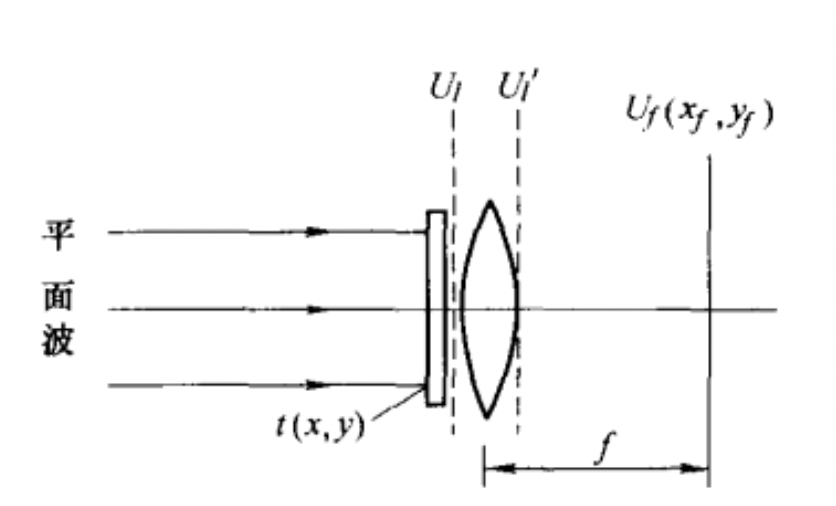
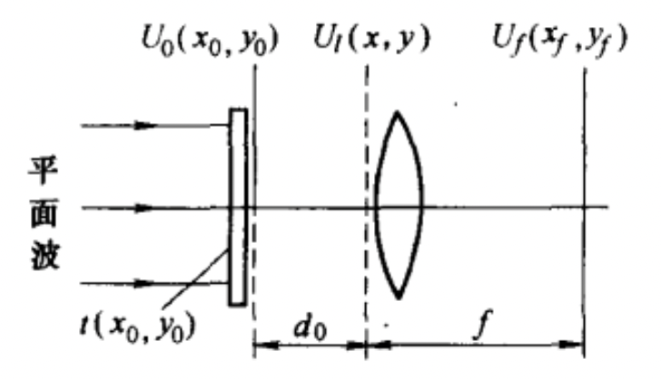
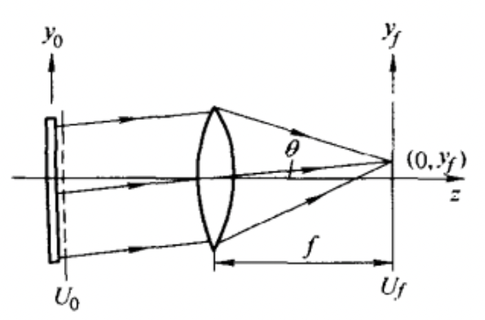
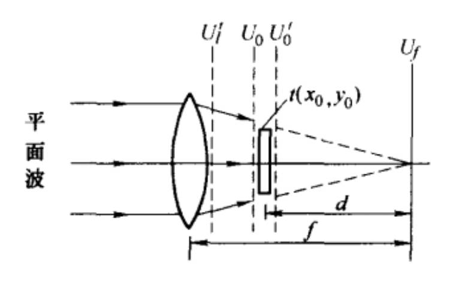

## 薄透镜的复振幅透过率

薄透镜假设：从$U_l$平面的$(x,y)$点入射的光线，经薄透镜后，仍从$U_l'$平面的$(x,y)$点出射。

设薄透镜的厚度函数为$\Delta(x,y)$：表示$(x,y)$点对应水平截面上透镜的厚度。设透镜中心$(0,0)$点处相位为0，则透镜的复振幅透过率为（假设光线无损耗，即振幅透过率为1）

$$
t(x,y)=e^{ik[n\Delta(x,y)+(\Delta_0(x,y)-\Delta(x,y)-n\Delta_0]}=e^{ik\Delta_0(x,y)}e^{ik(n-1)(\Delta(x.y)-\Delta_0)}
$$

为了求得$\Delta(x,y)$，将透镜分为两个部分

$$
\begin{split}
\Delta_1&=\Delta_{01}-\left(R_1-\sqrt{R_1^2-
(x^2+y^2)}\right)\\
\Delta_2&=\Delta_{02}-\left(-R_2-\sqrt{R_2^2-(x^2+y^2)}\right)
\end{split}
$$

对根号取傍轴近似：

$$
\begin{split}
\sqrt{R_1^2-(x^2+y^2)}&=R_1\sqrt{1-\frac{x^2+y^2}{R_1^2}}\approx R_1\left(1-\frac{x^2+y^2}{2R_1^2}\right)=R_1-\frac{x^2+y^2}{2R_1}\\
\sqrt{R_2^2-(x^2+y^2)}&=-R_2\sqrt{1-\frac{x^2+y^2}{R_2^2}}\approx -R_2\left(1-\frac{x^2+y^2}{2R_2^2}\right)=-R_2+\frac{x^2+y^2}{2R_2}
\end{split}
$$

可得厚度函数：

$$
\Delta(x,y)=\Delta_1+\Delta_2=\Delta_0-\frac{x^2+y^2}{2}\left(\frac{1}{R_1}-\frac{1}{R_2}\right)
$$

代入复振幅透过率公式得薄透镜的调制为：

$$
t(x,y)=e^{-ik(n-1)\left(\frac{1}{R_1}-\frac{1}{R_2}\right)\frac{x^2+y^2}{2}}
$$

根据几何光学公式：

$$
\frac{1}{f}=(n-1)\left(\frac{1}{R_1}-\frac{1}{R_2}\right)
$$

得：

$$
t(x,y)=e^{-ik\frac{x^2+y^2}{2f}}
$$

下面用几何光学的知识验证一下上式的准确性：

1. 平面光经过薄透镜后，光线被调制成$e^{-ik\frac{x^2+y^2}{2f}}$，即汇聚的平面波。

2. 据透镜距离为$d_1$的点光源发出的发散球面波$e^{ik\frac{x^2+y^2}{2d_1}}$，经过透镜后变为：

   
   $$
   U_l'(x,y)=e^{ik\frac{x^2+y^2}{2d_1}}e^{-ik\frac{x^2+y^2}{2f}}=e^{-ik\frac{x^2+y^2}{2d_2}}
   $$
   

   其中$d_2$满足$\frac{1}{d_1}+\frac{1}{d_2}=\frac{1}{f}$，与几何光学相符。

## 薄透镜的傅里叶变换性质

### 物体位于透镜前表面

根据菲涅尔衍射公式的傅里叶变换形式，未加透镜时，在薄透镜焦平面的衍射光场分布为：

$$
U_f(x_f,y_f)=\frac{e^{jkf}}{j\lambda f}e^{j\frac{k}{2f}(x_f^2+y_f^2)}F\left[U_l(x,y)e^{j\frac{k}{2f}(x^2+y^2)}\right]_{f_x=\frac{x_f}{\lambda f},f_y=\frac{y_f}{\lambda f}}
$$

当加入透镜后，透镜的相位调制作用恰好将傅里叶变换中多出来的指数项消去，即：

$$
\begin{split}
U_f(x_f,y_f)&=\frac{e^{jkf}}{j\lambda f}e^{j\frac{k}{2f}(x_f^2+y_f^2)}F\left[U_l(x,y)e^{-j\frac{k}{2f}(x^2+y^2)}e^{j\frac{k}{2f}(x^2+y^2)}\right]_{f_x=\frac{x}{\lambda f},f_y=\frac{y}{\lambda f}}\\
&=\frac{e^{jkf}}{j\lambda f}e^{j\frac{k}{2f}(x_f^2+y_f^2)}F\left[U_l(x,y)\right]_{f_x=\frac{x_f}{\lambda f},f_y=\frac{y_f}{\lambda f}}
\end{split}
$$

即透镜后焦面的光场为物体光场的频谱（当然得先去掉扭曲项$e^{j\frac{k}{2f}(x_f^2+y_f^2)}$的影响）。

==**即在后焦面上$(x_f,y_f)$点的振幅和相位正比于物体频谱所包含的频率分量$(f_x=x_f/\lambda f, f_y=y_f/\lambda f)$的振幅和相位。**==

### 物体位于透镜前表面一段距离

 

根据前一节的内容，我们已经推导了$F\left[U_l(x,y)\right]$与$U_f(x_f,y_f)$之间的关系，故只需知道$U_0(x_0,y_0)$与$F\left[U_l(x,y)\right]$之间的关系，这个通过频域传递函数形式的菲涅尔衍射公式比较好求。即：

$$
F\left[U_l(x,y)\right]=F[U_0(x_0,y_0)]e^{jkd_0}e^{-j\pi\lambda d_0(f_x^2+f_y^2)}
$$

代入前一节公式可得：

$$
U_f(x_f,y_f)=\frac{e^{jk(f+d_0)}}{j\lambda f}e^{jk\frac{x_f^2+y_f^2}{2f}\left(1-\frac{d_0}{f}\right)}F[U_0(x_0,y_0)]_{f_x=\frac{x_0}{\lambda f},f_y=\frac{y_0}{\lambda f}}
$$

后焦面仍为物体的频谱，但扭曲项$e^{jk\frac{x_f^2+y_f^2}{2f}}$额外增加了$(1-d_0/f)$倍。

更重要的是，当$d_0=f$时，扭曲项消失，此时：

$$
U_f(x_f,y_f)=\frac{e^{jk\cdot2f}}{j\lambda f}F[U_0(x_0,y_0)]_{f_x=\frac{x_0}{\lambda f},f_y=\frac{y_0}{\lambda f}}
$$

即通过2-f系统得到物体的频谱。

通过角谱的理论也可以对这个结果进行简略分析：

空间频率为$f_y=\frac{\sin(\theta)}{\lambda}\approx \frac{y_f}{\lambda f}$的平面波被透镜聚焦到$(0,y_f)$点。

即透镜在空间域的作用是点对点映射；在频域的作用是频率对点映射。

### 物体位于透镜后一段距离

入射光场为：

$$
U_l'(x,y) = e^{-jk\frac{x^2+y^2}{2f}}
$$

根据几何光学近似，物平面入射面的光场为：

（取$A/f=1$归一化，则$A/d=f/d$）

$$
U_0(x_0,y_0)=\frac{f}{d}e^{-jk\frac{x_0^2+y_0^2}{2d}}
$$

物平面出射面的光场为：

$$
U_0'(x_0,y_0)=\frac{f}{d}U(x_0,y_0)e^{-jk\frac{x_0^2+y_0^2}{2d}}
$$

则后焦面场分布为：

$$
\begin{split}
U_f(x_f,y_f)&=&\frac{f}{d}\frac{e^{jkd}}{j\lambda d}e^{j\frac{k}{2d}(x_f^2+y_f^2)}F\left[U(x_0,y_0)\right]_{f_x=\frac{x_f}{\lambda d},f_y=\frac{y_f}{\lambda d}}\\
&\xlongequal {d_0=f-d}&\frac{f}{d}\frac{e^{jkd}}{j\lambda d}e^{j\frac{k}{2f}\left(1-\frac{d_0}{f}\right)(x_f^2+y_f^2)}F\left[U(x_0,y_0)\right]_{f_x=\frac{x_f}{\lambda d},f_y=\frac{y_f}{\lambda d}}
\end{split}
$$

即后焦面仍是被扭曲的物体频谱，与物体放置于距透镜前焦面$d_0$的情况完全一致，只不过此时频谱与后焦面空间坐标之间的尺度变成了与$d$相关，相当于多了一个自由度，可以对频谱进行缩小显示。当物体紧贴透镜后表面时，此时后焦面场与物体紧贴透镜前表面时后焦面场完全相同。

### 对透镜傅里叶变换性质的补充

1. 平面光照明时，无论物体位于透镜一倍焦距内的哪个位置，后焦面都包含频谱信息，只不过被扭曲的程度不同，当物体恰好位于一倍焦距处时，扭曲消失，后焦面为完美的频谱。
2. 当点光源位于有限距离，即采用球面波照明方式时，无论物体位于透镜前还是透镜后，透镜仍可以起到傅里叶变换的作用，但此时频谱面位于对应的像面位置(点光源的像面位置)，而不再是后焦面。
3. 采用4-f系统可以做一对正逆傅里叶变换，二号透镜的后焦面为倒立等大的像。

### 透镜孔径的影响——渐晕效应的衍射光学解释

当透镜存在有限大小的孔径时，此时有效物体为物体与孔径的乘积，故**透镜成像的频谱为物体频谱与透镜孔径频谱的卷积**，由于孔径的空间频率一般较低（孔径没有复杂的空间结构，如矩形孔、圆孔），因此当卷积时，物体频谱中本来高频的信号较弱，与孔径频谱卷积后更弱了（因为加入孔径后该高频$f_0$处的强度约为原频谱中$2f_0$处强度）因此物体的高频信息丢失了，导致图像细节变模糊，产生渐晕效应。

若将透镜的孔径做成复杂的、具有空间频率$f_i$的光栅，那么卷积之后物体的高频信息将被转移为低频信息，容易被透镜接受。这是结构光照明实现超分辨的原理。