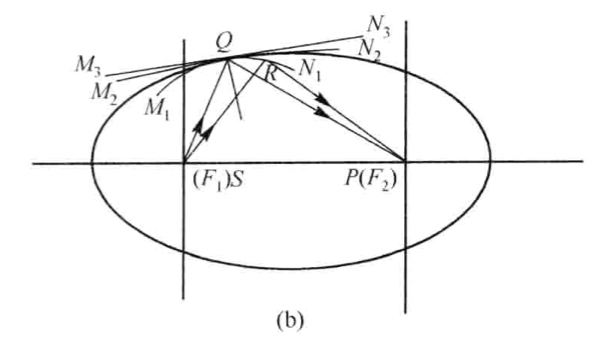
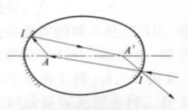
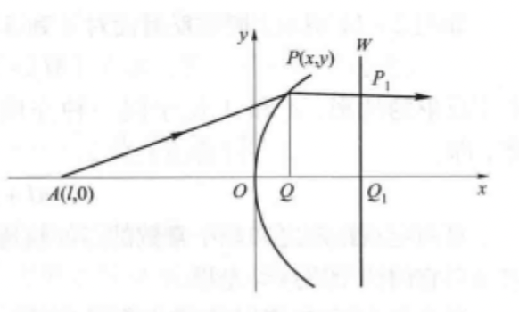

## 几何光学的基本定律

1. 在各向同性的均匀介质中，光沿直线传播（对应物理光学反例：衍射）
2. 从不同光源发出的光以不同方向通过空间某点时，彼此互不影响（对应物理光学反例：干涉）
3. 反射定律和折射定律

## 费马原理

光走光程为极值的路径。当物体成虚像时，光线虚拟走过的光程定义为负数。

1. 极小值：反射、折射

2. 稳定值：椭圆

   

3. 极大值：

   

## 马吕斯定律

光线在各向同性介质的传播过程中，始终保持着与波面的正交性，且任意两波面之间的光线光程相等。

几何光学基本定律、费马原理和马吕斯定律三者可以相互推导。

## 理想成像系统与理想成像条件

- 理想成像系统：点成像为点、直线成像为直线、平面成像为平面
- 点物体理想成像条件：等光程条件。物点与像点之间的任意光线光程相等。（从费马原理理解：光从一点出发，走任意路径都能到达另一点，说明这两点间光程为极值，又任意路径都是极值，则这个极值为稳定值。）
- 线段物体理想成像条件：余弦条件。

### 等光程的反射面

1. 椭圆反射面：实物和实像

   到两定点距离之和为定值

   

2. 双曲反射面：虚物实像和实物虚像

   到两定点距离之差为定值（差对应了虚/负光程）

   

3. 抛物面：无穷远成像

   到定点和定直线之差为定值

   

### 等光程的折射面

使定点成像无穷远的折射面：

即需要求到定点和定直线加权（按折射率加权）距离之和为定值的曲线。依图，需要有光程$\overline{AP}=\overline{AQ}$，即：

$$
n\sqrt{y^2+(-l+x)^2}=n(-l)+n'x
$$

化简可以得到：

$$
(1-e^2)x^2+y^2-2rx = 0
$$

其中$e=\frac{n'}{n}$，$r=l(1-\frac{n'}{n})$。

在ZEMAX中，利用上式作为非球面的建模公式，两个定义参数为$K=-e^2$和$r$。当$e$和$r$按上面式子取值时，可以对$A$点理想成像。

当$n'>n$时，双曲面能对$A$点在无穷远成理想像，当$n'<n$时，该理想成像曲面为椭球面。

### 余弦条件

推导略。详见应用光学（李林）

若$AB$能理想成像于$A'B'$，必满足：

$$
n\overline{AB}\cos{\theta}-n'\overline{A'B'}\cos{\theta'}=\text{const}
$$

### 阿贝正弦条件

$$
n\overline{AB}\sin{U}=n'\overline{A'B'}\sin{U'}
$$
