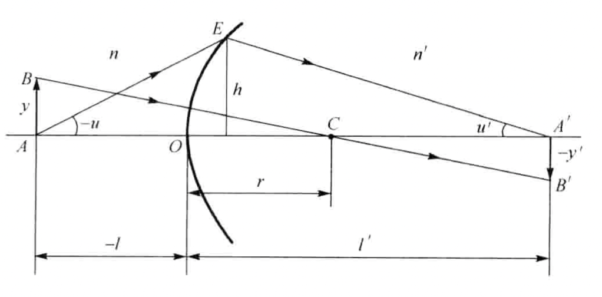

## 符号规则

**图像上标注的都为正值。**

1. 沿轴线段：

   O点到端点的方向与光线传播方向相同时，为正；

   反之为负。光线传播方向一般为从左到右。

   如O到A为向右，与光线传播方向相反，故$OA=L$，$OA$的长度为$-L$

2. 垂轴线段：

   在光轴之上时，为正；

   反之为负。

3. 光轴与光线的夹角：

   光轴到光线的转角为顺时针时，为正；

   反之为负。

   如$\angle OAE$为$OA$转向$AE$，为逆时针，故$\angle OAE=U$，绝对角度为$-U$。

4. 光线与法线的夹角：

   光线到法线的转角为顺时针时，为正；

   反之为负。

5. 法线与光轴的夹角：

   光轴到法线的转角为顺时针时，为正；

   反之为负。

## 单折射球面

在$\Delta AEC$中，由正弦定理可得：

$$
\frac{\sin(-U)}{r}=\frac{\sin I}{-L+r}
$$

在$\Delta A'EC$中，由正弦定理可得：

$$
\frac{\sin I'}{L'-r}=\frac{\sin U'}{r}
$$

傍轴近似可得：

$$
i=\frac{l-r}{r}u\\
i'=\frac{l'-r}{r}u'
$$

根据折射定律$ni=n'i'$可得：

$$
nu(\frac{l}{r}-1)=n'u'(\frac{l'}{r}-1)
$$

这是既含$u,u'$也含$l,l'$的式子，下面用$ul=u'l'=h$消去其中一个。

1. 消去$l,l'$：

   
   $$
   n'u'-nu=(\frac{n'-n}{r})h
   $$
   

2. 消去$u,u'$：

   
   $$
   n\left(\frac{1}{r}-\frac{1}{l}\right)=n'\left(\frac{1}{r}-\frac{1}{l'}\right)=Q\\
   \frac{n'}{l'}-\frac{n}{l}=\frac{n'-n}{r} \label{aa}
   $$
   

   其中$Q$被称为阿贝不变量，在物空间和像空间保持不变。

## 放大率

### 垂轴放大率$\beta$

定义垂轴放大率$\beta$：

$$
\beta =\frac{y'}{y}
$$

由$\triangle ABC$和$\triangle A'B'C$相似可得：

$$
\beta = \frac{y'}{y}=\frac{l'-r}{l-r}
$$

再由阿贝不变量公式可得：

$$
\beta =\frac{nl'}{n'l}
$$

当$\beta<0$时，成倒像，此时$l'/l<0$，物像异侧，成实像；当$\beta>0$时，成正像，此时$l'/l>0$，物像同侧，成虚像。

又$ul=u'l'=h$可得：

$$
\beta=\frac{y'}{y}=\frac{nu}{n'u'}
$$

即：

$$
nuy=n'u'y'=J
$$

该公式称为拉赫不变量。是阿贝正弦条件的傍轴近似。

### 轴向倍率$\alpha$

#### 微小位移

定义微小位移的轴向放大率$\alpha$为物体移动一小段位移$dl$与相应的像移$dl'$的比值，即：

$$
\alpha = \frac{dl'}{dl}
$$

对只含截距的单折射面公式进行微分可得：

$$
-\frac{n'dl'}{l'^2}+\frac{ndl}{l^2}=0
$$

可得：

$$
\alpha = \frac{nl'^2}{n'l^2}=\frac{l'}{l}\beta=\frac{n'}{n}\beta^2
$$

#### 一段位移

此时垂轴放大率$\overline{\alpha}$为：

$$
\overline{\alpha}=\frac{l_2-l_1}{l_2'-l_1'} \label{14}
$$

由只含截距的单折射球面公式可知：

$$
\frac{n'}{l_1'}-\frac{n}{l_1}=\frac{n'-n}{r}=\frac{n'}{l_2'}-\frac{n}{l_2}
$$

可得：

$$
\frac{l_2-l_1}{l_2'-l_1'}=\frac{nl_1'l_2'}{n'l_1l_2}
$$

代入可得：

$$
\overline{\alpha}=\frac{n'}{n}\beta_1\beta_2
$$

### 角倍率$\gamma$

易知：

$$
\gamma=\frac{u'}{u}=\frac{l}{l'}=\frac{n}{n'}\beta
$$

三个倍率的关系：

$$
\alpha\gamma=\beta
$$

## 共轴球面系统的递推公式

### 傍轴近似的$u-h$方法

$$
\begin{split}
n_i'u_i'&=n_iu_i+\left(\frac{n_i'-n_i}{r_i}\right)h_i\\
h_{i+1}&=h_i-u_i'd_i\\
u_{i+1}&=u_i'\\
n_i'&=n_{i+1}
\end{split}
$$

### 非傍轴近似

#### $U-L$方法

#### $U-H$方法

### 共轴球面系统的放大率

1. 垂轴倍率$\beta=\beta_1\beta_2\cdots\beta_k$
2. 轴向倍率$\alpha = \alpha_1\alpha_2\cdots\alpha_k$
3. 角倍率$\gamma=\gamma_1\gamma_2\cdots\gamma_k$

## 球面反射镜

球面反射镜可以看作一种特殊情况，此时$n'=-n$。