## 理想光学系统的三点、三面

1. 焦点和焦平面：

   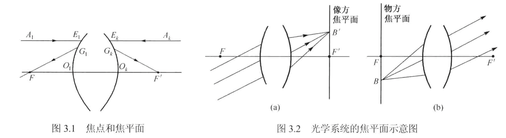

   与物方无穷远点共轭的像点为像方焦点，过像方焦点与光轴垂直的平面称为像方焦平面；

   与像方无穷远点共轭的物点为物方焦点，过物方焦点与光轴垂直的平面称为物方焦平面。

   物方焦距$f$和像方焦距$f'$满足：

   
   $$
   f'/f=-n'/n
   $$
   

   其中$n,n'$分别为物空间和像空间的折射率。

2. 主点与主平面：

   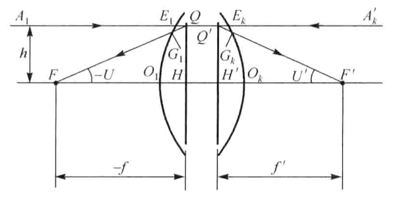

   放大率为+1的共轭平面称为主平面。主平面与光轴的交点称为主点。

   **焦距**：物方主点到物方焦点的距离称为物方焦距；像方主点到像方焦点的距离称为像方焦距。

3. 节点：

   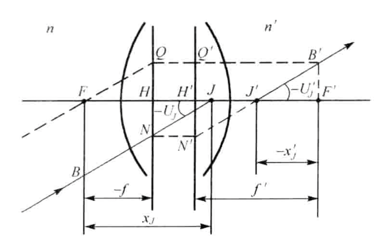

   角倍率为+1的一对共轭点为节点。

## 牛顿坐标和牛顿公式

牛顿坐标是指以**物方、像方焦点**分别作为物方、像方坐标原点的坐标系。在此坐标系下，物方截距为$x$，像方截距为$x'$。由$\Delta ABF$和$\Delta FHM$相似以及$\Delta F'H'N'$和$\Delta A'B'F'$相似可得：

$$
\frac{-f}{-x}=\frac{y'}{-y}=\frac{x'}{f'}
$$

根据此式可得理想光学系统垂轴倍率的关系：

$$
\beta = \frac{y'}{y}=-\frac{f}{x}=-\frac{x'}{f'}
$$

可得牛顿公式：

$$
xx'=ff'
$$

微分可得：

$$
\text{d}x'=-\frac{ff'}{x^2}\text{d}x
$$

沿轴倍率为：

$$
\alpha = \frac{\text{d}x'}{\text{d}x}=\frac{n'}{n}\frac{f^2}{x^2}=\frac{n'}{n}\beta^2
$$

角倍率：

$$
\gamma = \frac{\tan U'}{\tan U}=\frac{-y'/x'}{-y/x}=-\frac{f}{x'}=-\frac{n}{n'}\frac{f'}{x'}=\frac{n}{n'}\frac{1}{\beta}
$$

三者关系：

$$
\alpha\gamma=\beta
$$

牛顿坐标系下各个基点的坐标：

- 焦点：$x_F=0,x_{F'}=0$

- 主点：$x_H=-f,x_{H'}=-f'$

- 节点：$x_J=f',x_{J'}=f$（求解方法见下图）

  **即物方节点和物方主点之间的距离等于像方节点和像方主点之间的距离。主点间距等于节点间距**

  **当物方和像方空间折射率一致时，主点和节点重合**
  
  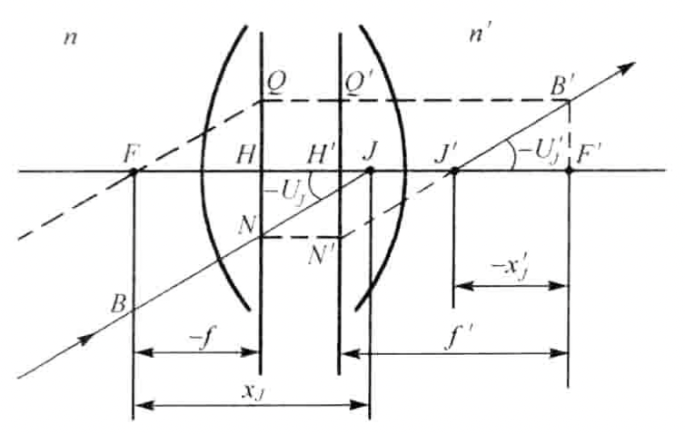

## 高斯坐标和高斯公式

高斯坐标是以**物方、像方主点**分别作为物方、像方坐标原点的坐标系。在此坐标系下，物方截距为$l$，像方截距为$l'$。根据上图，高斯坐标系中截距与牛顿坐标系中截距的关系为：

$$
l=x+f
$$

$$
l'=x'+f'
$$

代入牛顿公式可得：

$$
\frac{f'}{l'}+\frac{f}{l}=1
$$

高斯坐标下各个基点的坐标：

- 主点：$l_H=0,l_{H'}=0$
- 焦点：$l_F=f,l_{F'}=f'$
- 节点：$l_J=f+f',l_{J'}=f+f'$

## 理想光学系统分析单折射球面

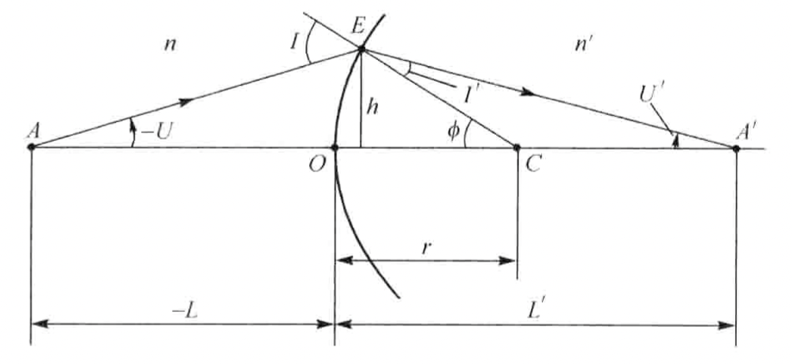

主点为$O$，两主点重合；节点为$C$，两节点重合。高斯坐标下，以$O$点为原点。

像方焦距：

$$
f'=\frac{n'}{n'-n}r
$$

物方焦距：

$$
f=-\frac{n}{n'-n}r
$$

主点和节点间距为$f+f'=n'r/(n'-n)-nr/(n'-n)=r$。

## 光焦度

根据两个焦距的关系：$f'/f=-n'/n$，代入高斯公式可得：

$$
\frac{n'}{l'}-\frac{n}{l}=-\frac{n}{f}=\frac{n'}{f'}
$$

定义光焦度$\Phi$：

$$
\Phi = -\frac{n}{f}=\frac{n'}{f'}
$$

定义光线的会聚度$\frac{n'}{l'},-\frac{n}{l}$，高斯公式可以理解为：理想光学系统对光线会聚度的改变量等于其光焦度。

以单折射球面为例：

$$
\Phi = \frac{n'}{f'}=\frac{n'-n}{r}
$$

故单折射球面成像公式可以改写成：

$$
\frac{n'}{l'}-\frac{n}{l}=\Phi
$$

$$
n'u'-nu=h\Phi
$$

## 光组

### 正切计算法

**用高斯坐标：以第一光组的物方主点$H_1$和最后一个光组的像方主点$H_k'$作为坐标原点。**

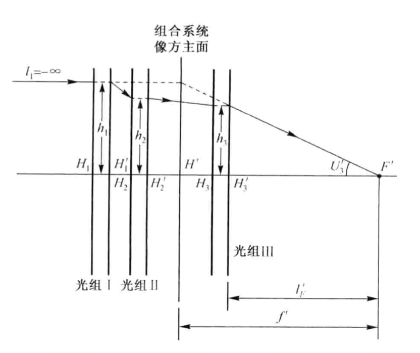

简便起见，假设任意光组的物、像空间都在空气中，此时$f=-f'$。

$$
\frac{1}{l'}-\frac{1}{l}=\frac{1}{f'}
$$

同时乘以高度$h$，可得：

$$
\frac{h}{l'}-\frac{h}{l'}=\tan{U'}-\tan{U}=\frac{h}{f'}
$$

可以得到递推公式：

$$
\begin{split}
\tan U_1&=0\\
\tan U_i'&=\tan U_{i+1}=\tan U_i+\frac{h_i}{f_i'}\\
h_{i+1}&=h_i-d_i\tan U_i'
\end{split}
$$

### 两个光组的组合为例

$$
\begin{split}
\tan U_1&=0\\
\tan U_1'&=\tan U_2=\tan U_1+\frac{h_1}{f_1'}=\frac{h_1}{f_1'}\\
h_2 &=h_1-d_1\tan U_1'=h_1\left(1-\frac{d_1}{f_1'}\right)\\
\tan U_2' &=\tan U_2 + \frac{h_2}{f_2'}=\frac{h_1}{f_1'}+\frac{h_2}{f_2'}=h_1\left(\frac{f_1'+f_2'-d_1}{f_1'f_2'}\right)\\
\end{split}
$$

#### 焦距$f',f$：

$$
f'=\frac{h_1}{\tan U_2'}=\frac{f_1'f_2'}{f_1'+f_2'-d_1}=-\frac{f_1'f_2'}{\Delta}
$$

定义$\Delta=d_1-f_1'+f_2=d_1-f_1'-f_2'$为光学间隔。

$$
f=-f'=\frac{f_1f_2}{\Delta}
$$

#### 光焦度$\Phi$：

$$
\Phi=\frac{1}{f'}=\frac{1}{f_1'}+\frac{1}{f_2'}-\frac{d_1}{f_1'f_2'}=\Phi_1+\Phi_2-d\Phi_1\Phi_2
$$

#### 焦点坐标$l_{F},l_{F'}$：

$$
l_{F'}=\frac{h_2}{\tan U_2'}=\frac{h_2}{h_1}\frac{h_1}{\tan U_2'}=f'\left(1-\frac{d_1}{f_1'}\right)
$$

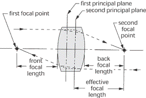

有效焦距(EFL)即$f'$，即主面到焦点的距离；后焦距(BFL)即$l_{F'}$，即最后一个主面到焦点的距离，对于透镜来说，最后一个主点在最后一个折射球面的顶点处。

同理可得：

$$
l_F=f(1+\frac{d_1}{f_2})
$$

#### 主点坐标$l_H,l_{H'}$：

$$
l_H=l_F-f=\frac{f}{f_2}d_1=\frac{f_1d_1}{\Delta}
$$

$$
l_{H'}=l_{F'}-f'=-\frac{f'}{f_1'}d_1=\frac{f_2'd_1}{\Delta}
$$

#### 节点坐标$l_J,l_{J'}$：

当物方和像方空间折射率一致时，主点和节点重合：

$$
l_J=l_H=\frac{f_1d_1}{\Delta}
$$

$$
l_{J'}=l_{H'}=\frac{f_2'd_1}{\Delta}
$$

#### 例子

求由两个光组组成的等效系统的焦距和基点位置。设光组位于空气中，均为薄透镜。数据如下：$f_1'=-f_1=90\ \text{mm},f_2'=-f_2=60\ \text{mm},d=H_1'H_2=50\ \text{mm}$。

[解]

像方焦距：$f'=-\frac{f_1'f_2'}{\Delta}=90\times60/(50-90-60)\ \text{mm}=54\ \text{mm}$

物方焦距：$f=-f'=-54\ \text{mm}$

以第一光组的物方主点$H_1$和第二光组的像方主点$H_2'$作为坐标原点时：

像方焦点：$l_{F'}=f'\left(1-\frac{d}{f_1'}\right)=54\times(1-50/90)\ \text{mm}=24\ \text{mm}$

物方焦点：$l_F=f\left(1+\frac{d}{f_2}\right)=-54\times(1-50/60)=-9\ \text{mm}$

像方基点：$l_{H'}=l_{F'}-f'=24-54\ \text{mm}=-30\ \text{mm}$

物方基点：$l_H=l_{F}-f=-9+54\ \text{mm}=45\ \text{mm}$

以第一光组的物方焦点$F_1$和最后一个光组的像方焦点$F_2'$作为坐标原点时：

像方焦点：$x_{F'}=l_{F'}-f_2'=24-60\ \text{mm}=-36\ \text{mm}$

物方焦点：$x_{F}=l_{F}-f_1=-9+90\ \text{mm}=81\ \text{mm}$

像方基点：$x_{H'}=l_{H'}-f_2'=-30-60\ \text{mm}=-90\ \text{mm}$

物方焦点：$x_{H}=l_{H}-f_1=45+90\ \text{mm}=135\ \text{mm}$

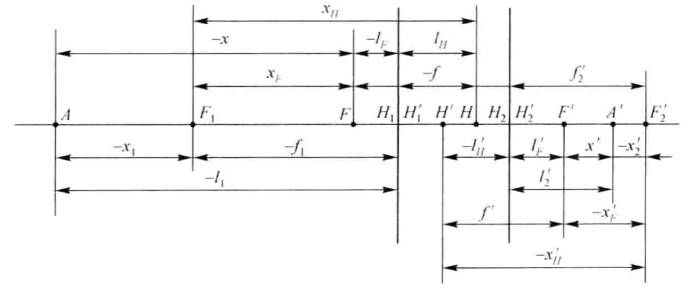

### 多光组中的一些名词

- 光学间隔$\Delta_i=d_i-f_i'+f_{i+1}$
- 筒长：多光组第一面到像面的距离。$L=\sum d_i+l_{F'}$
- 工作距离：多光组最后一面到像面的距离。$l'=l_{F'}$

### 双光组分析透镜

对于透镜，设折射率分别为$n_1=n_2'=1,n_1'=n_2=n$，双光组中各焦距分别为：

$$
f_1=-\frac{r_1}{n-1}, f_1'=\frac{nr_1}{n-1},f_2=\frac{nr_2}{n-1},f_2'=-\frac{r_2}{n-1}
$$

设透镜厚度为$d$，则$\Delta=d-f_1'+f_2=\frac{(n-1)d+n(r_2-r_1)}{n-1}$，可得透镜的焦距：

$$
f'=-\frac{f_1'f_2'}{\Delta}=-\frac{nr_1r_2}{(n-1)[(n-1)d+n(r_2-r_1)]}
$$

对于薄透镜，$d=0$：

$$
f'=\frac{1}{(n-1)\left(\frac{1}{r_1}-\frac{1}{r_2}\right)}
$$

## 典型光学系统

### 双光组的垂轴倍率

$$
\beta=\beta_1\beta_2=\frac{f_1}{x_1}\frac{f_2}{x_2}
$$

又$x_1'-x_2=f_1f_1'/x_1-x_2=\Delta$，可得：

$$
\beta=\frac{f_1f_2}{f_1f_1'-x_1\Delta}
$$

### 望远镜系统

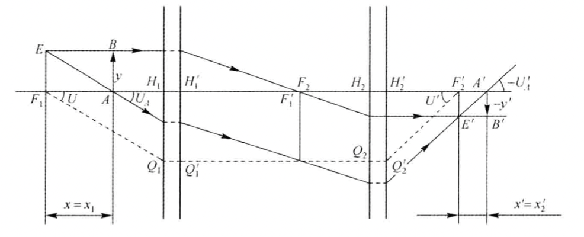

望远镜的光学间隔为0，即$x_1'=x_2$，无穷远的物体经第一光组成像于其一倍焦距外一点点的地方，再经第二光组成像于无穷远处。

- 垂轴倍率：
  
  
  $$
  \beta = \beta_1\beta_2=\frac{x_1'}{f_1'}\frac{f_2}{x_2}=\frac{f_2}{f_1'}
  $$
  
  
- 沿轴倍率：
  
  
  $$
  \alpha = \frac{n'}{n}\beta^2=\frac{f_2f_2'}{f_1f_1'}
  $$
  
  
- 角倍率：
  
  
  $$
  \gamma= \frac{n}{n'}\frac{1}{\beta}=\frac{f_1}{f_2'}
  $$

两种望远镜系统，分别为伽利略式(正+负)和开普勒式(正+正)。

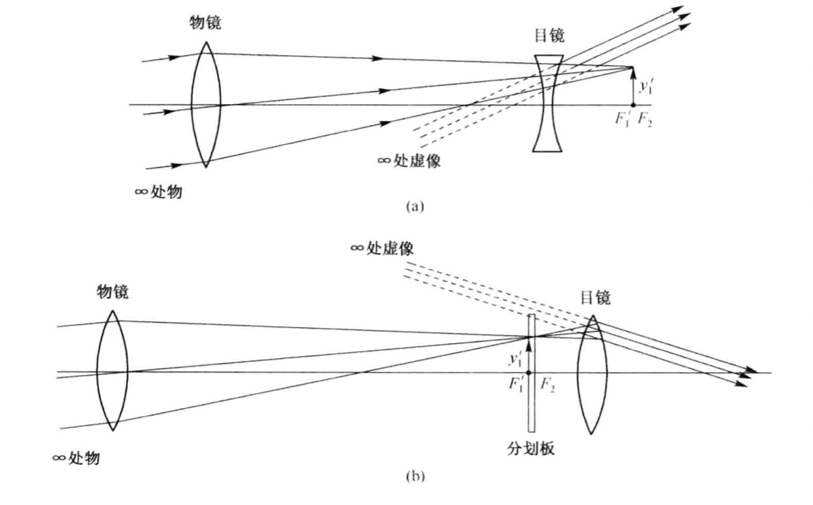

### 显微镜系统

根据双光组的公式：

$$
\beta=\frac{f_1f_2}{f_1f_1'-x_1\Delta}
$$

显微镜的思想是让$f_1f_1'-x_1\Delta\to 0$，这样来获得很高的放大倍率。根据牛顿公式，此时$\Delta \to x_1'$。

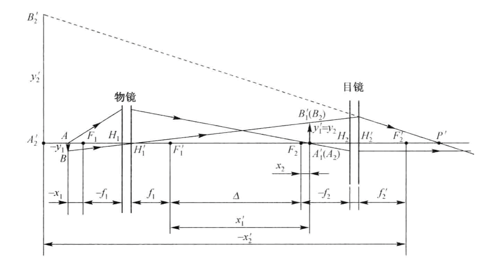

显微镜的成像过程为：物体位于物镜一倍焦距外一点点，经物镜成像于目镜一倍焦距内一点点，经目镜成一虚像。
