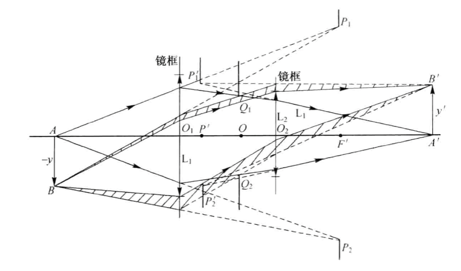
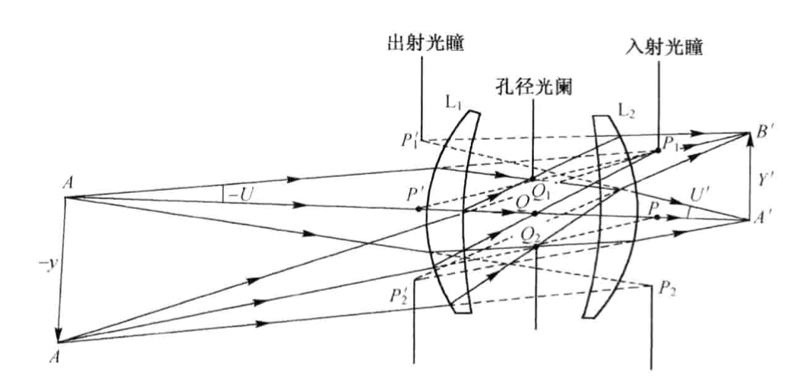
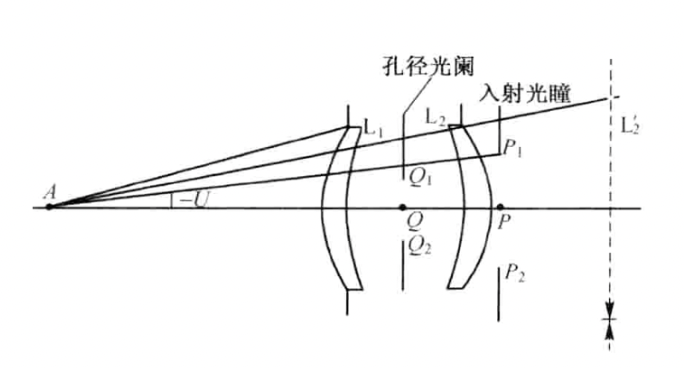
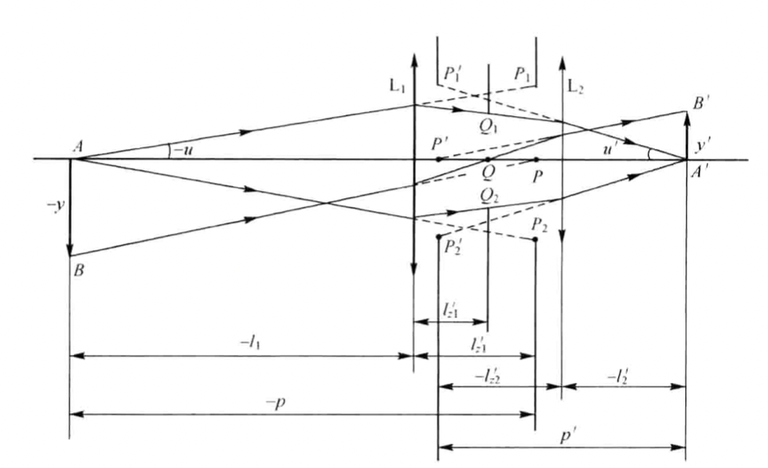
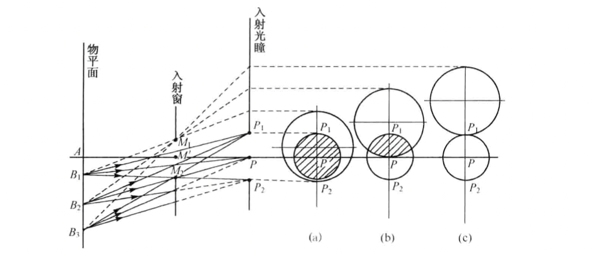
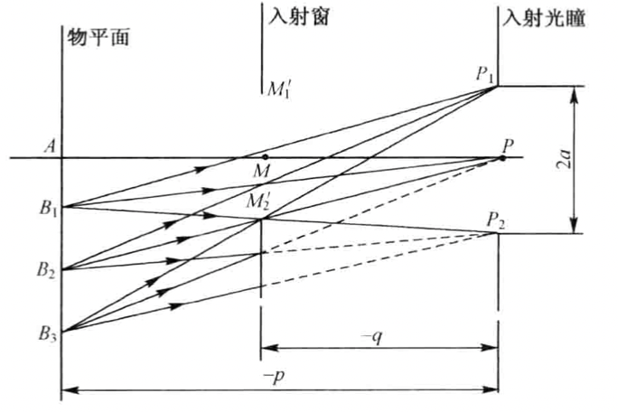
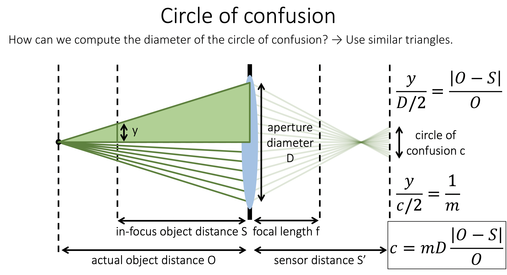

## 光阑的作用

1. 限制孔径角：孔径光阑

2. 限制成像范围：视场光阑

3. 限制渐晕效应：渐晕光阑

   **渐晕：轴上点发出的充满入射光瞳的光线经过光学系统以后，以充满出射光瞳的光束成像，但对于轴外点，充满入射光瞳的光线，其外围在光学系统中被挡掉，不能全部用于成像，使得越离轴的物体成像亮度渐渐变暗，这种现象称为渐晕。**

   

   如上图，L1和L2都可以看作渐晕光阑。

4. 消杂光

   

## 孔径光阑

- 孔径光阑：约束整个光学系统通光大小的光阑

- 入射光瞳：孔径光阑经过起前方整个光学系统成的像称为入射光瞳。这样定义的好处是，方便了解物空间的实际通光区域。

- 出射光瞳：孔径光阑经过起后方整个光学系统成的像称为出射光瞳。出射光瞳与入射光瞳共轭。

- 孔径角：物面中心到入瞳边缘的的光线称为**第一近轴光线**，第一辅助光线与光轴的夹角称为孔径角。物面视场边缘到入瞳中心的光线称为**第二近轴光线**。

  

- **主光线**：通过入瞳中心的光线称为主光线，其也通过孔径光阑和出瞳的中心。主光线是物面上发出的充满光学系统入瞳的光束的轴线。

- 相对孔径：入射光瞳直径$D$和整个系统焦距$f'$的比值称为该系统的**相对孔径**，相对孔径的倒数为**F数**，即：
  
  
  $$
  F=\frac{f'}{D}
  $$
  
  
  F数与孔径角的关系：
  
  根据阿贝正弦条件$ny\sin u=n'y'\sin u'$：
  
  
  $$
  \sin u=\frac{n'}{n}\beta\sin u'=\frac{n'}{n}\beta\frac{\tan u'}{\sqrt{1+\tan^2 u'}}=\frac{n'}{n}\beta\frac{1}{\sqrt{1+4F^2}}
  $$
  
  
  当$U_1$很小且$n_1=1$时：
  
  
  $$
  F=\frac{1}{2\text{NA}}
  $$
  
  
  F数越小，数值孔径越大，艾里斑越小，光学系统的分辨率越高。
  
  一般用F数表示光圈的大小，如f/1.8。光圈开口越大，F数越小，分辨率越高。

## 视场光阑

实际场景中可能的视场一般是大于光学系统要求的视场的，因此需要加入视场光阑来限制视场外较差的成像。

## 渐晕光阑

- 入射窗：渐晕光阑经过前面光学系统成的像称为入射窗。
- 出射窗：渐晕光阑经过前面光学系统成的像称为入射窗。

如上图，在$AB_1$范围内，充满入瞳的光线不会被入射窗遮挡，不产生渐晕；在$B_1B_2$范围内，充满入瞳的光线逐渐被入射窗遮挡，能量从100%下降到50%；在$B_2B_3$范围内，渐晕更加严重，能量从50%下降到0。

**对于孔径光阑和渐晕光阑，可以理解为：孔径光阑限制轴上点的孔径角，而渐晕光阑限制轴外点的孔径角。**

光学系统也可以不产生渐晕，如图由$\Delta B_1B_3M_2'$与$\Delta P_1P_2M_2'$相似可得：

$$
B_1B_3=\frac{2a(q-p)}{q}
$$

若$B_1B_3=0$，则要求$p=q$即入射窗和入射光瞳重合。这有两种可能：一是没有渐晕光阑；二是入瞳和入窗与物平面重合。

## 景深

