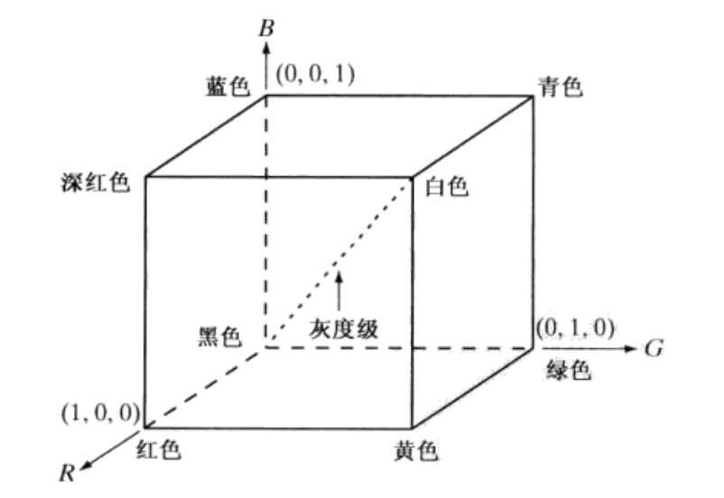

## 概述

1. 颜色可以分为彩色和非彩色。

2. 彩色的三个特征：
   1. 亮度：颜色明亮的程度，与发光强度有关；
   2. 色调：观察者感知到的主导色。
   3. ==饱和度==：颜色接近光谱色的程度，即颜色中彩色的比重。颜色可以看作光谱色和白光的混合。白光占比越低，饱和度越高。
   
   ==色调和饱和度一起称为色度。颜色由亮度和色度表征。==
   
3. 非彩色是指白色、黑色以及两者之间不同程度的灰色。非彩色没有色调、饱和度为零，只有明度的变化。

4. 色光混合：不同色光可以相互混合，混合色光的颜色与原色光不同。

5. 格拉斯曼定律：
   1. 人眼只能分辨颜色在明度、色调和饱和度三个方面的不同；
   2. 两种色光混合，其中一种连续变化，另一种不变，混合的颜色也是连续变化的。
   3. 色调、明度和饱和度相同的颜色产生相同的效果，与其光谱组成无关。
   
6. 三原色：通过三种颜色的混合能够得到所有颜色，这三种颜色称为三原色。红、绿、蓝是一组三原色。三原色不唯一。

## 色度学基础

1. 三刺激值：三原色的比重

2. 色品图：

   $$
   r/g/b=\frac{R/G/B}{R+G+B}
   $$

   则有$r+g+b=1$，以$r,g$为坐标轴，平面内任意点对应一种颜色。

3. CIE-RGB中光谱三刺激值随波长变化曲线

   

   每个波长对应一种颜色，用R、G、B三原色取混合得到各个波长对应的颜色，三原色的权重即为上方曲线。（负值表示无论如何混合都无法达到目标颜色，因此只能将目标颜色和三原色中某一个颜色混合得到新颜色，再通过三原色混合得到该新颜色）

4. CIE-RGB色品图

   

   可以看到，将上面三条曲线放在色品图里，变成了一条

5. CIE-XYZ光谱三刺激值

   

   通过对RGB的线性组合得到XYZ，使得所有刺激值都大于0，这样色品图将会保持在第一象限。X、Z分别表示红色和蓝色的比例，Y表示明度。

6. CIE-XYZ色品图

   x,y分别为r和g。色品图边缘的颜色完全饱和，而内部的点是纯色的混合色。越远离边界，白光成分越多，饱和度越低。==色品图中任意两点连线线段上的颜色，可以由这两点以不同比例混合组成。==

   

## 色彩空间/色彩模型

- RGB：

  RGB模型易于生成颜色。

  RGB是为彩色显示和彩色摄像机开发的模型。RGB模型可以看作一个正方体，R/G/B分别位于三个轴的单位向量处，黑色位于原点，白色位于(1,1,1)，黑白色连线上是灰度。

  

- HSI：

  HSI模型易于解释颜色。

  hue：色度；saturation：饱和度；value：亮度

  

- CMYK、CMY

  补色，用于白纸上的印刷
  $$
  R/G/B=1-C/M/Y
  $$
  譬如打印黑色，即$R=G=B=0$，则此时油墨需要$C=M=Y=1$

- YUV：

  Y：亮度；U、V：色差