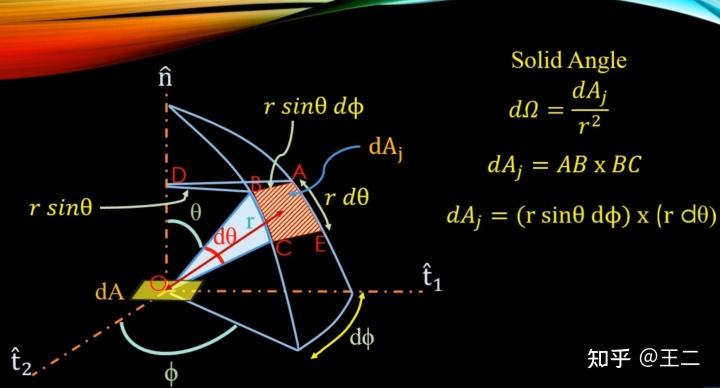
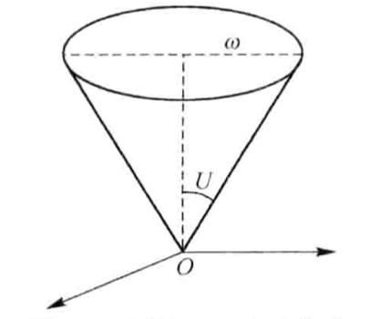
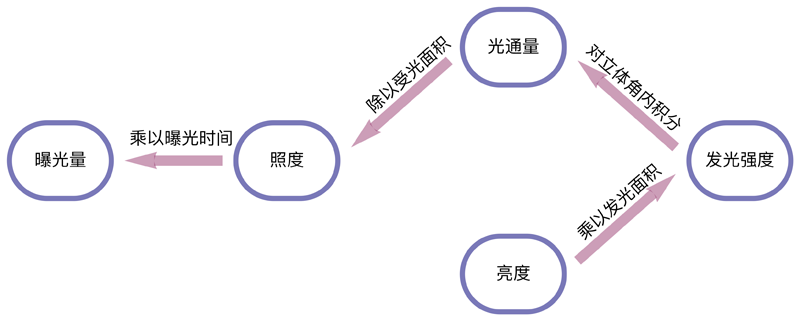
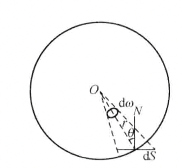
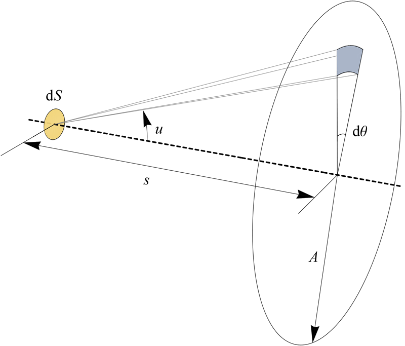

## 立体角

立体角的定义：立体角边界在球面上所截取的面积除以半径的平方：

$$
\text{d} \omega=\frac{\text{d}S}{r^2}
$$

立体角的单位为$\text{sr}$（球面度）。整个球面对应的立体角为$4\pi(\text{sr})$。

如图：

$$
\text{d}S=(r\sin\theta\text{d}\phi)\cdot(r\text{d}\theta)=r^2\sin\theta\text{d}\phi\text{d}\theta
$$

则：

$$
\text{d}\omega = \sin\theta\text{d}\phi\text{d}\theta
$$

成像过程中的孔径角$U$即对应该出的$\theta$，孔径角和立体角的关系为：

$$
\begin{split}
\omega& = \iint\sin\theta\text{d}\phi\text{d}\theta\\
&=\int_0^{2\pi}\text{d}\phi\int_0^{U}\sin\theta\text{d}\theta\\
&=2\pi(1-\cos U)\\
&=4\pi\sin^2\frac{U}{2}\left(\overset{U\to0}{=}\pi U^2\right)
\end{split}
$$

## 光能的定义

- **光通量（$\Phi$）**定义为单位时间内接受到的光功率，单位为瓦特，但在可见光光能问题中，单位通常用流明$(\text{lm})$。

- 光源在不同方向上的光通量不同。若某个立体角$\text{d}\omega$内的光通量为$\text{d}\phi$，则**发光强度**定义为单位立体角内的光通量：
  
  
  $$
  I=\frac{\text{d}\Phi}{\text{d}\omega}
  $$
  
  
  单位为坎德拉(candle, cd)，坎德拉与流明的换算为：$1 \text{lm}=1\text{cd}\cdot\text{sr}$。
  
  与光通量的关系为：
  
  
  $$
  \Phi = \int I\text{d}\omega=\int_0^{\phi_0}\int_0^{\theta_0}I\sin\theta\text{d}\phi\text{d}\theta
  $$
  
- 若照射到某个面元$\text{d}S$上的光通量为$\text{d}\Phi$，则定义**照度**为单位面积上接受的光通量大小：
  
  
  $$
  E=\frac{\text{d}\Phi}{\text{d}S}
  $$
  
  
  假设点光源如下图所示，以每个立体角内发光强度为$I_0$，均匀辐射，则面元$\text{d}S$上接受到的照度为：
  
  
  
  
  $$
  E=\frac{\text{d}\Phi}{\text{d}S}=\frac{\text{d}\Phi}{\text{d}\omega\cdot(r^2/\cos\theta)}=\frac{I_0\cos{\theta}}{r^2}
  $$
  
- 如下图，设某面元$\text{d}S$在与表面法线$N$夹角为$i$方向的立体角$d\omega$内发出的光通量为$\text{d}\Phi_i$，发光强度为$I_i=\text{d}\Phi_i/\text{d}\omega$，定义**光亮度**$L_i$为发光强度$I_i$与面元在辐射方向$i$上的投影面积的比值，即：
  
  
  $$
  L_i=\frac{I_i}{\text{d}S \cos i}
  $$
  
  
  
- 余弦辐射体：指光亮度为常数$L_i=L_0/\text{d}S$的辐射体，则发光强度为：
  
  
  $$
  I_i=L_i\cos i\text{d}S=L_0\cos i
  $$
  
  
  即余弦辐射体在发光强度上呈余弦变化，此时各个方向上的光亮度保持不变。

## F数与照度

假设某面元发光体的光亮度为常数$L_0$（即该光源为余弦辐射体），在镜头平面蓝色区域的光通量为：

$$
\text{d}\Phi=I_u\text{d}\omega = L_0 \text{d}S\cos u \text{d}\omega
$$

整个镜头的光通量为：

$$
\Phi = \int_0^{2\pi}\text{d}\phi\int_0^u L_0\text{d}S\cos u \sin u \text{d}u=\pi L_0\text{d}S\sin^2 U
$$

同理可得镜头到成像面元$\text{d}S'$上的光通量为：

$$
\Phi'=\pi L_0\text{d}S'\sin^2U'
$$

不考虑损耗时：$\Phi=\Phi'$，则面元$\text{d}S'$上的照度为：

$$
E' = \frac{\Phi'}{\text{d}S'}=\frac{\Phi}{\text{d}S'}=\pi L_0\frac{\text{d}S}{\text{d}S'}\sin^2 U=\pi L_0\sin^2 U\frac{y^2}{y'^2}
$$

根据阿贝正弦条件：$ny\sin U = n'y' \sin U'$，假设物像空间折射率相等，得：

$$
\sin U =\frac{y'}{y}\sin U'
$$

代入可得：

$$
E'=\pi L_0\sin^2 U'=\frac{\pi L_0}{4F^2}
$$

即**成像面照度或曝光量与F数的平方成反比。F数中焦距影响接收面元大小、孔径影响通光量，由于是二维孔径、二维成像，所以成平方关系。**