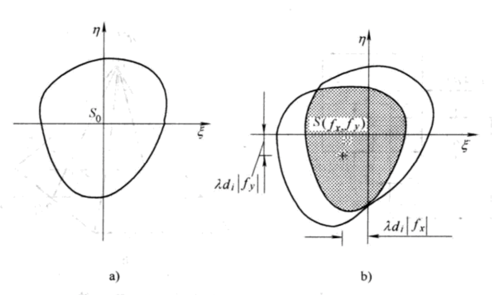

## 透镜的成像性质

在“透镜的傅里叶光学性质”中讨论了物面位于不同位置时，后焦面的光场分布，本节将从成像的角度出发，探讨成像过程中物面和像面的关系。

上图为典型的成像过程。我们将其分解为几个部分：

1. 物面到透镜前表面：$U_0(x,y)\to U_l(\xi,\eta)$

$$
U_l(\xi,\eta)=\frac{e^{jkd_0}}{j\lambda d_0}e^{j\frac{k}{2d_0}(\xi^2+\eta^2)}\iint U_0(x_0,y_0)e^{j\frac{k}{2d_0}(x_0^2+y_0^2)}e^{-j\frac{2\pi}{\lambda d_0}(x_0\xi+y_0\eta)}\ \text{d}x_0\text{d}y_0
$$

2. 透镜前表面到透镜后表面：$U_l(\xi,\eta)\to U_l'(\xi,\eta)$
   $$
   U_l'(\xi,\eta)=U_l(\xi,\eta)t_l(\xi,\eta)
   $$
   其中$t_l(\xi,\eta)$为透镜的复振幅透过率：
   $$
   t_l(\xi,\eta)=P(\xi,\eta)e^{-j\frac{k}{2f}(\xi^2+\eta^2)}
   $$

3. 透镜后表面到像面：$U_l'(\xi,\eta)\to U_i(x_i,y_i)$
   $$
   U_i(x_i,y_i)=\frac{e^{jkd_i}}{j\lambda d_i}e^{j\frac{k}{2d_i}(x_i^2+y_i^2)}\iint U_l'(\xi,\eta)e^{j\frac{k}{2d_i}(\xi^2+\eta^2)}e^{-j\frac{2\pi}{\lambda d_i}(\xi x_i+\eta y_i)}\ \text{d}\xi \text{d}\eta
   $$

汇总上面三个式子可得$U_0(x_0,y_0)\to U_i(x_i,y_i)$的关系：
$$
\begin{split}
U_i(x_i,y_i)=&\frac{e^{jk(d_0+d_i)}}{\lambda^2 d_0d_i}e^{j\frac{k}{2d_i}(x_i^2+y_i^2)}\iiiint U_0(x_0,y_0)P(\xi,\eta)\times\\
&e^{j\frac{k}{2}\left(\frac{1}{d_0}+\frac{1}{d_i}-\frac{1}{f}\right)(\xi^2+\eta^2)}\times\\
&e^{j\frac{k}{2d_0}(x_0^2+y_0^2)}\times\\
&e^{-j\frac{2\pi}{\lambda d_0}(x_0\xi+y_0\eta)}e^{-j\frac{2\pi}{\lambda d_i}(\xi x_i+\eta y_i)}\ \text{d}x_0\text{d}y_0\text{d}\xi\text{d}\eta
\end{split}
$$
对于上式第二行，假设选定物面和像面满足：
$$
\frac{1}{d_0}+\frac{1}{d_i}=\frac{1}{f}
$$
这也是几何光学的要求。则第二行项消去。

对于第三行：假设$(x_0,y_0)$只成像于以$(x_i,y_i)=(\beta x_0,\beta y_0)$为中心的很小区域内，且假设该区域内相位变化不大鱼几分之一弧度，则可做以下近似：
$$
e^{j\frac{k}{2d_0}(x_0^2+y_0^2)}\approx e^{j\frac{k}{2d_0}\frac{x_i^2+y_i^2}{\beta^2}}
$$
其中$\beta=\frac{d_i}{d_0}$。基于以上两个假设，成像关系可写作：
$$
\begin{split}
U_i(x_i,y_i)=&\frac{e^{jk(d_0+d_i)}}{\lambda^2d_0d_i}e^{j\frac{k}{2d_i}\left(1+\frac{d_0}{d_i}\right)(x_i^2+y_i^2)}\times\\
&\iint\left(
\iint U_0(x_0,y_0)e^{-j\frac{2\pi}{\lambda d_0}(x_0\xi+y_0\eta)}\ \text{d}x_0\text{d}y_0
\right)\times\\
&P(\xi,\eta)e^{-j\frac{2\pi}{\lambda d_i}(\xi x_i+\eta y_i)}\text{d}\xi\text{d}\eta
\end{split}
$$
舍去积分外相位因子，对内部项进行积分，可得：
$$
U_i(x_i,y_i)=\frac{1}{\lambda^2 d_0d_i}\iint G_0\left(\frac{\xi}{\lambda d_0},\frac{\eta}{\lambda d_0}\right)P(\xi,\eta)e^{-j\frac{2\pi}{\lambda d_i}(\xi x_i+\eta y_i)}\ \text{d}\xi\text{d}\eta
$$
利用卷积定理：
$$
U_i(x_i,y_i)=\frac{1}{\lambda^2d_0d_i}F\left[G_0\left(\frac{\xi}{\lambda d_0},\frac{\eta}{\lambda d_0}\right)\right]_{f_x=\frac{x_i}{\lambda d_i},f_y=\frac{y_i}{\lambda d_i}}*F[P(\xi,\eta)]_{f_x=\frac{x_i}{\lambda d_i},f_y=\frac{y_i}{\lambda d_i}}
$$
对于前一项：
$$
\begin{split}
F\left[G_0\left(\frac{\xi}{\lambda d_0},\frac{\eta}{\lambda d_0}\right)\right]_{f_x=\frac{x_i}{\lambda d_i},f_y=\frac{y_i}{\lambda d_i}}&=\lambda^2d_0^2 U_0(-\lambda d_0f_x,-\lambda d_0f_y)_{f_x=\frac{x_i}{\lambda d_i},f_y=\frac{y_i}{\lambda d_i}}\\
&=\lambda^2d_0^2 U_0\left(-\frac{x_i}{\beta},-\frac{y_i}{\beta}\right)
\end{split}
$$
代入可得：
$$
U_i(x_i,y_i)=\frac{1}{\beta}U_0\left(-\frac{x_i}{\beta},-\frac{y_i}{\beta}\right)*\widetilde{h}(x_i,y_i)
$$
其中：
$$
\widetilde{h}(x_i,y_i)=F[P(\xi,\eta)]_{f_x=\frac{x_i}{\lambda d_i},f_y=\frac{y_i}{\lambda d_i}}
$$
**$h(x_i,y_i)=\frac{1}{\beta}\widetilde{h}(x_i,y_i)$即==系统的脉冲响应函数==。物体经过透镜成像的过程可以看作两步：一是通过几何光学得到理想成像；二是理想成像与脉冲响应函数的卷积，得到实际成像，脉冲响应由光瞳函数的傅里叶变换决定。透镜成像是一个空不变的线性系统。**上式也表明，即使能完全按照几何光学成像无像差，像也不会与物体完全相同。

## 成像系统的一般分析

一般成像系统可以看作三个部分：

1. 物面到入瞳：可以通过标量衍射分析
2. 入瞳到出瞳：由透镜组合而成，可以看作一个线性系统
3. 出瞳到像面：通过标量衍射分析

入瞳到出瞳的系统可以看作一个黑箱，只要知道成像系统三个部分组成的整体的脉冲响应函数，就能完成成像过程的分析。这个系统可以分为两个大类：**衍射受限系统和有像差系统**。**衍射受限系统是指没有像差成像，即入瞳的发散球面波被转化成出瞳处的会聚球面波。**

### 相干光和非相干光照明的衍射受限系统

上一节提到的透镜即衍射受限系统，下面分析不知道具体结构的衍射受限光学系统的成像特性。

考虑位于$(x_0,y_0)$的点光源$\delta(x_0,y_0)$发出的球面波，经过成像系统后，会聚到像面上$(x_i,y_i)=(\beta x_0,\beta y_0)$的位置。根据衍射受限系统无像差的特性，出瞳处的复振幅为一被出瞳大小调制的会聚球面波，经过傍轴近似可以写成：
$$
U(\xi,\eta)=C'P(\xi,\eta)e^{-j\frac{k}{2d_i}[(\xi-\beta x_0)^2+(\eta-\beta y_0)^2]} \label{14}
$$
$C'$为一复数常数，$P(\xi,\eta)$为出瞳函数。

由于光源为点光源，则**像面上的图案为脉冲响应函数**，可由菲涅尔公式得到：
$$
h(x_0,y_0;x_i,y_i)=\frac{e^{jkd_i}}{j\lambda d_i}e^{j\frac{k}{2d_i}(x_i^2+y_i^2)}\iint U(\xi,
\eta)e^{j\frac{k}{2d_i}(\xi^2+\eta^2)}e^{-j\frac{2\pi}{\lambda d_i}(x_i\xi+y_i\eta)}\ \text{d}\xi\text{d}\eta \label{15}
$$
将$\eqref{15}$代入$\eqref{14}$可得：
$$
\begin{split}
h(x_0,y_0;x_i,y_i)=&C'\frac{e^{jkd_i}}{j\lambda d_i}e^{j\frac{k}{2d_i}(x_i^2+y_i^2)}\times\\
&\iint P(\xi,\eta)e^{-j\frac{k}{2d_i}[(\xi-\beta x_0)^2+(\eta-\beta y_0)^2]} e^{j\frac{k}{2d_i}(\xi^2+\eta^2)}e^{-j\frac{2\pi}{\lambda d_i}(x_i\xi+y_i\eta)}\ \text{d}\xi\text{d}\eta\\
=&C'\frac{e^{jkd_i}}{j\lambda d_i}e^{j\frac{k}{2d_i}(x_i^2+y_i^2)}e^{-j\frac{k}{2d_i}\beta^2( x_0^2+y_0^2)}\times \\
&\iint P(\xi,\eta)e^{-j\frac{2\pi}{\lambda d_i}[\xi(x_i-\beta x_0)+\eta(y_i-\beta y_0)]}\ \text{d}\xi\text{d}\eta
\end{split}
$$
舍去积分外相位因子，将复数常数合并为$C$，令$\widetilde{x_0}=\beta x_0,\widetilde{y_0}=\beta y_0$，可得：
$$
h(\widetilde{x_0},\widetilde{y_0};x_i,y_i)=C\iint P(\xi,\eta)e^{-j\frac{2\pi}{\lambda d_i}[\xi(x_i-\beta x_0)+\eta(y_i-\beta y_0)]}\ \text{d}\xi\text{d}\eta
$$
==该式表示点光源$(x_0,y_0)$在像面上的图案(脉冲响应)是以$(\beta x_0,\beta y_0)$为中心的出瞳函数傅里叶变换。==

当输入为复杂图案$U(x_0,y_0)$时，可分为两种情况：

1. 光源为空间相干光。此时系统为对复振幅的线性系统。
2. 光源为空间非相干光。此时系统为对光强的线性系统。

对空间相干光：
$$
\begin{split}
U_i(x_i,y_i)&=\iint U_0(x_0,y_0)h(\widetilde{x_0},\widetilde{y_0};x_i,y_i)\ \text{d}x_0\text{d}y_0\\
&=\iint \frac{1}{\beta^2}U_0\left(\frac{\widetilde{x_0}}{\beta},\frac{\widetilde{y_0}}{\beta}\right)h(\widetilde{x_0},\widetilde{y_0};x_i,y_i)\ \text{d}\widetilde{x_0}\text{d}\widetilde{y_0}
\end{split}
$$
令$\widetilde{h}=\cfrac{1}{\beta}h$，并定义理想光学像：
$$
U_g(x_i,y_i)=\cfrac{1}{\beta}U_0\left(\cfrac{x_i}{\beta},\cfrac{y_i}{\beta}\right)
$$
则像可写成：
$$
\begin{split}
U_i(x_i,y_i)&=\iint U_g(\widetilde{x_0},\widetilde{y_0})\widetilde{h}(\widetilde{x_0},\widetilde{y_0};x_i,y_i)\ \text{d}\widetilde{x_0}\text{d}\widetilde{y_0}\\
&=\iint U_g(\widetilde{x_0},\widetilde{y_0})\widetilde{h}(x_i-\widetilde{x_0},y_i-\widetilde{y_0})\ \text{d}\widetilde{x_0}\text{d}\widetilde{y_0}\\
&=U_g(x_i,y_i)*\widetilde{h}(x_i,y_i)
\end{split}
$$
其中卷积核：
$$
\widetilde{h}(x_i,y_i)=F[P(\xi,\eta)]_{f_x=\frac{x_i}{\lambda d_i},f_y=\frac{y_i}{\lambda d_i}} \label{21}
$$
==即衍射受限系统仍是空不变的线性系统。像面的复振幅是几何光学理想像与出瞳所确定的脉冲响应函数的卷积。==

对于空间非相干光，衍射受限系统是光强的线性系统。光强的脉冲响应函数为：
$$
h_I(\widetilde{x_0},\widetilde{y_0};x_i,y_i)=|h(\widetilde{x_0},\widetilde{y_0};x_i,y_i)|^2=|F[P(\xi,\eta)]|^2_{f_x=\frac{x_i}{\lambda d_i},f_y=\frac{y_i}{\lambda d_i}}
$$
此时成像为光强的叠加：
$$
I_i(x_i,y_i)=I_g(x_i,y_i)*h_I(x_i,y_i) \label{23}
$$
==称$h_I(x_i,y_i)$为点扩散函数(PSF)。==

#### 相干光衍射受限系统的频率响应

对(20)式使用卷积定理可得：
$$
G_i(f_x,f_y)=G_g(f_x,f_y)H_c(f_x,f_y)
$$
其中：$G_i(f_x,f_y)=F[U_i(x_i,y_i)],G_g(f_x,f_y)=F[U_g(x_i,y_i)]$分别为物体及其理想像的频谱。

==称$H_c(f_x,f_y)=F[\widetilde{h}(x_i,y_i)]$，即相干光的脉冲响应函数为相干传递函数(CTF)==，它表示相干光照明下衍射受限系统对物体频谱的调制。根据$\eqref{21}$式可得：
$$
\begin{split}
H_c(f_x,f_y)&=\iint\widetilde{h}(x_i,y_i)e^{-j2\pi (f_xx_i+f_yy_i)}\ \text{d}x_i\text{d}y_i\\
&=\cfrac{C}{\beta}\iiiint P(\xi,\eta)e^{-j\frac{2\pi}{\lambda d_i}(\xi x_i+\eta y_i)}e^{-j2\pi (f_xx_i+f_yy_i)}\ \text{d}\xi\text{d}\eta\text{d}x_i\text{d}y_i\\
&=\cfrac{C}{\beta}\iint P(\xi,\eta)\left(\iint e^{-j2\pi [x_i(f_x+\frac{\xi}{\lambda d_i})+y_i(f_y+\frac{\eta}{\lambda d_i})]}\ \text{d}x_i\text{d}y_i\right)\ \text{d}\xi\text{d}\eta\\
&=\cfrac{C}{\beta}\iint P(\xi,\eta)\delta\left(f_x+\frac{\xi}{\lambda d_i},f_y+\frac{\eta}{\lambda d_i}\right)\ \text{d}\xi\text{d}\eta\\
&=\frac{\lambda^2d_i^2C}{\beta}\iint P(\xi,\eta)\delta(\xi+\lambda d_if_x,\eta+\lambda d_if_y)\ \text{d}\xi\text{d}\eta\\
&=\frac{\lambda^2d_i^2C}{\beta}P(-\lambda d_if_x,-\lambda d_if_y)\\
&\propto P(-\lambda d_if_x,-\lambda d_if_y)
\end{split}
$$
略去常复数因子，可知：==相干光照明下，衍射受限系统的相干传递函数正比于出瞳函数的翻转。==

若出瞳的孔径为$D$，则：
$$
P(\xi)=\left\{
\begin{split}
1,\ &-\frac{D}{2}<x<\frac{D}{2}\\
0,\ &x>\left|\frac{D}{2}\right|
\end{split}
\right.
$$
则此时相干传递函数为：
$$
\begin{split}
H(f_x)=P(-\lambda d_i f_x)&=\left\{
\begin{split}
1,\ &-\frac{D}{2}<-\lambda d_if_x<\frac{D}{2}\\
0,\ &-\lambda d_if_x>\left|\frac{D}{2}\right|
\end{split}
\right.\\
&=\left\{
\begin{split}
1,\ &-\frac{D}{2\lambda d_i}<f_x<\frac{D}{2\lambda d_i}\\
0,\ &f_x>\left|\frac{D}{2\lambda d_i}\right|
\end{split}
\right.\\
\end{split}
$$
截止频率为$\cfrac{D}{2\lambda d_i}$。从角谱法的角度来说，孔径角被限制在一定角度导致空间频率高的信息无法被传输。

#### 非相干光照明衍射受限系统的频率响应

对$\eqref{23}$式使用卷积定理可得：
$$
A_i(f_x,f_y)=A_g(f_x,f_y)H_o(f_x,f_y)
$$
对于零频率分量有：
$$
A_i(0,0)=A_g(0,0)H_o(0,0)
$$
上面两式相除作归一化可得：
$$
\mathcal{A}_i(f_x,f_y)=\mathcal{A}_g(f_x,f_y)\mathcal{H}_o(f_x,f_y)
$$
==称$\mathcal{H}_o(f_x,f_y)=\cfrac{H_o(f_x,f_y)}{H_o(0,0)}$为非相干光照明下衍射受限系统的光学传递函数(OTF)==。

将$\mathcal{H_o}(f_x,f_y)$展开为复指数形式：
$$
\mathcal{H_o}(f_x,f_y)=m(f_x,f_y)e^{j\phi(f_x,f_y)}
$$
==称$m(f_x,f_y)=|\mathcal{H}_o|=\left|\cfrac{H_o}{H_o(0,0)}\right|=\left|\cfrac{\mathcal{A_i}}{\mathcal{A_g}}\right|$为调制传递函数(MTF)；称$\phi(f_x,f_y)$为相位调制函数(PTF)。==

由于强度余弦函数是非相干光照明衍射受限系统的本征函数，MTF决定了强度余弦函数的振幅响应；PTF决定了相位移动。

#### CTF和OTF的关系

$$
\mathcal{H}_o(f_x,f_y)=\frac{H_o(f_x,f_y)}{H_o(0,0)}=\frac{F[|\widetilde{h}(x_i,y_i)|^2]}{\iint |\widetilde{h}(x_i,y_i)|^2\ \text{d}x_i\text{d}y_i}=\frac{H_c(f_x,f_y)\star H_c(f_x,f_y)}{\iint |H_c(f_x,f_y)|^2\ \text{d}f_x\text{d}f_y}
$$

==即光学传递函数是相干传递函数的归一化自相关函数。==由于只用到了$h_I=|\widetilde{h}|^2$，故对衍射受限系统和有像差系统均适用。

利用$H_c(f_x,f_y)\propto P(-\lambda d_if_x,-\lambda d_if_y)$可得OTF和出瞳函数的关系：
$$
\mathcal{H}_o(f_x,f_y)=\frac{P(-\lambda d_if_x,-\lambda d_if_y)\star P(-\lambda d_if_x,-\lambda d_if_y)}{\iint|P(\xi,\eta)|^2\ \text{d}\xi\text{d}\eta}
$$
==OTF是出瞳函数的归一化自相关函数。当$P(\xi,\eta)$为正的振幅调制时，$\mathcal{H}_o$为正的实函数，此时MTF等于OTF。所以用MTF即可表示OTF。==

当出瞳函数为$0\ \text{or}\ 1$函数时，分析上式：
$$
\mathcal{H}_o=\frac{\iint P(\xi-\lambda d_if_x,\eta-\lambda d_if_y)P(\xi,\eta)\ \text{d}\xi\text{d}\eta}{\iint|P(\xi,\eta)|^2\ \text{d}\xi\text{d}\eta}=\frac{S(\lambda d_if_x,\lambda d_if_y)}{S_0}
$$

可知：对应透镜系统，总有出瞳函数为$0\ \text{or}\ 1$函数，此时零频率的MTF等于1，其他频率的MTF均小于1，且逐渐减小。==另外，假设孔径为$D$，非相干光照明的截止频率为$\lambda d_i f_o=D$，是相干光照明截止频率的两倍。==

#### **==衍射受限系统总结==**

- 振幅脉冲响应函数：光瞳函数的傅里叶变换（夫琅和费衍射图案）
  $$
  \widetilde{h}(x_i,y_i)=F[P(\xi,\eta)]_{f_x=\frac{x_i}{\lambda d_i},f_y=\frac{y_i}{\lambda d_i}}
  $$

- 强度脉冲响应函数、点扩散函数：光瞳函数的傅里叶变换的模方
  $$
  h_I(x_i,y_i)=\widetilde{h}^2(x_i,y_i)
  $$

- 相干传递函数：振幅脉冲想用函数的傅里叶变换；光瞳函数
  $$
  H_c(f_x,f_y)=P(-\lambda d_if_x,-\lambda d_if_y)
  $$

- 光学传递函数：强度脉冲响应函数/点扩散函数的傅里叶变换；光瞳函数的归一化自相关函数
  $$
  \mathcal{H}_o(f_x,f_y)=\frac{P(-\lambda d_if_x,-\lambda d_if_y)\star P(-\lambda d_if_x,-\lambda d_if_y)}{\iint|P(\xi,\eta)|^2\ \text{d}\xi\text{d}\eta}
  $$

- 调制传递函数、相位传递函数：光学传递函数的模、相位

- 相干成像：时域：振幅空谱与振幅脉冲响应函数的卷积；频域：振幅频谱与相干传递函数的乘积

- 非相干成像：时域：光强空谱与点扩散函数的卷积；频域：光强频谱与光学传递函数的乘积（对于透镜组等$0\ \text{or}\ 1$系统，光学传递函数等于调制传递函数）

### 有像差系统

由于成像系统存在像差，导致出瞳平面不是球面波，而是附加一个像差，这个像差称为**波像差**，定义为
$$
P'(\xi,\eta)=e^{jkW(\xi,\eta)}
$$
此时出瞳平面的复振幅为：
$$
U(\xi,\eta)=C'e^{-j\frac{k}{2d_i}[(\xi-\beta x_0)^2+(\eta-\beta y_0)^2]}\times P(\xi,\eta)\times P'(\xi,\eta)
$$
定义**广义光瞳函数**：
$$
\mathbf{P}(\xi,\eta)=P(\xi,\eta)P'(\xi,\eta)=P(\xi,\eta)e^{jkW(\xi,\eta)}
$$
有像差系统的脉冲响应、相干光照明、非相干光照明分析，只需在衍射受限系统上，将光瞳函数变为广义光瞳函数即可。

### 关于瑞丽判据

瑞丽判据适用于非相干光照明，对于相干光照明，还需要考虑相邻两点之间的相位差。当同相位时，两点完全不可分辨；相位差为$\pi$时，两点完全可分辨；相位差为$\cfrac{\pi}{2}$时，与非相干光照明一致。

