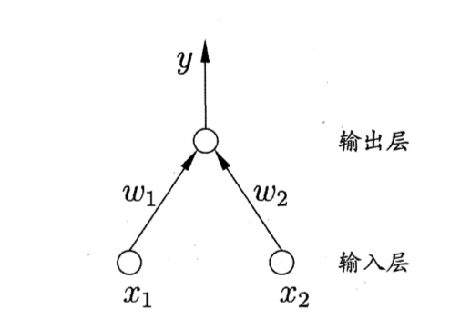

## 单层感知机模型

单层感知机只有一个输入层和一个输出层。其输出为：
$$
y=f(\pmb{w}^T\pmb{x}-\theta)
$$
其中$\pmb{w},\pmb{x}\in\mathbb{R}^d$。$f(\cdot)$常为符号函数$\text{sign}(\cdot)$，即：
$$
y=\left\{
\begin{split}
1,\ &\pmb{w}^T\pmb{x}-\theta\ge0\\
0,\ &\pmb{w}^T\pmb{x}-\theta<0
\end{split}
\right.
$$
从几何的角度，感知机可以理解为：**用一个$d$维超平面去分割空间，位于超平面之上的为1，反之为0。**

因此感知机的损失函数可以定义为：**所有误分类点到超平面距离之和**。

---

点到平面的距离为：
$$
d(\pmb{x}_0)=\cfrac{|\pmb{w}^T\pmb{x}-\theta|}{||\pmb{w}||_2^2}
$$

---

误分类点越少、误分类点到超平面距离越近，损失函数就越小。有两种误分类情况：

1. 标签$y$为1，预测$\hat{y}$为0，此时$\pmb{w}^T\pmb{x}-\theta<0$
2. 标签$y$为0，预测$\hat{y}$为1。此时$\pmb{w}^T\pmb{x}-\theta\ge0$

假设有$m$个误分类样本，两种情况下误分类点到超平面距离之和可以统一为：
$$
L(\pmb{w},\theta)=\sum_{i=1}^m (\hat{y}-y)\cfrac{\pmb{w}^T\pmb{x}_i-\theta}{||\pmb{w}||_2^2}
$$
不考虑$||\pmb{w}||_2^2$，可写成：
$$
L(\pmb{w},\theta)=\sum_{i=1}^m (\hat{y}-y)(\pmb{w}^T\pmb{x}_i-\theta)
$$
令$\theta$为一个哑神经元节点的权重，即该神经元的输入恒为$-1$，权重为$\theta$。令$\hat{\pmb{w}}=[\pmb{w};\theta],\hat{\pmb{x}}=[\pmb{x};-1]$，上式可简化为：
$$
L(\hat{\pmb{w}})=\sum_{i=1}^m (\hat{y}-y)\hat{\pmb{w}}^T\hat{\pmb{x}_i}
$$
对$\hat{\pmb{w}}$求导可得：
$$
\cfrac{\part L}{\part \hat{\pmb{w}}}=\sum_{i=1}^m(\hat{y}-y)\hat{\pmb{x}}_i
$$
==感知机采用随机梯度下降(SGD)==，即随机选取一个样本的负梯度方向作为下降方向。则权重的更新为：
$$
\pmb{w}\gets\pmb{w}-\eta(\hat{y}-y)\hat{\pmb{x}_i}
$$

---

**PS：**

1. 随机梯度下降：损失函数为标准BP，即以一个样本损失函数的负梯度方向作为下降方向。
2. 梯度下降：损失函数为累积BP，即以所有样本损失函数之和作为新的损失函数，以该损失函数的负梯度方向作为下降方向。
3. mini-batch随机梯度下降：损失函数为累积BP，以一个小批次的损失函数之和作为新的损失函数，以该损失函数的负梯度方向作为下降方向。神经网络的训练通常采用此种方式。

## 多层感知机

先总结一下从线性回归到多层感知机的“进化历程”：

1. 线性回归：单层神经网络（多输入、单一输出），无激活函数 —— 回归
2. softmax回归：单层神经网络（多输入、多输出），有激活函数 —— 分类
3. 单层感知机：单层神经网络（多输入、单一输出），有激活函数 —— 二分类
4. 多层感知机：双层神经网络（多输入、多输出，单隐藏层），有激活函数 —— 多分类

多层感知机已经可以算是有深度的神经网络了。其结构如下图所示：

## 神经网络的一些概念

- 训练误差与泛化误差：训练误差是指模型在训练集上得到的误差；泛化误差是指模型在从原始样本分布中抽取无限多数据样本时得到的误差。
- 独立同步假设：假设训练集和测试集的数据样本都是从相同的分布中独立提取的。
- 模型选择与验证集：从几个候选模型或超参中选择最佳的模型，称为模型选择。为了选择模型，将不同模型应用在验证集的数据样本上计算准确率或损失函数，来选取最佳模型。
- K折交叉验证：将数据集分成K个不重叠的子集，每次选择其中一个子集作为验证集，其他子集的并集作为训练集。每个模型进行K次训练和验证，K次验证集上的平均值作为该模型的结果。

### 过拟合的几种解决方法

1. 早停

2. 权重衰减(weight decay)

   参考[这篇文章](https://www.cnblogs.com/zingp/p/10375691.html)

   权重衰减即$L_2$正则化，实现方式是在损失函数中添加$\lambda ||\pmb{w}||_2^2$来作为惩罚，使得模型的权重平方和较小，提升模型的抗干扰能力(因为权重都很小，特征的值波动较大时，会被小权重衰减掉)。可以看出：权重衰减等价于带约束条件的优化问题。$L_2$正则化适用于大量特征的权重分布比较均匀的问题里。

   除此之外，还有$L_1$正则化，这样做会使得权重集中在某些特征上，而其他特征归零。$L_1$正则化适用于特征比较稀疏的情况。

3. 暂退法(dropout)

   在训练的过程中，随机将一些节点的激活值归零，并让该层的数学期望保持不变，即：
   $$
   h'=\left\{\begin{split}
   &0,&概率为p\\
   &\cfrac{h}{1-p},&其他情况
   \end{split}
   \right.
   $$
   每个点都有$p$的概率被dropout，因此整体的数学期望保持不变。

### 训练参数的初始化

==不要将所有权重初始化为0或者相同的值==，若初始化为相同的值，则对于任意输入，下一层神经元的激活值都会相等，导致下一层权重的梯度相等、更新后的值相等。

