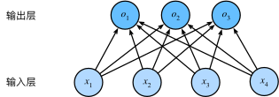

# softmax回归

[toc]

## 问题

softmax回归名为回归，但实际解决的是分类问题。在分类问题中，有两种分类方式：

1. 硬性分类：即输出为所属类别的编号
2. 软性分类：即输出为属于每个类别的概率，概率最大者为其类别

对于有序类别，如$\{婴儿，儿童，\cdots，老年人\}$，这种问题可以转变成回归问题，每个样本的输出只有一个特征。对于无序类别，可以采用独热编码的方式，如三个类别可以表示为：
$$
y=\{(1,0,0),(0,1,0),(0,0,1)\}
$$

## softmax函数

预测输出具有三个分量，分别表示属于三个类别的概率。

此时，输出可以表示为：
$$
\textbf{O}=\textbf{XW}+\pmb{b}
$$
若有$n$个样本，每个样本有$d$个特征，有$q$个分类类别，则

1. $\textbf{X}\in\mathbb{R}^{n\times d}$：$\textbf{X}$的每一行表示一个样本，$\textbf{X}_{ij}$表示第$i$个样本的第$j$个特征的值
2. $\textbf{W}\in\mathbb{R}^{d\times q}$：$\textbf{W}_{ij}$表示第$i$个特征对分类为第$j$个类别的贡献
3. $\pmb{b}\in\mathbb{R}^{1\times q}$：表示对每个类别的偏爱，$+\pmb{b}$项会使用广播机制
4. $\textbf{O}\in\mathbb{R}^{n\times q}$：$\textbf{O}_{ij}$表示第$i$个样本属于第$j$个类别的可信度-\sum_{i=1}^q y_i\log{

在问题描述中，标签表示概率，而对于全连接层的输出$\textbf{O}$是可正可负的，且没有使一个样本的输出加起来为1，因此不能表示概率。为了解决这个问题，可以使用==softmax函数将任意数值的$\textbf{O}$映射为分类概率==，softmax函数定义为：
$$
\text{softmax}(\pmb{x})_i=\cfrac{e^{x_i}}{\sum_{k}e^{x_k}}
$$
因此预测分类概率为：
$$
\hat{\textbf{Y}}=\text{softmax}(\textbf{O})
$$
其中softmax是按行执行的(因为每一行代表一个样本，而不同样本之间没必要进行softmax)。$\textbf{Y}\in\mathbb{R}^{n\times q}$，$\textbf{Y}_{ij}$表示第$i$个样本属于第$j$个类别的概率。

## 交叉熵损失

对于一个样本，其交叉熵损失(cross-entropy loss)为：
$$
l(\hat{\pmb{y}},\pmb{y})=-\sum_{i=1}^q y_i\log{\hat{y}_i}
$$
由于$\pmb{y}$是独热编码，因此交叉熵只会保留分类正确的概率，即==交叉熵表示分类正确概率的负对数==，完全正确时为0，完全错误是为$-\infty$。代入经过softmax处理后的数据可得：
$$
\begin{split}
l(\hat{\pmb{y}},\pmb{y})&=-\sum_{i=1}^q y_i\log{\hat{y}_i}\\
&=-\sum_{i=1}^q y_i\log{\frac{e^{o_i}}{\sum_{k=1}^qe^{o_k}}}\\
&=\sum_{i=1}^qy_i\log{\sum_{k=1}^qe^{o_k}}-\sum_{i=1}^qy_io_i\\
&=\log\sum_{k=1}^qe^{o_k}-\sum_{i=1}^qy_io_i
\end{split}
$$
其导数为：
$$
\part_{o_i}l(\hat{\pmb{y}},\pmb{y})=\cfrac{e^{o_i}}{\sum_{k=1}^qe^{o_k}}-y_i=\text{softmax}(\hat{\pmb{y}})_i-\pmb{y}_i
$$

