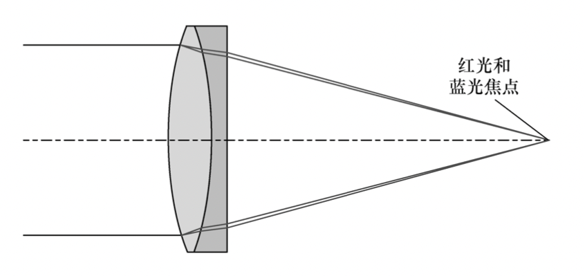
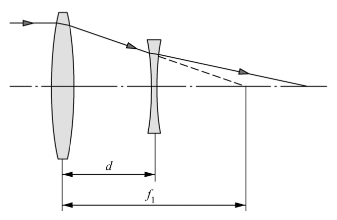

# 色差

[toc]

## 折射率-波长关系拟合公式

对于玻璃来说，在可见光波段，波长越长，折射率一般越低

- 柯西色散公式：
  $$
  n=A_0+\cfrac{A_1}{\lambda^2}+\cfrac{A_2}{\lambda^4}
  $$

- 塞尔迈耶尔方程：
  $$
  n^2=1+\cfrac{B_1\lambda^2}{\lambda^2-C_1}+\cfrac{B_2\lambda^2}{\lambda^2-C_2}+\cfrac{B_3\lambda^2}{\lambda^2-C_3}
  $$
  

## 近轴位置色差

### 单折射球面的近轴位置色差

设红光和蓝光在物空间折射率分别为$n_C,n_F$，在像空间的折射率分别为$n_C',n_F'$。根据高斯公式可得：
$$
\cfrac{n_C'}{l_C'}-\cfrac{n_C}{l_C}=\cfrac{n_C'-n_C}{r}
$$

$$
\cfrac{n_F'}{l_F'}-\cfrac{n_F}{l_F}=\cfrac{n_F'-n_F}{r}
$$

两式相减可得：
$$
\left(
\cfrac{n_C'}{l_C'}-\cfrac{n_F'}{l_F'}
\right)
-\left(\cfrac{n_C}{l_C}-\cfrac{n_F}{l_F}
\right)=\cfrac{(n_C'-n_F')-(n_C-n_F)}{r}
\label{5}
$$
令
$$
\Delta n=n_F-n_C
$$

$$
\Delta n'=n_F'-n_C'
$$

代入$\eqref{5}$式消去$n_F',n_F$可得：
$$
\begin{split}
\left(
\cfrac{n_C'}{l_C'}-\cfrac{n_C'+\Delta n'}{l_F'}
\right)
-\left(\cfrac{n_C}{l_C}-\cfrac{n_C+\Delta n}{l_F}
\right)&=\cfrac{\Delta n-\Delta n'}{r}\\
\cfrac{n_C'(l_F'-l_C')}{l_C'l_F'}-\cfrac{n_C(l_F-l_C)}{l_Cl_F}&=\Delta n
\left(\cfrac{1}{r}-\cfrac{1}{l_F}
\right)-\Delta n'
\left(\cfrac{1}{r}-\cfrac{1}{l_F'}
\right)
\end{split}
$$
由于$l_C\approx l_F\approx l,l_C'\approx l_F'\approx l'$，代入上式可得：
$$
\cfrac{n_C'(l_F'-l_C')}{l'^2}-\cfrac{n_C(l_F-l_C)}{l^2}=\Delta n
\left(\cfrac{1}{r}-\cfrac{1}{l}
\right)-\Delta n'
\left(\cfrac{1}{r}-\cfrac{1}{l'}
\right)
\label{9}
$$
根据$h=ul=u'l'$，在上式两边同时乘以$h^2$，并令$AchrL=l_F'-l_C'$，$AchrL_{-1}=l_F-l_C$可得(以红光折射率作为标准折射率)：
$$
(9)式左边\times h^2=n'u'^2AchrL-nu^2AchrL_{-1}\label{10}
$$

---

再看$\eqref{9}$式右侧，先推导折射角公式：

在$\triangle ACE$中：
$$
\cfrac{\sin I}{r-L}=\cfrac{\sin(-U)}{r}
$$
取傍轴近似可得：
$$
i=\cfrac{u(l-r)}{r}=h\cfrac{l-r}{lr}=h\left(\cfrac{1}{r}-\cfrac{1}{l}\right)
\label{12}
$$
同理可得：
$$
i'=h\left(\cfrac{1}{r}-\cfrac{1}{l'}\right)=\cfrac{n}{n'}i
\label{13}
$$

---

将$\eqref{12}\eqref{13}$代入$\eqref{9}$式右侧，并联合$\eqref{10}$可得：
$$
n'u'^2AchrL-nu^2AchrL_{-1}=hni\left(\cfrac{\Delta n}{n}-\cfrac{\Delta n'}{n'}\right)
$$
==该公式即为单折射球面的初级轴向色差公式。==将其应用于$k$个折射面并累加可得，前$k$个折射面的色差：
$$
AchrL_k=\cfrac{n_1u_1^2}{n_k'^2u_k'^2}AchrL_0+\cfrac{1}{n_k'u_k'^2}\sum_{j=1}^kh_jn_ji_j\left(\cfrac{\Delta n}{n_j}-\cfrac{\Delta n'}{n'_j}\right)
$$
其中第$m$个面贡献的色差为：
$$
AchrLC_m =h_mn_mi_m\left(\cfrac{\Delta n}{n_m}-\cfrac{\Delta n'}{n'_m}\right)
$$

### 薄透镜的近轴位置色差

假设薄透镜处于空气中，透镜的折射率为$n$，则薄透镜的焦距为：
$$
\cfrac{1}{f'}=(n-1)\left(\cfrac{1}{r_1}-\cfrac{1}{r_2}\right)=(n-1)(\rho_1-\rho_2)
$$
其中$\rho_1,\rho_2$为两折射面的曲率。代入高斯公式可得：
$$
\cfrac{1}{l_C'}-\cfrac{1}{l_C}=(n_C-1)\kappa
$$

$$
\cfrac{1}{l_F'}-\cfrac{1}{l_F}=(n_F-1)\kappa
$$

两式相减可得：
$$
\begin{split}
\cfrac{l_F'-l_C'}{l_C'l_F'}-\cfrac{l_F-l_C}{l_Cl_F}&=(n_C-n_F)\kappa\\
\cfrac{AchrL}{l'^2}-\cfrac{AchrL_0}{l^2}&=\Delta n\kappa\\
\end{split}
$$
可得：
$$
AchrL = \cfrac{u^2}{u'^2}AchrL_0-\cfrac{\Delta nh^2}{(n-1)u'^2f'}
$$
其中$n$是定标焦距$f$时的折射率，一般取$n_D$，为黄光波长下的折射率。定义阿贝数$V$：
$$
V=\cfrac{n_D-1}{n_C-n_F}
$$
则==薄透镜的位置色差公式可以写作==：
$$
AchrL = \cfrac{u^2}{u'^2}AchrL_0-\cfrac{h^2}{u'^2f'V}
$$

### 双透镜消色差

假设物体没有色差，即$AchrL_0=0$，则第一个透镜产生的位置色差为
$$
AchrL_1=-\cfrac{h_1^2}{u_1'^2f_1'V_1}
$$
在像空间产生的位置色差为：
$$
\begin{split}
AchrL_2&=\cfrac{u_2^2}{u_2'^2}AchrL_1-\cfrac{h_2^2}{u_2'^2f_2'V_2}\\
&=-\cfrac{h_1^2}{u_2'^2f_1'V_1}-\cfrac{h_2^2}{u_2'^2f_2'V_2}
\end{split}\label{25}
$$

#### 双胶合透镜

当双透镜组合如上图所示时，称为双胶合透镜，此时$h_1=h_2$，令$\eqref{25}$式等于0可得：
$$
f_1'V_1=-f_2'V_2\label{26}
$$
可知==若使用双胶合透镜，两个透镜的焦距为一正一负==。当两透镜间距为0时，透镜组的焦距满足：
$$
\cfrac{1}{f'}=\cfrac{1}{f_1'}+\cfrac{1}{f_2'}\label{27}
$$
联立$\eqref{26}\eqref{27}$两式可得：
$$
f_1'=f'\left(1-\cfrac{V_2}{V_1}\right)
$$

$$
f_2'=f'\left(1-\cfrac{V_1}{V_2}\right)
$$

下图为矫正后的轴向色差与波长的关系图：

从上图可知，即使矫正了位置色差，也不可能在整个波段上完全消除色差，而只是在一个波段内压制色差。

#### 双分离透镜

假设两个透镜不是胶合的，而是有一个距离$d$，此时两个透镜上光束的高度的关系为：
$$
h_2=h_1-d\tan u_1'
$$
代入$\eqref{25}$式可得：
$$
\cfrac{V_1d}{f_1'^2}+(V_2-V_1-\cfrac{V_1d}{f'^2})+\cfrac{V_1}{f'}=0
$$
通过上式可求得相距为$d$的两透镜焦距，使得位置色差为0。

## 色球差

色球差定义为不同波长光线球差的差异，等价于离轴光线与傍轴光线色差之间的差异。定义为：
$$
\begin{split}
色球差&=SphL_F-SphL_C\\
&=(L_F'-l_F')-(L_C'-L_C)\\
&=(L_F'-L_C')-(l_F'-l_C')\\
&=AchrL_{\text{marginal}}-AchrL_{\text{paraxial}}
\end{split}
$$
