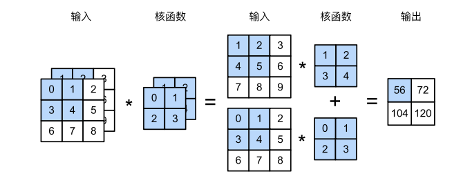

# torch.nn.Conv2d

[toc]

## 卷积层的意义和适用范围

卷积层相对于全连接层的意义在于，单个像素不连接下一层所有元素，而只连接其周围的像素，而且每个像素对周围像素的影响效果相同。这样做能够大幅减少训练参数，但也降低了神经网络的泛化性，因此只能解决特定性质的问题。神经网络中使用卷积层要求问题具有如下性质：

1. 平移不变性：对应于==每个像素对周围像素的影响效果相同==。
2. 局域性：对应于==只连接其周围的像素==。

神经网络中的卷积层实际上进行的是互相关运算。

## pytorch的卷积层

Pytorch采用`nn.Conv2d()`实现卷积操作，它有如下形参：

`nn.Conv2d(in_channels, out_channels, kernel_size, stride=1, padding=0, dilation=1, groups=1, bias=True, padding_mode='zeros', device=None, dtype=None)`

计算公式为：
$$
\text{out}(N_i,C_{\text{out}_j})=\text{bias}(C_{\text{out}_j})+\sum_{k=0}^{C_{\text{in}}-1}\text{weight}(C_\text{out},k)\star\text{input}(N_i,k)
$$
==输入$\text{input}$的形状为$(N,C_{\text{in}},H,W)$，输出$\text{output}$的形状为$(N,C_{\text{out}},H_{\text{out}},W_{\text{out}})$，卷积核的形状为$(C_{\text{out}},C_{\text{in}},\text{kernel\_size[0]},\text{kernel\_size[1]})$。==

对于多通道输入、单通道输出：

多个通道对相应的卷积核卷积之后做哈德曼积。

对于多通道输入、多通道输出：

相当于对多通道输入、单通道输出重复多次。

## 卷积层的输出尺寸

当输入尺寸为$H_{\text{in}}$，卷积核尺寸为$\text{kernel\_size}$一边填充数为$\text{padding}$，步幅为$\text{stride}$，扩张率为$\text{dialation}$时，输出尺寸为：
$$
H_{\text{out}}=\left\lfloor\cfrac{H_{\text{in}}+2\times\text{padding}-[\text{dialation}\times(\text{kernel\_size-1})+1]+\text{stride}}{\text{stride}}\right\rfloor
$$
 空洞卷积：

