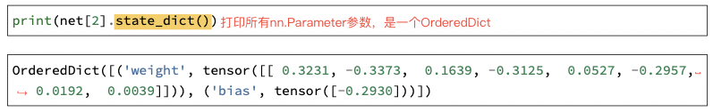
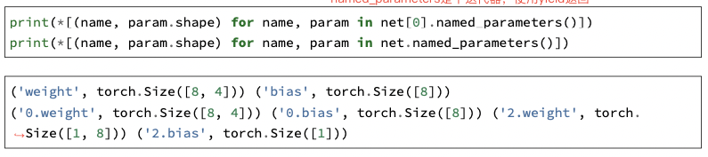
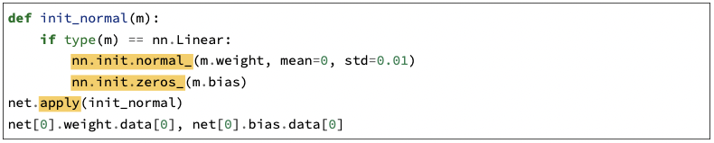
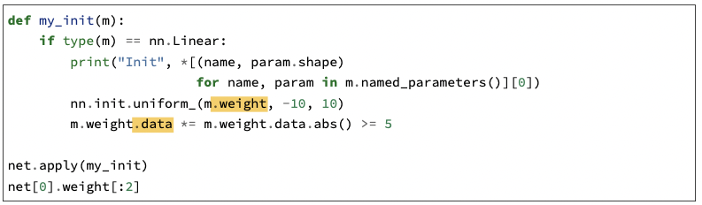
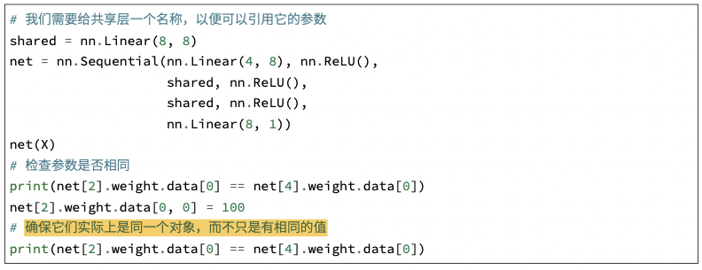
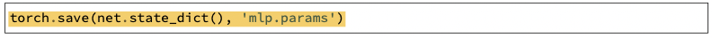
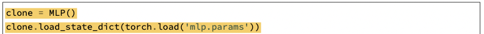

# 深度学习计算

[toc]

## 参数管理

### 参数访问

- `Module.state_dict()`：返回一个OrderedDict，打印模块所有的`nn.Parameters`参数。

  

- `Module.named_parameters()`：产生一个迭代器函数，返回一个tuple（name, parameter）

  

### 参数初始化

参数初始化使用`nn.init`模块

常用函数包括：

`nn.init.normal_`：产生正态分布

`nn.init.zeros_`：全0初始化

`nn.init.constant_`：全等初始化

`nn.init.uniform_`：产生均匀分布

也可以自定义初始化，注意：`nn.init`的初始化作用在`Module.params`上，而自定义的初始化需要直接作用在`Module.params.data`上。如下图：

### 共享参数

将同一个模块实例化多次加入网络中即实现共享参数，如：

## 参数保存与加载

- 保存：使用`torch.save(tensors, path)`

  可以存储单个张量，张量组成的list、tuple、dict等和网络的所有参数，如：

  

- 加载：使用`torch.load(path)`

  若需要将参数加载到网络中，使用`Module.load_state_dict()`，如：

  

