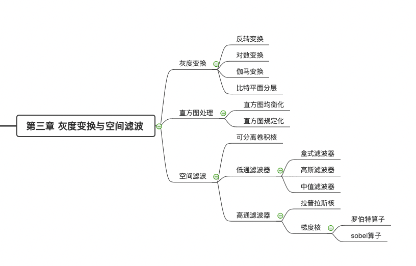

1. 经累积分布函数处理可以得到均衡化的直方图：
   $$
   s=(L-1)\int_o^rp_r(w)\ \text{d}w
   $$
   

2. 灰度值$r$相对于其均值$m$的第$n$阶矩定义为：
   $$
   \mu_n=\sum_{i=0}^{L-1}(r_i-m)^np(r_i)
   $$
   方差是二阶矩：
   $$
   \sigma^2=\mu_2=\sum_{i=0}^{L-1}(r_i-m)^2p(r_i)
   $$
   方差是图像对比度的测度。

3. 卷积满足交换律、结合律和分配律；相关只满足分配律。

4. 秩为1的卷积核可以分离成两个向量的外积。高斯核和盒式核都是可分离的。

5. 低通滤波器核一般使得所有系数之和为1，这样做能保证变换前后灰度值相等。

6. 当卷积采用零填充时，图像会出现黑边框，此时可以采用复制填充（填充边界处的值）或对称填充（填充以边界为对称轴的镜像）。

7. 使用低通滤波可以矫正图像阴影。通过对含阴影图像的低通滤波可以得到图像的阴影模式，再用原图除以该阴影模式。

8. 使用中值滤波器可以很好去除图像中的椒盐噪声（随机分布的白点和黑点）。

9. 拉普拉斯算子和梯度算子的系数之和都为0。

10. 钝化遮蔽：图像减去模糊后的图像，得到高频部分；原图再加上高频部分，可以锐化图像。