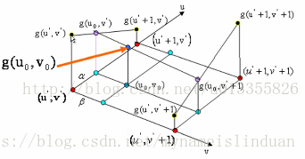

[toc] 

## bit、Byte

bit - 比特；byte - 字节、位

1 Byte = 8 bit

1 kB = $2^{10}\approx10^3$ Byte

1 MB = $2^{10}*2^{10}\approx10^{3}*10^3$ Byte

## 图像内插

### 最近邻内插

找到最近的那个点：$x'=x_0\cfrac{L_0}{L'}$

### 双线性内插 (bilinear interpolation)

i) 单线性内插

$$
\cfrac{y-y_0}{y_1-y_0}=\cfrac{x-x_0}{x_1-x_0}
$$
可得：
$$
y=(1-\alpha)y_0+\alpha y_1
$$
其中$\alpha = \cfrac{x-x_0}{x_1-x_0}=x-x_0$，因为图像中$x_0,x_1$是相邻的两个点。

ii) 双线性内插

现在一个方向上做单线性插值得到两个插值点，再用这两个插值点再进行一次单线性插值。

### 双三次插值(bicubic interpolation)

https://www.voycn.com/article/jisuanjishijuewushuangsancichazhibicubic

## 距离测度

城市街区距离(4邻接)、棋盘距离(8邻接)

## 去噪声的例子

1. 使用图像相加去除噪声

2. 使用中值滤波器去除椒盐噪声

3. 使用低通滤波矫正阴影

4. 算数平均滤波器：$f(x,y)=\cfrac{1}{mn}\sum_{(r,c)\in S_{xy}}g(r,c)$

5. 几何均值滤波器：$f(x,y)=\left[\prod_{(r,c)\in S_{xy}}g(r,c)\right]^{1/mn}$

6. 谐波平均滤波器：消除盐粒噪声
   $$
   f(x,y)=\cfrac{mn}{\sum_{(r,c)\in S_{xy}}\cfrac{1}{g(r,c)}}
   $$

7. 反谐波平均滤波器：$Q>0$时消除胡椒噪声；$Q<0$时消除盐粒噪声
   $$
   f(x,y)=\cfrac{\sum_{(r,c)\in S_{xy}}g(r,c)^{Q+1}}{\sum_{(r,c)\in S_{xy}}g(r,c)^{Q}}
   $$
   

8. 双边滤波

   

   当不是边界处时，邻域内所有点与锚定点(假如是噪点)的差值都差不多大，$s$基本相同，此时为高斯滤波。

   当是在边界附近时，锚定点在边界内时，边界外的点与锚定点差值很大，导致$s$很小，卷积时基本不起作用，而边界内的点与锚定点差值不是很大，导致$s$很大，卷积时起主要作用。

   总结：双边滤波根据锚定点与周围值的差异确定卷积权重，差异大时权重小，差异小时权重大。

## Gamma变换

物体 ----$\gamma=1/2.2$----> 存储：防止高亮部分溢出

存储 ----$\gamma=2.2$----> 显示：还原显示

## 直方图

直方图均衡：
$$
s=(L-1)\int_0^rp_r(w)\ \text{d}w
$$
直方图匹配：

r ----直方图均衡----> s <----直方图均衡(记录映射关系)---- z

s ----查表----> z

## 可分离卷积核

卷积核矩阵的秩为1时，卷积核可分离，计算复杂度从$MNmn$下降到$MN(m+n)$

高斯核是可分离核：$e^{-\frac{r^2}{2\sigma^2}}$

## 边缘检测算子

### 拉普拉斯算子

0	1	0

1	-4	1

0	1	0

或

1	1	1

1	-8	1

1	1	1

### Robert算子

-1	0

0	1

或

0	-1

1	0

### Sobel算子

-1	-2	-1

0	0	0

1	2	1

或

-1	0	1

-2	0	2

-1	0	1

### Prewitt算子

-1	-1	-1

0	0	0

1	1	1

### Canny边缘检测

1. 高斯平滑
2. 利用Sobel边缘卷积算子提取边缘
3. 非最大值抑制：如果当前像素为梯度方向直线上的最大值，则保留该像素；如果不是最大值，则该像素置于0
4. 双边抑制：大于大阈值的认为是边界（强边界）；小于小阈值的认为不是边界；两者之间的认为是弱边界。
5. 滞后技术：与强边界相连的弱边界认为是边界，其他弱边界不是边界

## 采样过程

## 频域滤波器

1. 理想低通滤波器
2. 高斯低通滤波器
3. 巴特沃斯低通滤波器: $\cfrac{1}{1+[D(u,v)/D_0]^{2n}}$
4. 频域拉普拉斯：$-4\pi(u^2+v^2)$

## 快速傅里叶变换

1. 2D to 1D
   $$
   \begin{split}
   F(u,v)&=\sum_{x=0}^{M-1}\sum_{y=0}^{N-1}f(x,y)e^{-j2\pi ux/M}e^{-j2\pi vy/N}\\
   &=\sum_{x=0}^{M-1}e^{-j2\pi ux/M}\sum_{y=0}^{N-1}f(x,y)e^{-jw\pi vy/N}\\
   &=\sum_{x=0}^{M-1}F(x,v)e^{-j2\pi ux/M}
   \end{split}
   $$
   二维DFT可以分解为两次一维DFT，一次沿列做，一次沿行做。

2. 递归求解

$$
F(u)=\sum_{x=0}^{M-1}f(x)W^{ux}_{M}
$$

其中$u=0,1,\cdots,M-1$，$W_M^{ux}=e^{-j2\pi ux/M}$。假设$M=2^p,K=M/2$。将求和写成奇数号采样点和偶数号采样点分别求和的形式：
$$
\begin{split}
F(u)&=\sum_{x=0}^{K-1}f(2x)W_{2K}^{2ux}+\sum_{x=0}^{K-1}f(2x+1)W_{2K}^{u(2x+1)}\\
&=\sum_{x=0}^{K-1}f(2x)W_{K}^{ux}+W_{2K}^u\sum_{x=0}^{K-1}f(2x+1)W_{K}^{ux}\\
&=F_{even}(u)+W_{2K}^uF_{odd}(u)
\end{split}
$$
其中：
$$
F_{even}(u)=\sum_{x=0}^{K-1}f(2x)W_{K}^{ux}
$$
为==偶数号采样点组成新序列，该新序列的离散傅里叶变换==。
$$
F_{odd}(u)=\sum_{x=0}^{K-1}f(2x+1)W_{K}^{ux}
$$
为==奇数号采样点组成新序列，该新序列的离散傅里叶变换==。

除此之外：对于原序列，前$K$个点的傅里叶变换为：
$$
F(u)=F_{even}(u)+F_{odd}(u)W_{2K}^u
$$
后$K$个点的傅里叶变换为：
$$
F(u)=F_{even}(u)-F(u)W_{2K}^u
$$
可以减少乘法的运算。

对于1个点的FFT，其变换为其本身，故需乘法次数$m(0)=0$，加法次数$a(0)=0$；

对于2个点的FFT，可以分成奇数号采样点的和偶数号采样点的两次FFT，算出$F_{odd}$和$F_{even}$，再需要1次乘法和1次加法得到$F(0)$，1次加法得到$F(1)$，故$m(1)=2m(0)+1,a(1)=2(0)+2$。

对于4个点的FFT，$m(2)=2m(1)+2,a(2)=2a(1)+4$。

对于$M=2^p$个点的FFT，$m(p)=2m(p-1)+2^{p-1}$次乘法，其中$2m(p-1)$为两个子序列FFT所需要的乘法，$2^{p-1}=M/2$为合成前$M/2$个点频谱所需的乘法；$a(p)=2a(p-1)+2^p$，由于合成$M$个点的频谱都需要加法，故额外需要$2^p$次加法。

总的次数为：
$$
\begin{split}
m(p)&=2m(p-1)+2^{p-1}=2(2m(p-2)+2^{p-2})+2^{p-1}=4m(p-2)+2*2^{p-1}\\
&=8m(p-3)+3*2^{p-1}\\
&=2^{p-1}m(1)+(p-1)*2^{p-1}\\
&=2^pm(0)+p*2^{p-1}\\
&=\frac{M}{2}\log_2M
\end{split}
$$
同理对于加法：
$$
a(p)=2^pm(0)+p*2^p=M\log_2M
$$
故一维FFT的时间复杂度为$M\log_2M$。

https://zhuanlan.zhihu.com/p/374489378

## 图像的噪声

来自于图像的产生和传输：

图像的产生：光照水平和传感器的温度

图像的传输：图像传输信道的干扰

根据噪声的灰度分布：高斯噪声、瑞利噪声、伽马噪声、指数噪声、均匀噪声、椒盐噪声

白噪声：根据噪声的空间分布

## 线性系统、卷积、采样

## 图像的复原

图像的退化：$g(x,y) = f(x,y)*h(x,y)+\eta(x,y)$或$G(u,v) = F(u,v)\times H(u,v)+N(u,v)$

1. 逆滤波

$$
\hat{F}(u,v) = \cfrac{G(u,v)}{H(u,v)}=F(u,v)+\cfrac{N(u,v)}{H(u,v)}
$$

当$H(u,v)$很小时，会导致噪声项$N(x,y)$支配重建的图像。因此这种方法通常要将$H(u,v)$截断，保证$H(u,v)$不会出现接近0值。

2. 维纳滤波(最小均方误差滤波)

$$
\hat{F}(u,v)=\cfrac{1}{H(u,v)}\left[\cfrac{|H(u,v)|^2}{|H(u,v)|^2+S_\eta(u,v)/S_f(u,v)}\right]G(u,v)
$$

$S_\eta(u,v)=|N(u,v)|^2$为噪声的功率谱，$S_f(u,v)=|F(u,v)|^2$为原图的功率谱。

3. 最小二乘方滤波

$$
\hat{F}(u,v)=\left[\cfrac{H^*(u,v)}{|H(u,v)|^2+\gamma|P(u,v)|^2}\right]G(u,v)
$$

$P(u,v)$是拉普拉斯卷积核的傅里叶变换。

4. 最小二乘法

   假设正向过程为$g=Hf$，给定$g$，求$f$

   $f使得\min ||g-Hf||^2_2$

   $E=(g-Hf)^T(g-Hf)=g^Tg-g^THf-f^TH^Tg+f^TH^THf$

   $\part E/\part f = -2H^Tg+2H^THf=0$,$f=(H^TH)^{-1}H^Tg$

   若方程欠定，则用带约束的最小二乘法，即拉格朗日乘子法。

5. 常见的复原/逆问题：

   （见computational imaging）运动去模糊（运动模糊图案为图像与一个核卷积，卷积核的傅里叶变换为一个sinc函数）、滤波反投影

6. 滤波反投影

一条投影线可以表示为
$$
x\cos\theta+y\sin\theta = \rho
$$
在每条投影线方向上的线积分和为
$$
g(\rho,\theta)=\iint f(x,y)\delta(x\cos\theta+y\sin\theta-\rho)\ \text{d}x\text{d}y
$$
即用$\delta$函数采样该直线上的函数值，并积分求和。上式称为==雷登变换==，$g(\rho,\theta)$称为正弦图。

傅里叶切片定理：

一个方向上的投影的傅里叶变换$G(\omega,\theta_j)$，是得到投影的区域的二维傅里叶变换在$\theta_j$方向的切片，即：
$$
G(\omega,\theta_j) = \int g(\rho,\theta_j)e^{-j2\pi\omega\rho}\ \text{d}\rho
$$

$$
G(\omega,\theta_j)=F(u,v)|_{u=\omega\cos\theta_j,v=\omega\sin\theta_j}=F(\omega\cos\theta_j,\omega\sin\theta_j)
$$

滤波反投影公式：
$$
f(x,y)=\int_0^\pi\left(\int_{-\infty}^{+\infty}|\omega|G(\omega,\theta)e^{j2\pi \omega\rho}\ \text{d}\omega\right)\ \text{d}\theta
$$
滤波反投影分为4步：

1. 固定$\theta_j$，计算每个投影对$\rho$的傅里叶变换$G(\omega,\theta)$
2. 滤波，即乘以$|\omega|$，可以加窗。
3. 对于滤波后的投影，对$\rho$做逆傅里叶变换
4. 对$\theta$积分

## 腐蚀与膨胀

### 二值图像

腐蚀与膨胀都只考虑前景元素，不考虑背景元素和不关心元素

腐蚀：all关系，结构元中所有前景元素都与图像匹配

膨胀：any关系，结构元中存在前景元素与图像匹配

开运算：先腐蚀再膨胀，结构元在图像内部滑动

闭运算：先膨胀再腐蚀，结构元在图像边界上滑动

击中-击不中：前景元素、背景元素都要匹配

边界提取：图像减去它自身的腐蚀

孔洞填充：要自己选起始点，选择孔洞里面某个点就可以，结构元选4连通，从起始点开始膨胀，每次膨胀之后与背景取交集，直到收敛。

提取连通分量（测地膨胀）：同上，也要自己选起始点，选择你要提取的分量上的某个点，结构元选8连通，从起始点开始膨胀，每次膨胀之后与前景取交集，直到收敛。

骨架：腐蚀-腐蚀的开运算，做k次取并集。

提取包含某个特征的连通分量：把特征设计为结构元，对图像腐蚀n次直到收敛，这样就提取出了图像中的指定特征，再对这些特征做提取连通分量，就可以得到包含该特征的连通分量

自动孔洞填充：取边框的补集，开始测地膨胀，得到了与边框连通的背景，再取补集（即孔洞+围绕孔洞的连通区域），补集与背景的交集就是所有孔洞。

### 灰度图像

腐蚀：结构元内最小值 去除盐粒噪声

膨胀：结构元内最大值 去除胡椒噪声

开运算：先腐蚀后膨胀，平滑亮特征

闭运算：先膨胀后腐蚀，平滑暗特征

形态学梯度：膨胀-腐蚀（区域最大值-区域最小值，如果图像平坦，则等于0，图像变化则非0）

顶帽变换：原图-原图的腐蚀，提取出亮特征

底帽变换：原图的膨胀-原图，提取出暗特征

粒度测定：利用开/闭运算删除比结构元小的亮/暗特征的性质，逐渐增大结构元的尺寸，当结构元刚刚大于粒子的直径时，其区域像素值会发生很大变化。

## 图像分割

### 二阶导数和一阶导数的比较

1. 一阶导数产生粗边缘；二阶导数更细
2. 二阶导数对精细结构有更强的响应
3. 二阶导数会产生双边缘效应，即进入边缘和离开边缘都有响应，且符号相反，可以根据符号判断是从明到暗还是从暗到明

### 孤立点检测

二阶导数超过一定阈值即认为是孤立点

### 线检测

二阶导数、不同方向的拉普拉斯算子来检测线的方向

### 边缘检测

#### 边缘模型

台阶模型、斜坡模型、屋顶模型

#### 梯度算子检测边缘

1. 平滑，去除噪声产生的假边缘
2. 用x、y方向梯度算子得到梯度分量图$g_x,g_y$
3. 计算梯度图和梯度方向图，分别为$M=\sqrt{g_x^2+g_y^2}\approx|g_x|+|g_y|,\alpha=\arctan\left(\frac{g_y}{g_x}\right)$

#### Marr-Hildreth边缘检测子

LoG函数：高斯拉普拉斯函数，即高斯函数的二阶导数。

1. 先用LoG函数与原图卷积，也等价于先用高斯核滤波再求二阶导数

2. 找过零点，过零点即边缘

   找过零点的方法：3*3核内，至少有一对对角元素值的符号相反，且他们的差超过一个阈值。

#### Canny边缘检测子

1. 高斯平滑
2. 利用Sobel边缘卷积算子提取边缘
3. 非最大值抑制：如果当前像素为梯度方向直线上的最大值，则保留该像素；如果不是最大值，则该像素置于0
4. 双边抑制：大于大阈值的认为是边界（强边界）；小于小阈值的认为不是边界；两者之间的认为是弱边界。
5. 滞后技术：与强边界相连的弱边界认为是边界，其他弱边界不是边界

### 霍夫变换

截距-斜率空间：

xy坐标点变成直线

xy坐标直线变成直线的交点

极坐标空间：

xy坐标点变成曲线

xy坐标直线变成曲线的交点

### 阈值处理

#### 基本全局阈值处理

初始阈值---》分割两部分的灰度平均值$m_1,m_2$---〉更新阈值为$\frac{1}{2}(m_1+m_2)$

当阈值在直方图上可分时很有效。

#### Otsu方法

最大类间方差

类间方差：$\sigma_B^2=P_1(m_1-m_G)^2+P_2(m_2-m_G)^2$

化简可得：$\sigma_B^2=\cfrac{(P_1m_G-m)^2}{P_1(1-P_1)}$，其中$m=\sum_{i=0}^k iP_i$

#### 边缘改进阈值处理

只利用边缘像素的直方图获得阈值，将该阈值应用于全局。

### 直接得到分割的区域

#### k均值

初始k个均值/聚类中心--》像素按欧氏距离最小原则分配给每个聚类--〉将每个聚类的平均值作为新的聚类中心

#### 
