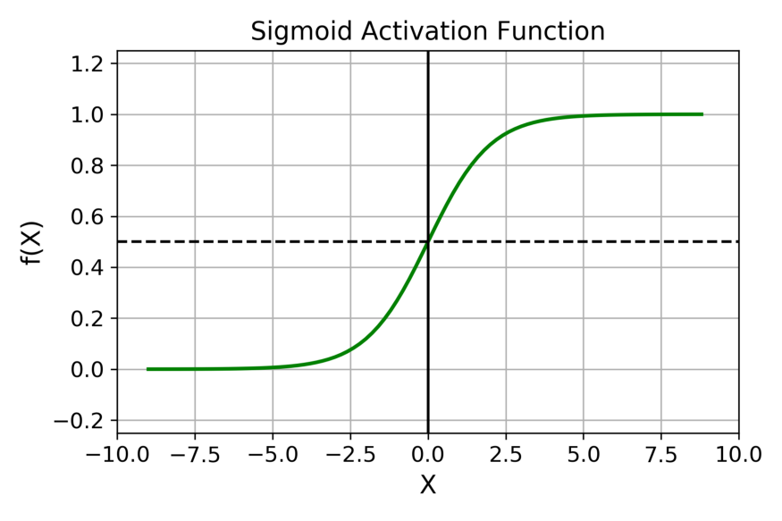

[Reference](https://finance.sina.com.cn/tech/2021-02-24/doc-ikftssap8455930.shtml#:~:text=%E6%BF%80%E6%B4%BB%E5%87%BD%E6%95%B0%EF%BC%88Activation%20Function%EF%BC%89%E6%98%AF,%E8%BE%93%E5%85%A5%E9%9B%86%E5%90%88%E4%B8%8B%E7%9A%84%E8%BE%93%E5%87%BA%E3%80%82)

目录：

[toc]

# 常见激活函数

## sigmoid函数

$$
f(x)=\frac{1}{1+e^{-x}}
$$

- 导数：
  $$
  f'(x)=(-1)\cdot\frac{1}{(1+e^{-x})^2}\cdot e^{-x}\cdot(-1)=\frac{e^{-x}}{(1+e^{-x})^2}=f(x)(1-f(x))
  $$

- 优点：

  1. 梯度平滑
  2. 可微
  3. 明确的预测，函数值介于0～1，且十分接近 0 或 1。

- 缺点：

  1. 指数计算很慢