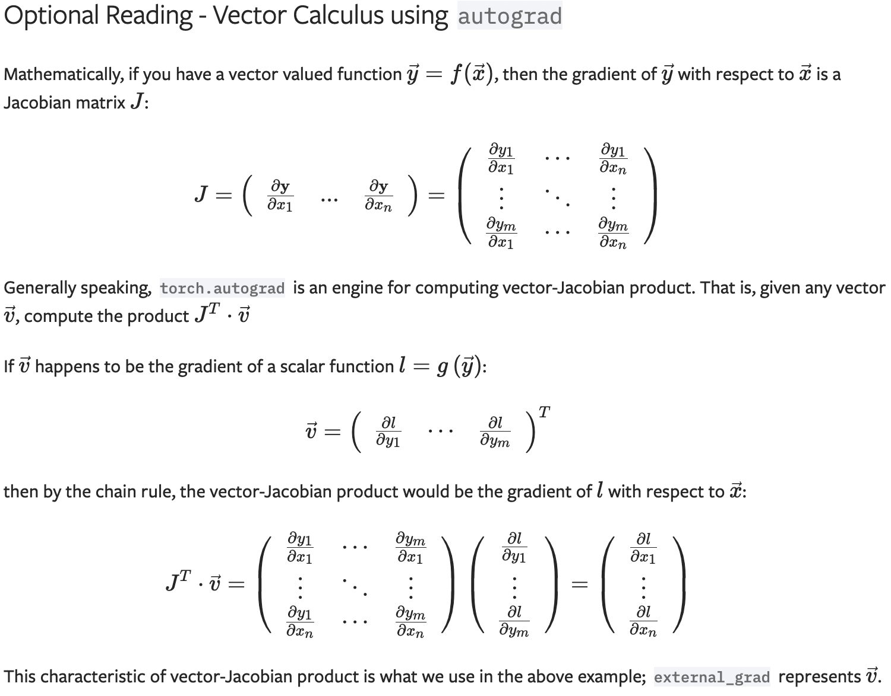

## 常用命令

`x=torch.tensor(3.0, requires_grad=True)`：创建可求导的张量，注意必须是浮点数才能求导

`x.backward()`：运行自动求导

有相互关系的张量构造时，pytorch会自动生成运算关系图(计算图)，一旦使用了`x.backward()`计算梯度后，这个计算图自动被销毁，因此再次使用`x.backward`会报错。为了保存计算图，可以使用`x.backward(retain_graph=True)`。

`x.grad`：查看顶层变量关于变量 x 的偏导，返回值为偏导在 x 值处的值

`x.requires_grad`：查看是否可求导

`x.requires_grad_(True/False)`：修改是否可导

## 标量对向量/矩阵求导

假设$L$是一个标量，$\textbf{W}$是一个 M×N 维矩阵，则$L$对$\textbf{W}$的导数矩阵为一个 M×N 维矩阵，且$[\frac{\part L}{\part \textbf{W}}]_{m,n}=\frac{\part L}{\part w_{m,n}}$，即：
$$
\frac{\part L}{\part \textbf{W}}=
\begin{bmatrix}
\frac{\part L}{\part w_{11}} & \frac{\part L}{\part w_{12}} & \cdots & \frac{\part L}{\part w_{1N}} \\
\frac{\part L}{\part w_{21}} & \frac{\part L}{\part w_{22}} & \cdots & \frac{\part L}{\part w_{2N}} \\
\vdots & \vdots & \ddots & \vdots \\
\frac{\part L}{\part w_{M1}} & \frac{\part L}{\part w_{M2}} & \cdots & \frac{\part L}{\part w_{MN}}
\end{bmatrix}
$$

## 向量/矩阵对向量/矩阵求导

假设$\textbf{L}$是一个 P×Q 维矩阵，$\textbf{W}$是一个 M×N 维矩阵，则$\textbf{L}$对$\textbf{W}$的导数矩阵为一个 P×Q×M×N 维矩阵，且$j_{p,q,m,n}=[\frac{\part \textbf{L}}{\part \textbf{W}}]_{p,q,m,n}=\frac{\part l_{p,q}}{\part w_{m,n}}$。

pytorch不支持向量求导，但是可以通过设置`x.backward(gradient=v)`求得。

$$
\frac{\part l}{\part \textbf{x}^{[M,1]}}=\frac{\part l}{\part \textbf{y}^{[N,1]}}\frac{\part \textbf{y}^{[N,1]}}{\part \textbf{x}^{[M,1]}}
$$
（注：标注上标$^{[M,N]}$的为 M×N 矩阵）
$$
\vec{v}^{[N,1]}=\frac{\part l}{\part \textbf{y}^{[N,1]}}
$$

$$
J^{[N,M]}=\frac{\part \textbf{y}^{[N,1]}}{\part \textbf{x}^{[M,1]}}
$$

则：
$$
\frac{\part l}{\part \textbf{x}^{[M,1]}}=(J^T)^{[M,N]}\cdot\vec{v}^{[N,1]}
$$
在pytorch中即：`dl/dx = y.backward(gradient=dl/dy)`

**即：即使中间层反向传播时存在向量对向量求导，但是总可以变成标量对向量求导。**

[详细参考](https://zhuanlan.zhihu.com/p/69175484)

## 实例

[一个简单的分类问题](https://zhuanlan.zhihu.com/p/74631214)