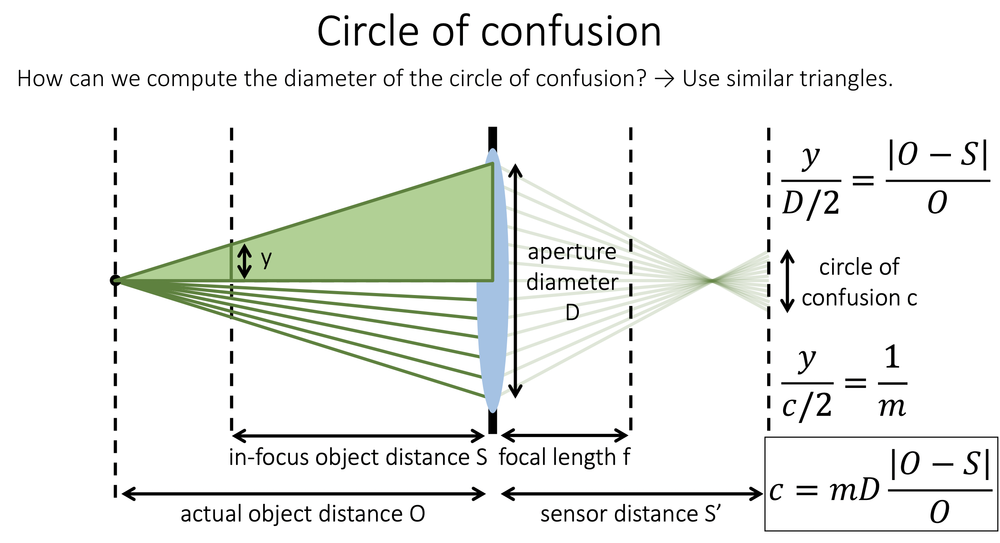

O与f是一对物像面，S与S'是一对物像面。由于离焦，导致sensor面上产生confusion。现在需要量化confusion直径$c$与景深$|O-S|$之间的关系。

根据相似：
$$
\frac{y}{D/2}=\frac{|O-S|}{O}
$$
根据成像公式，将高$y$的物体放大$m=\frac{S'-f}{f}$倍(假设sensor和透镜距离不变，则$m$为常数)：
$$
\frac{y}{c/2}=\frac{1}{m}
$$
可得：
$$
c=mD\frac{|O-S|}{O}
$$
设可以忍受confusion的阈值为$\epsilon$，则景深(Depth of Field, DOF)为：
$$
{\rm DOF}=\frac{2\epsilon O}{mD}
$$
随着透镜孔径的增大，confusion变大、景深变短。