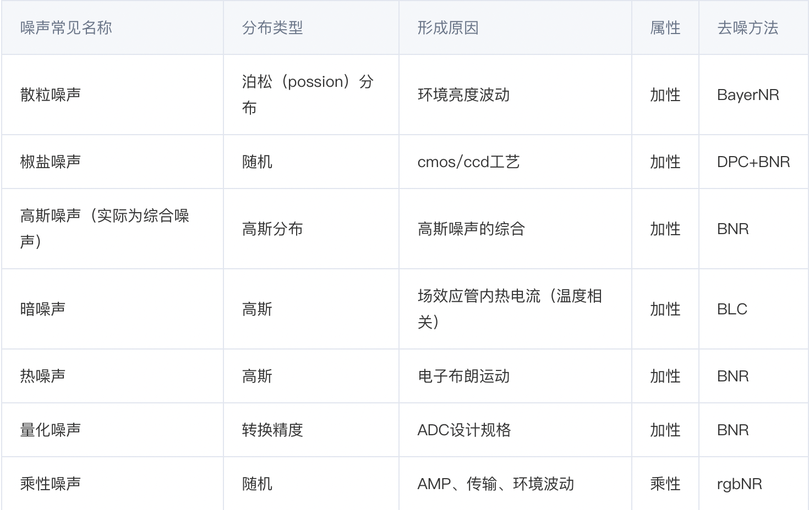
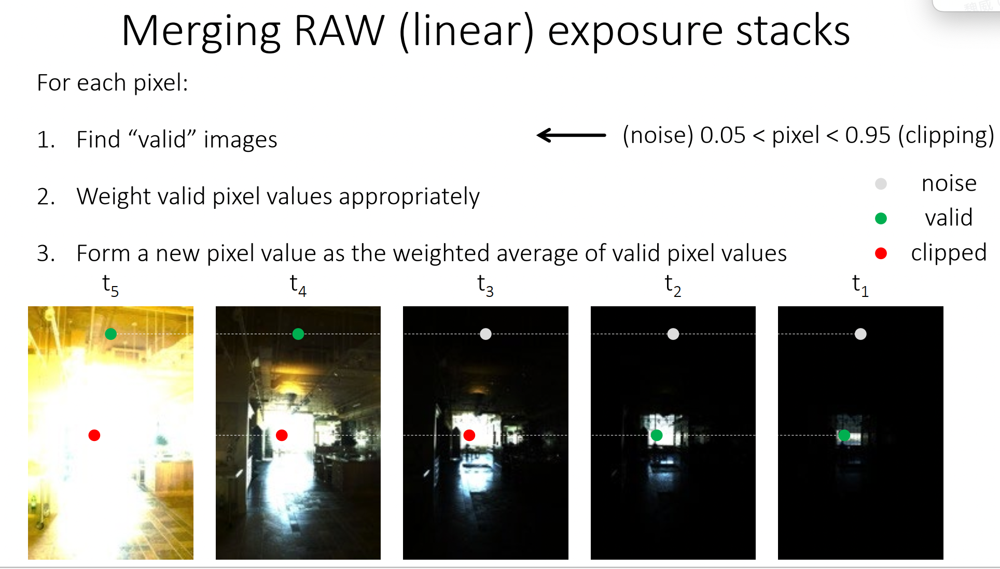
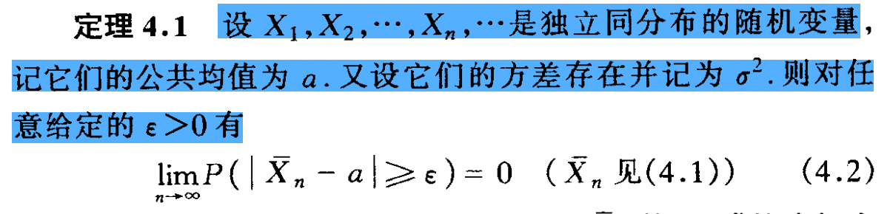

# What Camera does

## image sensor

成像传感器由微透镜阵列、颜色滤镜、光电二极管和势井组成。传感器将光信号转换成电信号。

940 nm

光电二极管的光电转换效率用量子效率(quantum efficiency, QE)表示：
$$
QE=\cfrac{electrons~count}{photons~count}
$$

即一个光子激发的电子个数。

- CCD型：电荷耦合元件，基于CMOS，高端相机采用
- CMOS型：互补金属氧化物半导体，基于MOSFET，便宜

### color filter array

Color filter array多采用Bayer排列，2*2 阵列中绿色占两个，蓝色和红色各一个。因为人对绿光更敏感。照相机多采用RGB CFA，摄像机多采用YCbCr CFA

### optical low-pass filter

光学低通滤波器为了降低欠采样带来的混叠效应，将成像系统的MTF截止在图像传感器能正确采样的频率。通常由两个双折射晶体组成，将一束光线分成四束。当入射光线是相干光时，OLPF可能会产生问题。

### 画幅

35mm全画幅与胶片画幅一致。

## 传感器噪声

- 按是否稳定分类：

  1. 固定模式噪声：噪声位置不随时间变化。来源：暗电流的不均匀性、光响应的不一致性

  2. 暂态噪声：噪声随时间变化。来源：热噪声；光子噪声/散粒噪声；1/f噪声
- 主要噪声：

  1. 光子噪声/散粒噪声：泊松分布。光强越强，散粒噪声越大，信噪比：$\text{SNR}=\frac{N}{\sqrt{N}}$，$N$为光子数。可以看出，光子数较少时，散粒噪声很大。

  2. 暗噪声：
  3. 读出噪声/本底噪声、模数转换噪声：读出电路产生的噪声。高斯分布。模数转换引入量化噪声。
- 衡量标准：

  1. 动态范围(dynamic range, DR)：满阱容量与本底噪声的比值。
  2. 信噪比：信号与噪声的比值

设传感器单位时间接收到的光子数为N。散粒信号分布为$S_1\sim Poisson(N\cdot QE\cdot t)$，暗电流信号分布为$S_2\sim Poisson(D\cdot t)$，读出信号分布为$S_3\sim Normal(0,\sigma_{read})$，模数转换信号分布为$S_4\sim Normal(0,\sigma_{ADC})$。设在模拟放大器处的ISO增益为$g$。

则最终数字信号为：
$$
I_0=g\cdot(S_1+S_2+S_3)+S_4
$$
若做黑电平校正，则信号值变为
$$
I=g\cdot (S_1+S_3)+S_4
$$
其数学期望为(代表信号的值)：
$$
E(I)=\mu=E(g*S_1)+E(S_3)+E(S_4)=N\cdot QE\cdot g\cdot t
$$
其标准差为(代表噪声的值)：
$$
\sigma=\sqrt{Var(I_0)}=\sqrt{E(I_0^2)-[E(I_0)]^2}=\sqrt{(N\cdot QE+D)*g^2t+\sigma^2_{read}*g^2+\sigma^2_{ADC}}
$$
信噪比为：
$$
SNR=\cfrac{\mu}{\sigma}=\cfrac{N\cdot QE \cdot \cdot t}{\sqrt{(N\cdot QE+D)*g^2t+\sigma^2_{read}*g^2+\sigma^2_{ADC}}}
$$
在高光照下，光子噪声主宰了噪声项；在低光照下，读出噪声和模数转换噪声主宰了噪声项。

在高ISO下，光子噪声和读写噪声主宰了噪声项；在低ISO下，ADC噪声主宰了噪声项。

在长时间曝光下，暗电流噪声主宰了噪声项。

==增加光照或曝光，噪声变大，但信噪比也变大==。

一次长曝光要好于多次短曝光，因为每次曝光都会有读写和ADC噪声

增加曝光要好于增加ISO或数字增亮。

噪声的评估：

1. 暗电流噪声评估：对黑暗场景拍多张取平均。
2. 增益g、读出噪声和ADC噪声评估

## AFE

相机中的模拟前端主要由模拟放大器、模数转换器以及LUT(look-up table)组成，将势井产生的模拟信号转化成原始数字马赛克图像(raw digtial mosaiced image)。其中analog amplifier将模拟值进行增益gain的数值放大(ISO设置的模拟增益)，再经过ADC将模拟信号转换为数字信号(输出的值为10-16bits)，最后LUT可以在一定的范围内修正传感器响应的非线性，修复一些损坏的像素。

## 颜色

光源光谱能量分布$*$物体反射率谱=入眼光谱能量分布

入眼光谱能量分布$*$三种视锥细胞光谱响应度 对波长积分=人眼感受的光强

long-medium-short敏感函数

## ISP

### dead pixel correction 坏点校正

坏点类型：

dead pixel（总是低像素值）；hot pixel（总是高像素值）；stuck pixel（总是中间值）

static dead pixel：恒定；dynamic dead pixel：变动

校正方法：

各种插值方法

### black level compensation 黑电平校正

黑电平校正的原因：

1. AD转换时，模拟信号必须高于一定阈值才能被转化成数字信号，为了不损失暗部细节，通常模拟信号增加一个固定值再去转化成数字信号
2. 暗电流导致光照为0时仍然有电压输出。

黑电平导致输出0光强对应blc灰度值，即[blc, 255]，黑电平校正就是将其变为[0, 255]

blc灰度值检测：使用光学黑色像素(optical black pixel)检测0光强下电压输出值。

![Активная матрица, область оптического черного и немикролинзовая область в  КМОП-сенсоре - Фотопедия](data:image/png;base64,iVBORw0KGgoAAAANSUhEUgAAAPMAAADPCAMAAAAXkBfbAAAAflBMVEX///8AAADo6Ojq6urj4+PKysr7+/tfX19tbW2lpaXZ2dnHx8ceHh45OTnf39+BgYE/Pz+srKyNjY2fn58YGBhFRUXw8PC4uLj29vaXl5eysrLJycnQ0NC9vb3T09N+fn5oaGiRkZF0dHRWVlZPT08vLy8nJyckJCRLS0sRERHlFNMxAAAIZElEQVR4nO2dDXebLBuAiRBEaGTAKh8RUdLu7fP//+CLSbc9z9lqs6YzmnCdntMEbpSrIH6hBSCTuW8wfiN93mrMSMOGqj59NA3edj8yoDYAOJg+MfozWpg3l9SiH0Xd59fzEzED0fZA8djaWwk7emp2g0EdGwBIygHSATyqphxUwmP7j0Hm2BHw+DN+xQGB16Jd/z0Zv0bjt7vT/HRlAbDgWgy8VTvnWW0lM5pLeHQuJRdw0MgGgVHKqUtatQDUSm0ZHzrPigEx33K5xayiinvjuaw7UlQGpVJ2EFIYZmXVdJL7a8u+onlqQURkuXVSkG5QUnlORdtrOjq/WMq1dcz7HinBQnfgNiW3T0LzznEn2Y5x3XsmjGq5YoMLWx0YqUmSpE+a87ZvVdxHx4UX15Z9xY9mLZECNFFxNAx9AWA9xJ07OvcUCGHdnpePXagBRN+eReqjbSiEAjCm/iBlbEQZNVI1p8AoCZqDOjpzSqASIDBlwSB0SfS1ZV8petdQ4hSBLXfJ2RJWDxVvy5Pzk8ODtlXw+kDlFsnu4Mo04rUcem7aWIdyX3Jo29TUogkeVVVoutITRJAIybl6dbai2ru+ubbtK9vY98qoMvYMBVE5Rnqx7UOUlKcqRhJlobSKvPQsEoFiajoMqGwaS6LHVYDRm4pEIfaAxb5Kyb2nYcwd6gCdBsO2qoDSIka1mFGsQRBjVRUQg6YxBjfpK4Rpv9WMY3NTGGCMKVIWbgqcEk0aAHAanHGRAtKX40d4TEkBwBRpZG/Sr7HAmGnGEmm5aZnXVv0vfn/tGszP2EJ3hrH9wjre38c/63trZ/SFL2U3Mg9puI49vHYtZqWWWu269+NuCCw2m81wXxuzCcm5vK+uDXfJ+bm+djVmhW02D6G4di1mBdvNF3Ff+ynQlP19jdmJZinn8ZnPp6hvDzR9jkS/bG6Q6eOq9iadeXbOztn5Zvgz50eyZuLhI86crpm6+voBZ4lgcQ6woGfFzQsUH3M+c/FosB087+8zHxc4o3NQXx8relbkTFzkvA/lGYzDxYH054TOQu/hBc7Vs6reR5Ax/mEQZ8TOgPgimwuc1eNZF0vY/8b4xdzmifwy57MufcKnzeZr+zkV/gTIHM7YPoSn5dznmcUZwBrTx8VIz+M84nd2Ifc95nPG4tktQ3o+ZwCq3TIul87pbOTjIgbvOZ1BEw9LuMU1qzNoynIB0vM6g/YpXv9wbGZn0L5c/xh0bmew3dlrS8/uDKrna09Ont/ZqB277rHJ/M7A2MftR6v7KVzBGTT904/nTv61bf+ymb/fG/5V5A+e27iGMyhI+XqO5XevM4M7ZiT6b5QZKJjGVD+ntOjzj2uv4gxoeTrdwLIcDGj8vhlI51oKGgaoO7o3msmWGtMa2nnjWwypr5GGiAKzTWXoVkOj671BLUAaAefw1p1Xm+s44+JUDvWaIDPwoAfSEhWAH9po49h6nHOyt0URihA5kf2elbLn3Hpp9gGnv5ocApS099ynIqF2zschnHWKfh3n71QHfWAsINo5VZS+p9YPxB5SN6W8QZFJhCIiLSuNqDRHhNWh5Uy6tC2QouE+IPYSUx+xpdNOEOWW79yQYEvppIHIVbCklkckra+65CSNSXawJigUbQC68goGCnltY0gr7bjBMjm3u9hI5VWrHRU2vDcCXN+5JXXTvmiupHexPdDum8U+OJ7OQ3C0Q9nKQZZ1LLZHZwtjBzntHmUq2j1ZFVHoSEW8jk5S59JyyuU703HQFrRWokGqc9AIBIyzx0MWqoSHtdWu8Qalka2tW+OhYQ2M4wjdBasoZp0zrTN+YIbSorLnTVq77vb8AfAgx3VS+fFjufU5b0+7svqOnD+B7DwVmZ2z87rIzlOR2Tk7r4vsPBWZnbPzusjOU5HZOTuvi+w8FZmds/O6yM5Tkdk5O6+L7DwVmZ2z87rIzlOR2Tk7r4vsPBWZnbPzusjOU5F/3dn8XP1vJmP/K/fXmd5/xnKcIXl9nNIww3553g67n3P7i+GyNxEux1l/GWciN4WpI61Rg0FjcDHO08WwQQbTusAYjq/0BnVZG3TBg8WLcW54RVqw5VLqFy9ERCi0SkqWOkAZbKBWDEJYZCXfot5Ly8+azvpbFuPc9S2XWPq6ogQpF7yzurcx1Qm9OGgrLtpD2W1LSzgl1UHoj695Kc64Otj4gkKNuyLCSvtBMh1clbZxdKDAWS6KwwH66JTueuZs+PgjtktxRsSZunTWCoL6rXXmQFAnXaXTkPUidWBcDSHajjvl6rKSLrIPr2sxzg4CzBiqqtaIve+A0waz5JeynpTSjWcCUQeZqlDjqFBnPm/yO5biPEHRo18TL3kSbwXOaX/9uQtcgfOnk52nIrNzdl4X2XkqMjtn53WRnacis3N2XhfZeSoyO2fndZGdpyKzc3ZeF9l5KjI7Z+d1kZ2nIrNzdl4X2XkqMjtn53WRnacis3N2XhfvO3+fV3xPzvT1bdF35GyG/pR8R85o93DyuiNnvdmc3mB+P86432z645z4+3GGKX13nCp9N864GjOqMeN+nFl8+hb9XTmnfZV7/b8Od+QMdHl3++fkfJoynp2z87rIzr+LyM7ZOTuvhez8u4jsfAvO7/8/92nnrlgf/UXO7uF5tz42Fl7gXLdshezr4gLnAq6S4iLn1ZKdz3XuqzUjwj8TzrT6/bWhfx5WzamZ37oX+8Z9ydvgz+4/3wbZOTtn59vhHp3DpDN9uXb9/gbDpDOu99tbY9+u8ZpHJpP5W6Dikve3rRITN49Vd8HbRhdLs3/r4pp+TKfV34i4Peu2fIvD6UT8SXzyC/yuD27eoug3DwfZNfe0UWM3sOLm2vgdzL0JZzKZzAL4P3Zyb9s5DI+KAAAAAElFTkSuQmCC)

### lens shading correction 透镜阴影校正

阴影种类：

1. luma shading: 图片四个角落的亮度与中心不同。来自于余弦四次方定律、机械和镜头未对准、光电二极管的角度敏感性。
2. color shading: 图片四个角落的颜色与中心不同。来自于镜头的色差

校正方法：

1. 查表。将余弦四次方做成表
2. 多项式拟合

### bayer noise reduce 拜尔域去噪

### white balance

在不同的光源下，人类视觉系统(human visual system, HVS)可以自动适应环境并识别颜色，使感知到的颜色就像标准光源下看到的一样，称为色度适应性(chromatic adaptation)。==白平衡就是将不同光源条件下拍摄的白色物体(ccd接受到的不是白色)转变成为白色存储和显示，即拍出了接近人眼看到景象的照片。==自动白平衡需要选取一个标准来作为校准，根据标准不同而分为以下两类：

- 灰世界假设：假设整个场景的平均颜色作为中间灰度([1/2,1/2,1/2])。

- 白世界假设：假设最亮颜色为白色

### demosaice

通过对color filter array中的RGB分别**插值**去马赛克，将RAW格式转换成RGB格式。

插值方式：最近邻插值；线性插值；双线性插值。

### 颜色校正矩阵(color correction matrix)

颜色校正矩阵。拍摄color checker24色板，将相机拍摄图片值与色板标准值之间进行对比（RGB颜色空间），得出一组能将拍摄值校正到最接近标准值的3x3矩阵。通过这个矩阵对所有相机拍摄的图片进行颜色校正。

### tone reproduction/mapping

https://www.zhihu.com/search?type=content&q=%E4%BC%BD%E9%A9%AC%E7%9F%AB%E6%AD%A3

即色调映射，将记录到的高bit图片（如HDR）能够在低bit显示器上很好的显示。

无颜色的色调映射：可以用下图公式，也可以用gamma校正

带颜色的色调映射：

1. 仅把亮度重映，保持颜色不变

2. 仅把低频信息的亮度重映，保持高频亮度和整体颜色不变

3. 基于边缘检测的色调映射

双边滤波(既包含滤波又包含边缘检测避免边缘被模糊)base layer: 双边滤波后的结果；detail: 原图减去双边滤波。

PS: gamma校正：
$$
L'=L^\gamma
$$
$\gamma$通常取2.2或1/2.2。gamma校正是一种方法，用于gamma encoding(12bit raw转8bit RGB)以及tone mapping

==这一步将12 bit转化成8 bit。==

1. CRT（阴极射线显像管）的输入输出关系为$output=input^{2.2}$，为了保证线性输入输出关系，先将input做一个1/2.2的伽马矫正。
2. 人眼对较暗颜色分辨率更高，因此需要用更多的内存来存暗部颜色，所以用1/2.2伽马矫正，来增大了较暗数值的表示精度。

### 色彩转换

### denoise

噪声来源：

- shot noise/poisson noise（散粒噪声）：光子到达传感器的数量是一个随机过程，符合泊松分布
- dark-shot noise（暗噪声）：传感器发热导致逸出电子从而产生的噪声，温度越高，噪声越大
- Read noise（读出噪声）：AFE读取产生的噪声

### 自动曝光

曝光由光圈、曝光时间、ISO(增益)共同决定。

image sensor主频：一秒能扫多少个像素

ISO增益包括模拟增益和数字增益。模拟增益会等比例放大噪声，无好无坏（放大读出噪声）；数字增益会引入量化增益，可能会恶化信噪比。

曝光量的测量：

### HDR

获取多张不同曝光程度的图片，低曝光照片用于获取高光部分、高曝光照片获取低光部分，将不同图片加权合成在一起合成一张图片即为HDR图片。

HDR需要保证拍多张照片过程中景象不要移动。因此HDR算法包括一步对准的过程。

HDR图片用==浮点数==存储

==？HDR存储格式==

加权融合的时候，每张图片的权重为$1/t$，即对曝光时间归一化。

### 自动对焦

包括对焦测量和透镜移动

1. 主动式：由超声波、红外等测物距，然后算出像距

2. 被动式：

   1. 反差对焦(Contrast Detection Auto Focus)：选取的待对焦区域的对比度(选取区域像素最大值减最小值)最大时表示对焦成功。对焦慢。

      

   2. 相位对焦(Phase Detection Auto Focus)：弱光下可能无法对焦

      

## 概率论补习

### 古典概率

古典概率又称事前概率，即事先知道各个结果发生概率，而不用做大量实验来获取概率。（常常是等概率事件）

几何概率：结果的数量无限多且等概率，往往要借助几何面积来求解。

排列：$A_n^r$：从n个里取r个物体排序，结果有$A_n^r=n(n-1)(n-2)\cdots(n-r+1)=\cfrac{n!}{(n-r)!}$，例如$A_5^3=5*4*3$

组合：$C_n^r$：从n个里取r个物体不考虑顺序，一个组合对应$r!$个排列，所以$C_n^r=\cfrac{A_n^r}{r!}=\cfrac{n!}{r!(n-r)!}$，例如$C_5^3=\cfrac{5*4*3}{3*2*1}$

==二项式$(a+b)^n$各项的系数满足组合公式==，$a^rb^{n-r}$相当于从n个数中取r个a。

多项式$(x_1+x_2+\cdots+x_k)^n$各项的系数满足公式：$\cfrac{n!}{r_1!r_2!\cdots r_k!}$

### 事件运算

#### 事件加法

事件A、B的加法定义为
$$
C=A+B=\{A或B发生\}
$$
C仍然是一个事件。

加法公理：若各事件互斥，则各事件之和的概率等于各事件概率之和。（或者说加法公理定义了互斥事件）

#### 事件乘法

事件A、B的乘法定义为
$$
C=AB=\{A和B都发生\}
$$

#### 事件减法

事件A、B的减法定义为
$$
C=A-B=\{A发生，B不发生\}=AB^c
$$

#### 条件概率

在事件B发生的前提下，发生事件A的概率，定义为条件概率$P(A|B)$
$$
P(A|B)=\cfrac{P(AB)}{P(B)}
$$

#### 独立事件

满足
$$
P(AB)=P(A)P(B)
$$
的事件A、B相互独立。此时$P(A|B)=P(A)$。即事件B发不发生对事件A发生的概率没有影响。

==各事件乘积的概率等于各事件概率的乘积 等价于 事件独立==

==各事件加法的概率等于各事件概率的加法 等价于 事件互斥==

### 随机变量

随机变量的值在每次实验中不同。在试验前不知道变量的值，只有在试验后才确定，这种变量称为随机变量。随机事件可以由包含随机变量的关系式表示。例如随机事件：年收入高于10万元，可以定义年收入为随机变量，关系式为$X>100000$。

设$X$为离散型随机变量，其全部可能值为$\{a_1,a_2,\cdots\}$，则
$$
p_i=P(X=a_i),i=1,2,\cdots
$$
称为$X$的概率函数/==概率分布==。==即随机变量的取值与该值发生的概率的关系称为随机变量的分布。==

对于连续性随机变量，定义：
$$
F(x)=P(X\le x)
$$
为概率分布函数，$f(x)=F'(x)$为概率密度函数。概率密度函数等价于离散随机变量的概率分布，表示$X=x$的概率。

#### 二项分布

$n$次独立实验中成功$X$次(成功概率为$q$)的概率分布：
$$
p_i=C_n^iq^i(1-q)^{n-i}
$$
计作$X\sim B(n,q)$

#### 泊松分布

假设独立实验次数$n$很大，而成功概率$p$很小，但==成功次数的数学期望$\lambda=np$比较适中==，即二项分布取极限的情况。
$$
\begin{split}
p_i&=\cfrac{n!}{i!(n-i)!}q^i(1-q)^{n-i}\\
&=\cfrac{n!}{i!(n-i)!}\left(\cfrac{\lambda}{n}\right)^i\left(1-\cfrac{\lambda}{n}\right)^{n-i}\\
&=\cfrac{n!}{n^i(n-i)!}\cfrac{\lambda^i}{i!}\left(1-\cfrac{\lambda}{n}\right)^n\left(1-\cfrac{\lambda}{n}\right)^{-i}\\
&=\left(1-\cfrac{1}{n}\right)\left(1-\cfrac{2}{n}\right)\cdots\left(1-\cfrac{i-1}{n}\right)\cfrac{\lambda^i}{i!}\left(1-\cfrac{\lambda}{n}\right)^n\left(1-\cfrac{\lambda}{n}\right)^{-i}\\
&\overset{n\to+\infty}{=}\cfrac{e^{-\lambda}\lambda^i}{i!}
\end{split}
$$
记为$X\sim P(\lambda)$

其数学期望为：
$$
E(X)=\sum_{i=0}^{+\infty}ip_i=\lambda
$$
$X^2$的数学期望为：
$$
E(X^2)=\sum_{i=0}^{+\infty}i^2p_i=\lambda+\lambda^2
$$
方差为：
$$
Var(X)=E\left(\left[X-E\left(X\right)\right]^2\right)=E(X^2)-[E(X)]^2=\lambda
$$
对于发射光子数来说，令一段时间内发射光子数$X$的数学期望$\lambda=N$，则发射光子数$X$的概率分布为：
$$
p_i=P(X=i)=\cfrac{e^{-N}N^i}{i!}
$$
其平均值(数学期望)为$\mu=N$，方差为$\sigma^2=N$，信噪比$SNR=\cfrac{\mu}{\sigma}=\cfrac{N}{\sqrt{N}}=\sqrt{N}$。

#### 正态分布

$$
p_i=\cfrac{1}{\sqrt{2\pi}\sigma}e^{-\frac{(x-\mu)^2}{2\sigma^2}}
$$

记为：$X\sim N(\mu,\sigma)$

#### 协方差

定义协方差$Cov(X,Y)$为：
$$
E[(X-\mu_x)(Y-\mu_y)]=E(XY)-\mu_x\mu_y
$$

若$X$和$Y$为独立变量，则上式等于$E(X)E(Y)-\mu_x\mu_y=0$。且$Cov^2(X,Y)\le\sigma_X^2\sigma_Y^2$，可以定义==相关系数$Corr(X,Y)$==：
$$
Corr(X,Y)=\cfrac{Cov(X,Y)}{\sigma_X\sigma_Y}\in[-1,1]
$$

#### 矩

设$X$为随机变量，$c$为常数，$k$为正整数，则$E((X-c)^k)$称为随机变量$X$关于$c$点的$k$阶矩。

#### 数学期望

数学期望的性质：
$$
E(aX_1+bX_2+c)=aE(X_1)+bE(X_2)+c
$$
若干==独立==随机变量乘积的数学期望等于各独立随机变量数学期望的乘积
$$
E(X_1X_2\cdots X_n)=E(X_1)E(X_2)\cdots E(X_n)
$$
方差的性质：
$$
Var(X+c)=Var(X)
$$

$$
Var(aX_1)=a^2Var(X_1)
$$

若干==独立==随机变量乘积的方差等于各独立随机变量方差的乘积
$$
Var(X_1X_2\cdots X_n)=Var(X_1)Var(X_2)\cdots Var(X_n)
$$

##### 样本均值的数学期望

$$
E(\bar X)=E\left(\cfrac{1}{N}\sum_{i=1}^N X_i\right)=\cfrac{1}{N}\sum_{i=1}^N E\left(X_i\right)=\cfrac{1}{N}\times N\mu=\mu
$$

##### 样本方差的数学期望

令样本方差、总体方差分别为$s^2,\sigma^2$：
$$
s^2=\cfrac{1}{N}\sum_{i=1}^N(X_i-\bar X)^2
$$

$$
\sigma^2=\cfrac{1}{N}\sum_{i=1}^N(X_i-\mu)^2
$$

则样本方差的数学期望为：
$$
\begin{split}
E(s^2)&=E\left(\cfrac{1}{N}\sum_{i=1}^N(X_i-\bar X)^2\right)\\
&=\cfrac{1}{N}E\left(\sum_{i=1}^N((X_i-\mu)+(\mu-\bar X))^2\right)\\
&=\cfrac{E\left(\sum_{i=1}^N(X_i-\mu)^2 \right)-E\left((\bar X-\mu)^2 \right)}{N}\\
&=Var(X)-Var(\bar X)\\
&=\sigma^2-Var(\frac{1}{N}\sum_{i=1}^NX_i)\\
&=\sigma^2-\frac{1}{N^2}N\cdot Var(X)\\
&=\cfrac{N-1}{N}\sigma^2
\end{split}
$$
==样本均值的方差为总体方差的$1/n$。==比如n张图片取平均，得到m张平均图片，这m张平均图片的方差为原来图片方差的1/n。

#### 大数定理

设$X_1,X_2,\cdots,X_n$为独立同分布的随机变量(n次实验)，当$n\to+\infty$，他们的平均值$\bar{X}$趋向于$\mu$。

每个随机变量分布是总体中一个样本的某特征的分布。

$E(X_i)=\mu_i$是第$i$个样本的数学期望，但不是总体的数学期望；$E(\bar{X})=\bar{\mu}$是多次实验的数学期望，实验次数趋近于无穷大时，$\bar{\mu}$趋近于总体的均值$\mu$。

#### 中心极限定理

大量独立同分布的随机变量(很多次实验)经过标准化后呈标准正态分布。

标准化:
$$
\cfrac{x-\mu}{\sigma}
$$

### 参数估计

用样本的统计量去估计总体分布的参数称为参数估计。

#### 无偏估计

设$x_1,x_2,\cdots,x_n$是来自总体的一个样本，用来估计统计参数$\theta$的统计量$\hat\theta=\hat\theta(x_1,x_2,\cdots,x_n)$，则$\hat\theta$为$\theta$的一个估计。若对于具有任意$\theta$的总体分布，都能通过样本统计量$\hat\theta$准确地估计出$\theta$，则称$\hat\theta$是$\theta$的无偏估计。即：
$$
E_\theta(\hat\theta)=\theta
$$
即==样本某统计量的数学期望等于总体某参数。样本均值是总体均值的无偏估计==，样本k阶原点矩是对总体k阶原点矩的无偏估计。

当参数可估时，其无偏估计可以有很多，如：

$X_1,X_2,\cdots,X_n$是取自某总体的样本，记总体均值为$\mu$，总体方差为$\sigma^2$，则$\hat\mu_1=X_1,\hat\mu_2=\bar X$都是总体均值$\mu$的无偏估计，因为$E(X_1)=\mu,E(\bar X)=\mu$，这时为了比较哪个无偏估计更好，会比较估计量的方差，方差小的更好：
$$
Var(X_1)=\sigma^2
$$

$$
Var(\bar X)=\cfrac{\sigma^2}{n}
$$

所以选样本均值作为总体均值的估计量更好。

#### 矩估计

样本的矩：

样本k阶原点矩：
$$
\hat\mu_k=\cfrac{1}{N}\sum_{i=1}^N X_i^k
$$
总体k阶原点矩：
$$
\mu_k=\sum x_ip_i(x;\theta_1,\theta_2,\cdots,\theta_k)
$$
==样本k阶原点矩是总体k阶原点矩的无偏估计==。因此可令$\hat\mu_k=\mu_k$，联立这$k$个方程可求解$\theta_1$到$\theta_k$。

#### 极大似然估计

对于这个函数： p(x|θ) 输入有两个：x表示某一个具体的数据； θ 表示模型的参数

如果 θ 是已知确定的， x 是变量，这个函数叫做概率函数(probability function)，它描述对于不同的样本点 x ，其出现概率是多少。

如果 x 是已知确定的， θ 是变量，这个函数叫做似然函数(likelihood function), 它描述对于不同的模型参数，出现 x 这个样本点的概率是多少。

##### 例1: 正态分布

待估计参数两个：$\mu,\sigma^2$，设样本均值为$\bar X$，样本方差为$s^2$。

###### 矩估计

$E(X)=\mu=\bar X,Var(X)=\sigma^2=s^2$

###### 极大似然估计

设$X_1,X_2,\cdots ,X_n$是从正态分布总体$N(\mu,\sigma^2)$中抽取的样本，则样本$(X_1,X_2,\cdots,X_n)$出现的似然概率为：
$$
L=\prod_{i=1}^n P(X=X_i)=\prod_{i=1}^n\cfrac{1}{\sqrt{2\pi}\sigma}e^{-\frac{(X_i-\mu)^2}{2\sigma^2}}
$$

$$
\log L=\sum_{i=1}^n\log(\cfrac{1}{\sqrt{2\pi}\sigma}e^{-\frac{(X_i-\mu)^2}{2\sigma^2}})=-\cfrac{n}{2}\log(2\pi)-\cfrac{n}{2}\log(\sigma^2)-\cfrac{1}{2\sigma^2}\sum_{i=1}^n(X_i-\mu)^2
$$

$$
\cfrac{\part \log L}{\part \mu}=-\cfrac{1}{\sigma^2}\sum_{i=1}^n(X_i-\mu)=0
$$

$$
\cfrac{\part \log L}{\part (\sigma^2)}=-\cfrac{n}{2\sigma^2}+\cfrac{1}{2(\sigma^2)^2}\sum_{i=1}^n(X_i-\mu)^2=0
$$

可得：
$$
\mu=\frac{1}{n}\sum_{i=1}^nX_i=\bar X
$$

$$
\sigma^2=\frac{1}{n}\sum_{i=1}^n(X_i-\bar X)^2=s^2
$$

##### 例2: 均匀分布

待确定参数两个：$a,b$，设样本均值为$\bar X$，样本方差为$s^2$。

###### 矩估计

$$
E(X)=\int_a^b x_ip_i\ \text{d}x_i=\int_a^b \frac{x_i}{b-a}\ \text{d}x_i=\frac{b+a}{2}=\bar X
$$

$$
Var(X)=E(X^2)-E^2(X)=\frac{(b-a)^2}{12}=s^2
$$

联立可求解$a,b$

###### 极大似然估计

无法求出

##### 例3: 柏松分布

待确定参数一个：$\lambda$，设样本均值为$\bar X$。

###### 矩估计

$$
E(X)=\lambda=\bar X
$$

###### 极大似然估计

$$
L(\lambda)=\prod \frac{e^{-\lambda}\lambda^{x_i}}{x_i!}
$$

$$
\ln L(\lambda)=-n\lambda+\left(\sum x_i\right)\ln\lambda-\sum\ln (x_i!)
$$

$$
\cfrac{\part \ln L(\lambda)}{\part \lambda}=-n+\frac{\sum x_i}{\lambda}=0
$$

得：$\lambda=\frac{1}{n}\sum x_i=\bar X$。

#### 最小方差无偏估计

##### 方差与均方误差

$$
Var(\hat \theta)=E((\hat \theta-E(\theta))^2)
$$

$$
MSE(\hat \theta)=E((\hat\theta-\theta)^2)=Var(\hat \theta)+(E(\hat \theta)-\theta)^2
$$

==方差是指样本中数据偏移其平均值的程度，是一个统计量；均方误差是指样本统计量与总体统计参数的差异。当$\hat \theta$是$\theta$的无偏统计时，即$E(\hat\theta)=\theta$，此时均方误差等于方差。==

##### 最小均方误差估计

##### 最小方差无偏估计

##### 维纳滤波-最小均方误差滤波

