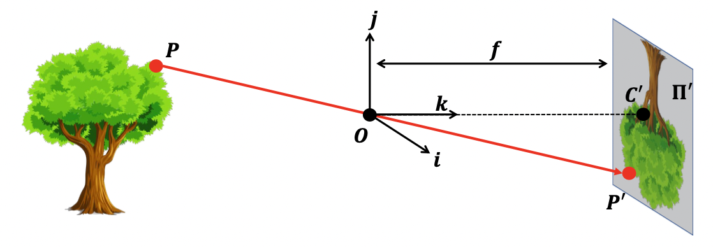
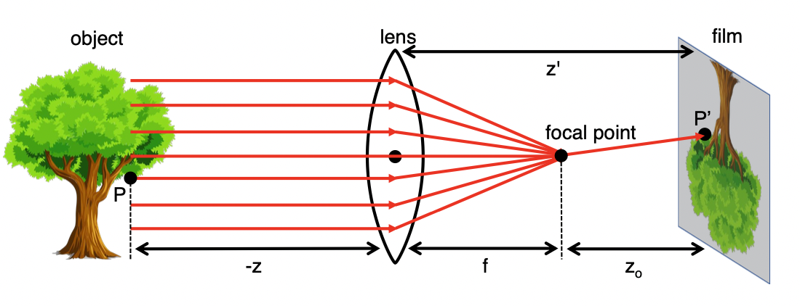
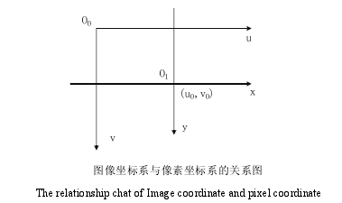
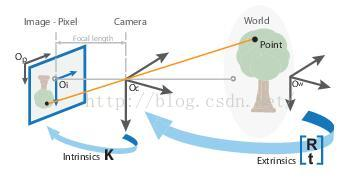
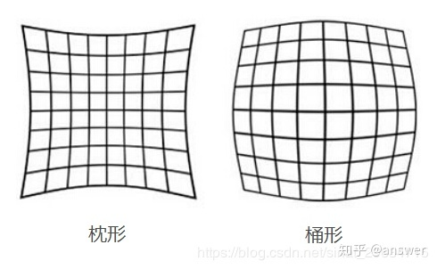

# 相机模型

[toc]

## Pinhole camera

1. 为什么pinhole camera可以成像？

   如果没有pinhole而是自由传播，胶片上的每个单独的点都会受到物体上各个点发射光线的影响。由于存在pinhole，只有沿着小孔的光线能够进入相机，于是可以得到一对一的映射来成像。(p.s. lensless imaging又是这种利用缺点创造优势的体现)

2. 相机坐标系$(X_c,Y_c)$和图像坐标系$(x,y)$

   

   相机坐标系中以pinhole作为坐标系原点。CCD面通常称为image plane，但成虚像时image plane也会跑到物体和原点之间，相机坐标系中光轴与CCD平面的交点为图像坐标系的原点。

3. 关于pinhole的大小

   Pinhole越大，会导致成像模糊；而pinhole变小，会使图像变暗且产生衍射效应。一个选取标准是：pinhole的直径等于艾里斑直径。
   $$
   D_{\rm airy}=\frac{1.22\lambda}{\rm NA}
   $$

   $$
   {\rm F\ number}=\frac{f}{D_{\rm pinhole}}=\frac{1}{2\cdot{\rm NA}}
   $$

   

   得：
   $$
   D_{\rm pinhole}=D_{\rm airy}=\frac{2.44\lambda f}{D_{\rm pinhole}}
   $$
   即：
   $$
   D_{\rm pinhole}=\sqrt{2.44\lambda f}
   $$

4. 透镜相机

   

   简略的说，透镜相机也可以看作一个小孔相机，小孔在焦点处。

5. 从相机坐标系到图像坐标系

   根据相似三角形：
   $$
   \frac{X_c}{z}=\frac{x}{f}
   $$

   $$
   \frac{Y_c}{z}=\frac{y}{f}
   $$

   可以得到从相机坐标系到图像坐标系的转化矩阵
   $$
   \begin{bmatrix}
   x\\
   y
   \end{bmatrix}
   =
   \begin{bmatrix}
   \frac{f}{Z_c}X_c\\
   \frac{f}{Z_c}Y_c
   \end{bmatrix}
   $$
   若考虑skewness（偏度）：

   

   因为一些制造工艺上的不精确性，我们的成像传感器CCD通常不是完美的矩形网格，可能会有变形。比如偏斜(skewness)用于描述CCD单元的变形程度。此时：
   $$
   \begin{bmatrix}
   x\\
   y
   \end{bmatrix}
   =
   \begin{bmatrix}
   \frac{f}{Z_c} & \frac{f}{Z_c}\frac{1}{\tan(\theta)}\\
   0 & \frac{f}{Z_c}\frac{1}{\sin(\theta)}
   \end{bmatrix}
   \begin{bmatrix}
   X_c\\
   Y_c
   \end{bmatrix}
   $$
   写成齐次坐标形式
   $$
   \begin{bmatrix}
   x\\
   y\\
   1
   \end{bmatrix}
   =
   \begin{bmatrix}
   \frac{f}{Z_c} & -\frac{f}{Z_c}\frac{1}{\tan(\theta)} & 0 & 0\\
   0 & \frac{f}{Z_c}\frac{1}{\sin(\theta)} & 0 & 0\\
   0 & 0 & \mathbf{1/Z_c} & 0
   \end{bmatrix}
   \begin{bmatrix}
   X_c\\
   Y_c\\
   Z_c\\
   1
   \end{bmatrix}
   $$

## 相机矩阵模型

**相机矩阵模型描述了外界某点再数字图像上对应的像素位置**，需要经过以下坐标系转换：

**世界坐标系 --> 相机坐标系 --> 图像坐标系 --> 像素坐标系**

### 内参

1. 像素坐标系$(u,v)$与图像坐标系$(x,y)$的转换：

   

   像素坐标系$O_0$的中心在左上角(从左上角开始离散编号)，且像素编号与空间坐标存在一个转换：$u=N_x x$，其中$N_x$表示单位长度上有多少个像素，则：
   $$
   \begin{bmatrix}
   u\\
   v
   \end{bmatrix}
   =
   \begin{bmatrix}
   N_xx +u_0\\
   N_yy+v_0
   \end{bmatrix}
   $$
   写成齐次坐标形式：
   $$
   \begin{bmatrix}
   u\\
   v\\
   1
   \end{bmatrix}
   =\begin{bmatrix}
   N_x & 0 & u_0\\
   0 & N_y & v_0\\
   0 & 0 & 1
   \end{bmatrix}
   \begin{bmatrix}
   x\\
   y\\
   1
   \end{bmatrix}
   $$

2. 从相机坐标系$(X_c,Y_c)$到像素坐标系$(u,v)$：
   $$
   \begin{split}
   \begin{bmatrix}
   u\\
   v\\
   1
   \end{bmatrix}
   &=\begin{bmatrix}
   N_x & 0 & u_0\\
   0 & N_y & v_0\\
   0 & 0 & 1
   \end{bmatrix}
   \begin{bmatrix}
   x\\
   y\\
   1
   \end{bmatrix}\\
   &=
   \begin{bmatrix}
   N_x & 0 & u_0\\
   0 & N_y & v_0\\
   0 & 0 & 1
   \end{bmatrix}
   \begin{bmatrix}
   \frac{f}{Z_c} & -\frac{f}{Z_c}\frac{1}{\tan(\theta)} & 0 & 0\\
   0 & \frac{f}{Z_c}\frac{1}{\sin(\theta)} & 0 & 0\\
   0 & 0 & \mathbf{1/Z_c} & 0
   \end{bmatrix}
   \begin{bmatrix}
   X_c\\
   Y_c\\
   Z_c\\
   1
   \end{bmatrix}\\
   &=
   \begin{bmatrix}
   \frac{N_xf}{Z_c} & -\frac{N_xf}{Z_c}\frac{1}{\tan(\theta)} & \frac{u_0}{Z_c} & 0\\
   0 & \frac{N_yf}{Z_c}\frac{1}{\sin(\theta)} & \frac{v_0}{Z_c} & 0\\
   0 & 0 & \frac{1}{Z_c} & 0
   \end{bmatrix}
   \begin{bmatrix}
   X_c\\
   Y_c\\
   Z_c\\
   1
   \end{bmatrix}\\
   &=
   \frac{1}{Z_c}
   \begin{bmatrix}
   \alpha & -\frac{\alpha}{\tan(\theta)} & u_0 & 0\\
   0 & \frac{\beta}{\sin(\theta)} & v_0 & 0\\
   0 & 0 & 1 & 0
   \end{bmatrix}
   \begin{bmatrix}
   X_c\\
   Y_c\\
   Z_c\\
   1
   \end{bmatrix}
   \end{split}
   $$
   其中
   $$
   \alpha = N_cf\\
   \beta=N_yf\\
   u_0\\
   v_0\\
   \theta
   $$
   为**相机的五个内参**。

### 外参

上面各式中物体坐标$P$是在相机坐标系$O$中定义的，若存在一个世界坐标系$(X_w,Y_w)$，则需要旋转平移到相机坐标系。
$$
\begin{bmatrix}
X_c\\
Y_c\\
Z_c\\
1
\end{bmatrix}
=
\begin{bmatrix}
R & t\\
0 & 1\\
\end{bmatrix}
\begin{bmatrix}
X_w\\
Y_w\\
Z_w\\
1
\end{bmatrix}
$$
旋转、平移矩阵$R,T$即相机的外参。

### 总体

归纳一下，从世界坐标系到像素坐标系为：
$$
\begin{bmatrix}
u\\
v\\
1
\end{bmatrix}
=
\frac{1}{Z_c}
\begin{bmatrix}
\alpha & -\frac{\alpha}{\tan(\theta)} & u_0 & 0\\
0 & \frac{\beta}{\sin(\theta)} & v_0 & 0\\
0 & 0 & 1 & 0
\end{bmatrix}
\begin{bmatrix}
R & t\\
0 & 1\\
\end{bmatrix}
\begin{bmatrix}
X_w\\
Y_w\\
Z_w\\
1
\end{bmatrix}
$$

### 径向畸变(Distortion)

考虑透镜带来的畸变效果，影响从相机坐标系到图像坐标系

由于畸变，在图像坐标系中：
$$
x'=x(1+k_1r^2+k_2r^4+k_3r^6)=m(r)x\\
y'=y(1+k_1r^2+k_2r^4+k_3r^6)=m(r)y
$$
下面推导在$u',v'$相对无畸变时$u,v$的变化：
$$
u'=N_xx'+u_0=N_xm(r)x+u_0=N_xm(r)\frac{u-u_0}{N_x}+u_0=m(r)(u-u_0)+u_0=\\
v'=m(r)(v-v_0)+v_0
$$

