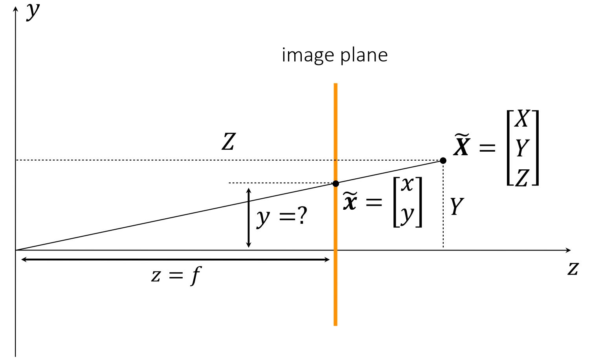
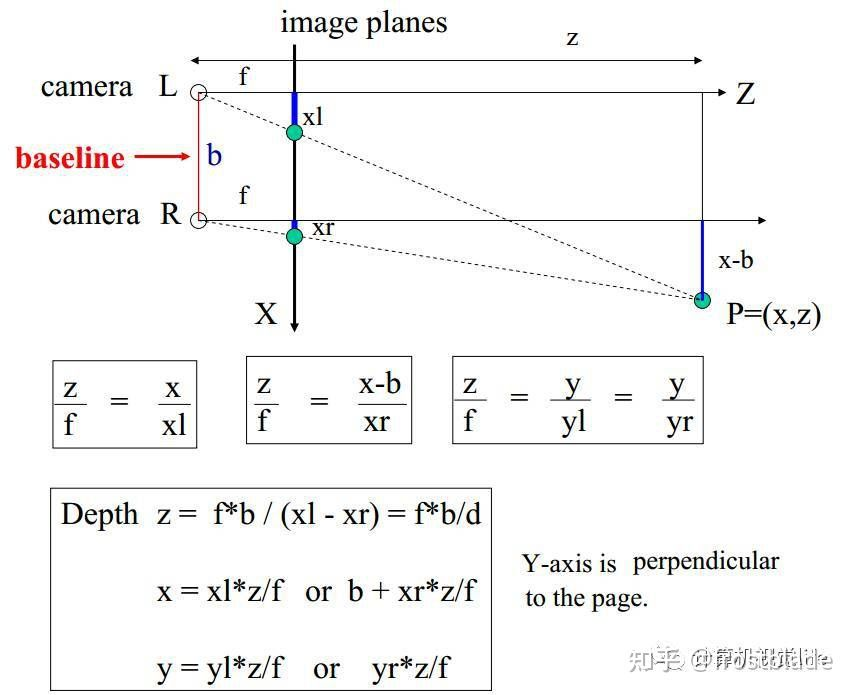

# 相机模型和双目视觉

[toc]

## Pinhole camera

1. 为什么pinhole camera可以成像？

   如果没有pinhole而是自由传播，胶片上的每个单独的点都会受到物体上各个点发射光线的影响。由于存在pinhole，只有沿着小孔的光线能够进入相机，于是可以得到一对一的映射来成像。(p.s. lensless imaging又是这种利用缺点创造优势的体现)

2. 相机坐标系$(X_c,Y_c)$和图像坐标系$(x,y)$

   

   相机坐标系中以pinhole作为坐标系原点。CCD面通常称为image plane，但成虚像时image plane也会跑到物体和原点之间，相机坐标系中光轴与CCD平面的交点为图像坐标系的原点。

3. 关于pinhole的大小

   Pinhole越大，会导致成像模糊；而pinhole变小，会使图像变暗且产生衍射效应。一个选取标准是：pinhole的直径等于艾里斑直径。
   $$
   D_{\rm airy}=\frac{1.22\lambda}{\rm NA}
   $$

   $$
   {\rm F\ number}=\frac{f}{D_{\rm pinhole}}=\frac{1}{2\cdot{\rm NA}}
   $$

   

   得：
   $$
   D_{\rm pinhole}=D_{\rm airy}=\frac{2.44\lambda f}{D_{\rm pinhole}}
   $$
   即：
   $$
   D_{\rm pinhole}=\sqrt{2.44\lambda f}
   $$

4. 透镜相机

   

   简略的说，==透镜相机也可以看作一个小孔相机，小孔在焦点处。==

5. 相机矩阵模型

**相机矩阵模型描述了外界某点再数字图像上对应的像素位置**，需要经过以下坐标系转换：

**世界坐标系 --> 相机坐标系 --> 图像坐标系 --> 像素坐标系**

### 内参

#### 从相机坐标系到图像坐标系

分析相机模型时，一般把成像平面绕着pinhole反转过去，便于理解。

此时：非齐次坐标表示
$$
\widetilde{X}=[X,Y,Z]^{\text{T}}
$$

$$
\widetilde{x}=[x,y]^{\text{T}}=[fX/Z,fY/Z]^{\text{T}}
$$

写成齐次坐标：
$$
X=[X,Y,Z,1]^{\text{T}}
$$

$$
x_1=[fx,fy,Z]^{\text{T}}
$$

即：
$$
x_1=P_1X
$$

$$
P_1=
\begin{bmatrix}
f & 0 & 0 & 0\\
0 & f & 0 & 0\\
0 & 0 & 1 & 0
\end{bmatrix}
$$

#### 从成像坐标系到像素坐标系(CCD实际探测坐标)

##### 偏度影响

若考虑skewness（偏度）：

因为一些制造工艺上的不精确性，我们的成像传感器CCD通常不是完美的矩形网格，可能会有变形。比如偏斜(skewness)用于描述CCD单元的变形程度。此时：
$$
x=x'-\cfrac{y}{\tan{\theta}}
$$

$$
y=\cfrac{y}{\sin\theta}
$$

此时：
$$
P_2 = 
\begin{bmatrix}
1 & -\frac{1}{\tan\theta} & 0\\
0 & \frac{1}{\sin\theta} & 0 \\
0 & 0 & 1
\end{bmatrix}
$$

$$
x_2=P_2x_1=P_2P_1X=
\begin{bmatrix}
f & -\frac{f}{\tan\theta} & 0 & 0\\
0 & \frac{f}{\sin\theta} & 0 & 0\\
0 & 0 & 1 & 0
\end{bmatrix}
\begin{bmatrix}
X\\
Y\\
Z\\
1
\end{bmatrix}
$$

##### 坐标换算

像素坐标系$(u,v)$与图像坐标系$(x,y)$的转换：

像素坐标系$O_0$的中心在左上角(从左上角开始离散编号)，且像素编号与空间坐标存在一个转换：$u=N_x x$，其中$N_x$表示单位长度上有多少个像素，则：
$$
\begin{bmatrix}
u\\
v
\end{bmatrix}
=
\begin{bmatrix}
N_xx +u_0\\
N_yy+v_0
\end{bmatrix}
$$
得：
$$
\begin{bmatrix}
u\\
v\\
Z
\end{bmatrix}
=
\begin{bmatrix}
N_x & 0 & u_0\\
0 & N_y & v_0\\
0 & 0 & 1
\end{bmatrix}
P_2P_1X=
\begin{bmatrix}
N_x & 0 & u_0\\
0 & N_y & v_0\\
0 & 0 & 1
\end{bmatrix}
\begin{bmatrix}
f & -\frac{f}{\tan\theta} & 0 & 0\\
0 & \frac{f}{\sin\theta} & 0 & 0\\
0 & 0 & 1 & 0
\end{bmatrix}
\begin{bmatrix}
X\\
Y\\
Z\\
1
\end{bmatrix}
=
\begin{bmatrix}
N_xf & -N_x\frac{f}{\tan\theta} & u_0 & 0\\
0 & N_y\frac{f}{\sin\theta} & v_0 & 0\\
0 & 0 & 1 & 0
\end{bmatrix}
\begin{bmatrix}
X\\
Y\\
Z\\
1
\end{bmatrix}
$$
其中：
$$
\alpha = N_cf\\
\beta=N_yf\\
u_0\\
v_0\\
\theta
$$
为**相机的五个内参**。

### 外参

外参描述了从世界坐标系到相机坐标系的转换：

上面各式中物体坐标$P$是在相机坐标系$O$中定义的，若存在一个世界坐标系$(X_w,Y_w)$，则需要旋转平移到相机坐标系。
$$
\begin{bmatrix}
X_c\\
Y_c\\
Z_c\\
1
\end{bmatrix}
=
\begin{bmatrix}
R & t\\
0 & 1\\
\end{bmatrix}
\begin{bmatrix}
X_w\\
Y_w\\
Z_w\\
1
\end{bmatrix}
$$
旋转、平移矩阵$R,T$即相机的外参。

### 总体

归纳一下，从世界坐标系到像素坐标系为：
$$
\begin{bmatrix}
u\\
v\\
Z
\end{bmatrix}
=
\begin{bmatrix}
N_xf & -N_x\frac{f}{\tan\theta} & u_0 & 0\\
0 & N_y\frac{f}{\sin\theta} & v_0 & 0\\
0 & 0 & 1 & 0
\end{bmatrix}
\begin{bmatrix}
R & t\\
0 & 1\\
\end{bmatrix}
\begin{bmatrix}
X_w\\
Y_w\\
Z_w\\
1
\end{bmatrix}
$$

==一共11个自由度，其中5个内参，3个旋转角度，3个平移距离。==

### 径向畸变(Distortion)

考虑透镜带来的畸变效果，影响从相机坐标系到图像坐标系

由于畸变，在图像坐标系中：
$$
x'=x(1+k_1r^2+k_2r^4+k_3r^6)=m(r)x\\
y'=y(1+k_1r^2+k_2r^4+k_3r^6)=m(r)y
$$
下面推导在$u',v'$相对无畸变时$u,v$的变化：
$$
u'=N_xx'+u_0=N_xm(r)x+u_0=N_xm(r)\frac{u-u_0}{N_x}+u_0=m(r)(u-u_0)+u_0\\
v'=m(r)(v-v_0)+v_0
$$

## 双目视觉

根据上节内容，现有两个相机$L,R$，分别同时对$P(x,z)$成像，可得：
$$
x_l=fx/z
$$

$$
x_r=f(x-b)/z
$$

可得：
$$
z=fb/(x_l-x_r)
$$

$$
x=x_lb/(x_l-x_r)
$$

## 相机标定

